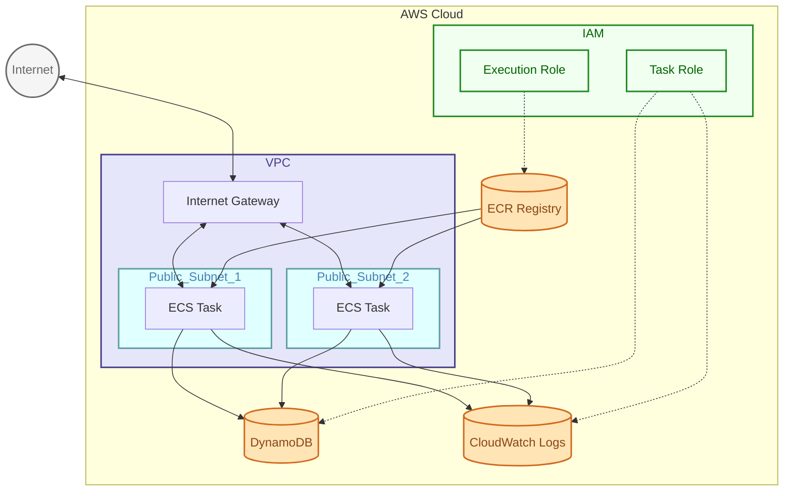
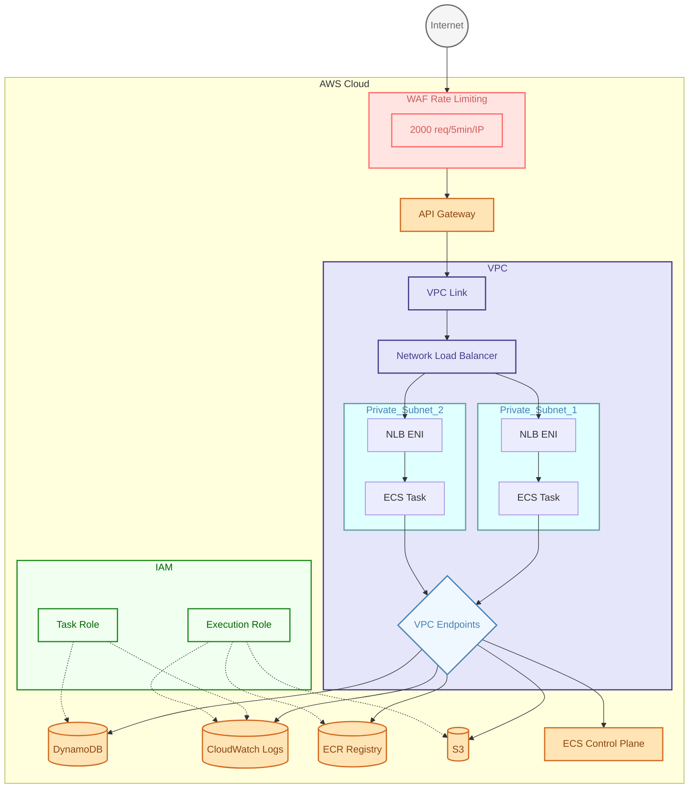

# API Deployment on AWS

- [API Deployment on AWS](#api-deployment-on-aws)
  - [Introduction](#introduction)
  - [Deployment using ECS](#deployment-using-ecs)
    - [Simplistic implementation](#simplistic-implementation)
      - [Architecture Diagram](#architecture-diagram)
    - [More Private Implementation](#more-private-implementation)
      - [Architectural Diagram](#architectural-diagram)
  - [Deployment using lambda](#deployment-using-lambda)
    - [Amazon API Gateway to AWS Lambda to Amazon DynamoDB - Java](#amazon-api-gateway-to-aws-lambda-to-amazon-dynamodb---java)

## Introduction

Here we look at deploying a simple RESTful API to AWS. We will explore various different mechanisms to achieve this. 
The API is written using Spring boot and provides the following:

- `POST /api/v1/products` - Create a new product
- `GET /api/v1/products/{id}` - Retrieve a specific product by ID
- `GET /api/v1/products` - List all products
- `PUT /api/v1/products/{id}` - Update an existing product
- `DELETE /api/v1/products/{id}` - Delete a product by ID

The database is DynamoDB and these operations are tested in the script [test-api.sh](./api/scripts/test-api.sh)

## Deployment using ECS

Elastic Container Service (ECS) is a container orchestration service provided by AWS. It integrates easily with other AWS services such as:
- VPC
- IAM
- CloudWatch
- DynamoDB

In addition to the option of running your containers on ECS using EC2 VMs, ECS also supports both AWS Fargate for a serverless option. This can reduce operational burden and costs depending on the nature of the running container.

### Simplistic implementation

To get started I developed the cloudformation template [ecs-deploy.cfn](./deployments/cloudformation/ecs-deploy.cfn) which has the following resources:

- Network Resources
    - VPC
    - 2 Public Subnets - In different AZs for high availability
    - Internet Gateway - Allows internet access
    - Route Table - Routes traffic through IGW
- Container Infrastructure
    - ECS Cluster - Manages Fargate tasks
    - Task Definition 
      - image from ECR
      - cloudwatch logging
      -  health check on /actuator/health
      -  fargate launch type
      -  configuration (environment variables)
      -  IAM roles links 
- ECS Service
    - Defined to runs in public subnets
    - Public IP enabled
    - Security group to allow traffic in on port 8080 and out - not best practice but this is a simple getting started config
- DynamoDB Table 
  - Hash key on `id`
  - Pay-per-request billing
  - Accessed by ECS tasks via TaskRole
- Security - IAM Roles
    - ExecutionRole - Allows ECS to pull images and create logs
    - TaskRole - Allows containers to access DynamoDB and CloudWatch

#### Architecture Diagram



With the infrastructure defined we can now deploy and test via script:

```bash
cd /deployments/scripts
# Cloudformation Deployment:
./deploy.sh ecs-deploy
# Testing:
./ecs-api-test.sh
```

### More Private Implementation

The cloudformation template [ecs-deploy-private.cfn](./deployments/cloudformation/ecs-deploy-private.cfn) improves security and adds API Gateway integration with these resources:

- Network Resources
    - VPC
    - 2 Private Subnets - For ECS tasks
    - Network Load Balancer - to share load across the ECS tasks
    - Private Route Tables - private subnet -> VPC Endpoint routing
- Container Infrastructure
    - ECS Cluster - Manages Fargate tasks
    - Task Definition 
      - Image from ECR
      - CloudWatch logging
      - Health check on /actuator/health
      - Fargate launch type
      - Environment variables
      - IAM role links
- API Gateway - for now simply provides a public endpoint and proxies traffic to the NLB
- DynamoDB Table - as above
- ECS Service
    - Defined to runs in private subnets
    - Public IP disabled
- VPC Endpoints (PrivateLink)
    - DynamoDB Gateway endpoint
    - ECR API/Docker endpoints
    - Logs - S3 / Cloudwatch
- Security
    - IAM Roles
      - ExecutionRole - Pull images and create logs
      - TaskRole - Access DynamoDB and CloudWatch
    - Security Groups
      - ECS & VPC Endpoints - Only allow inbound only from VPC
    - WAF Rate Limiting
      - 2000 requests per 5 minutes per IP

This implementation improves on the basic version by:

1. Isolating ECS tasks in private subnets
2. Adding API Gateway as a managed API layer
3. Using VPC endpoints for private AWS service access
  - interface endpoints that create an ENI in the subnets to access AWS services over a private IP
  - gateway endpoints for S3 and dynamo that rely on route tables to route the traffic privately despite referencing the public IPs of those services
4. Implementing basic rate limiting via WAF
5. Providing cross AZ load balancing across the ECS tasks

The network flow is as follows:

```text
Client -> Internet -> API Gateway -> VPC Link -> Private NLB -> ECS Tasks (across AZs)
```

#### Architectural Diagram



## Deployment using lambda

Next we are going to explore doing the same thing using AWS Lambda which should simplify things significantly for such a basic application.
To simplify things further we will use some pre-baked serverless patterns described on [serverlessland](https://serverlessland.com/patterns/)

### Amazon API Gateway to AWS Lambda to Amazon DynamoDB - Java

https://serverlessland.com/patterns/apigw-lambda-dynamodb-sam-java
https://github.com/aws-samples/serverless-patterns/tree/main/apigw-lambda-dynamodb-sam-java