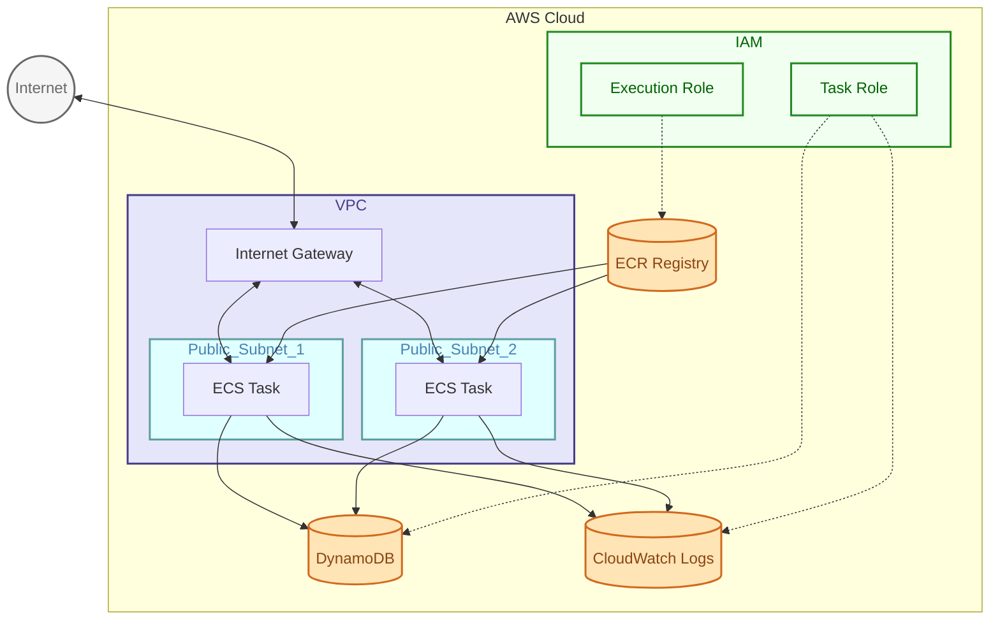
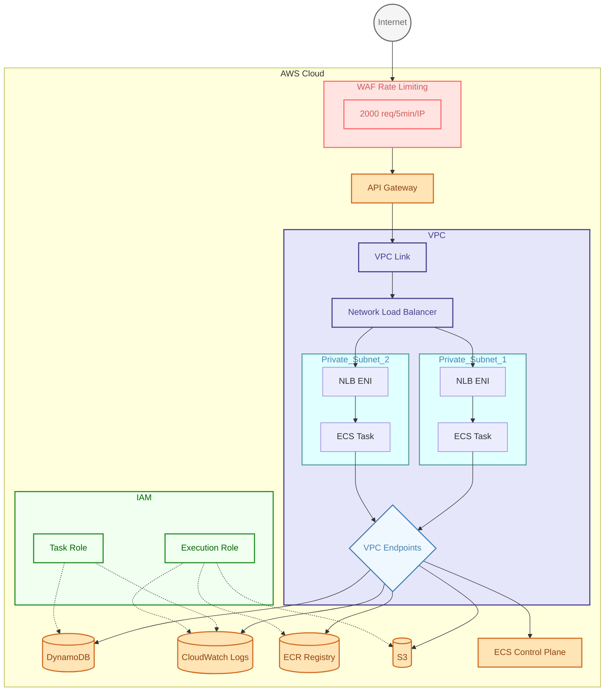
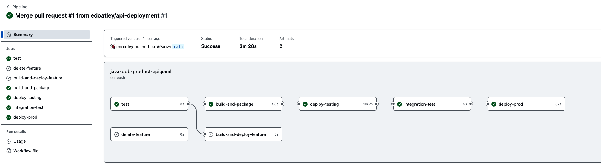
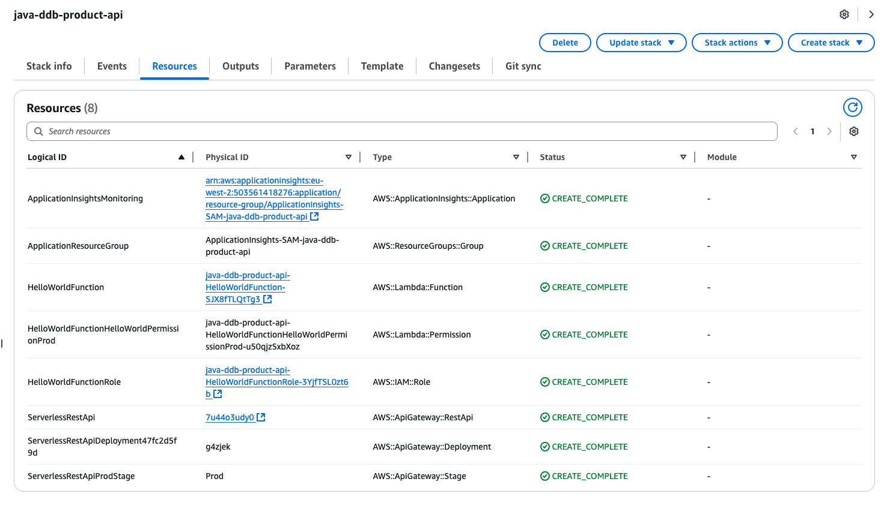
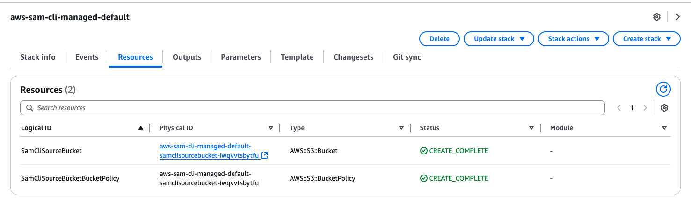
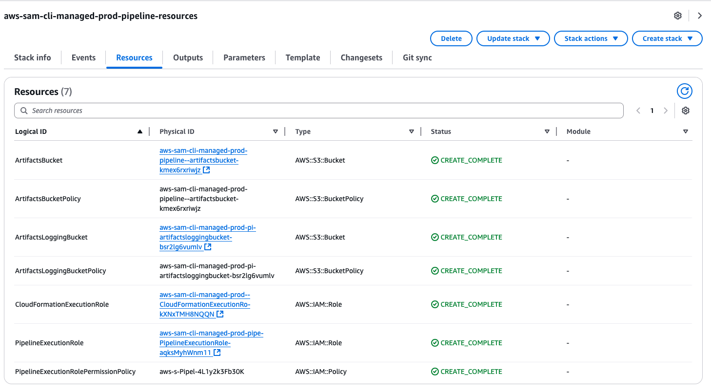
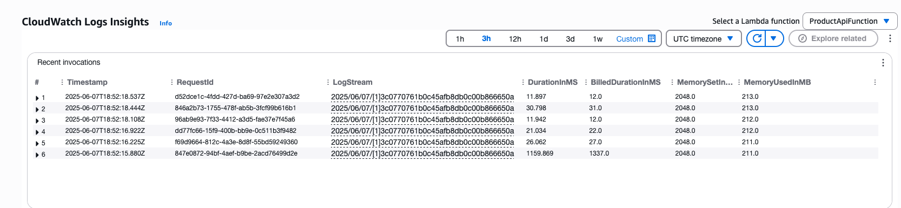
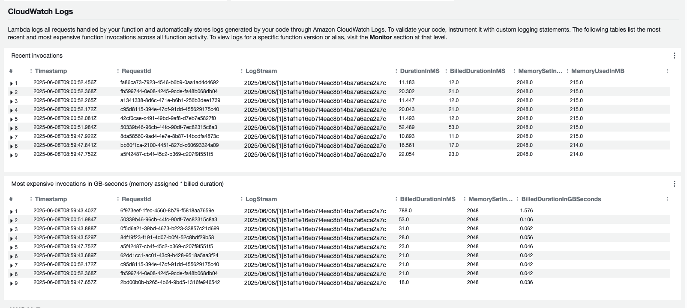
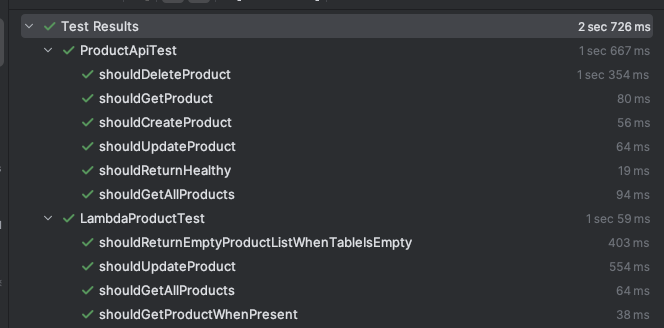
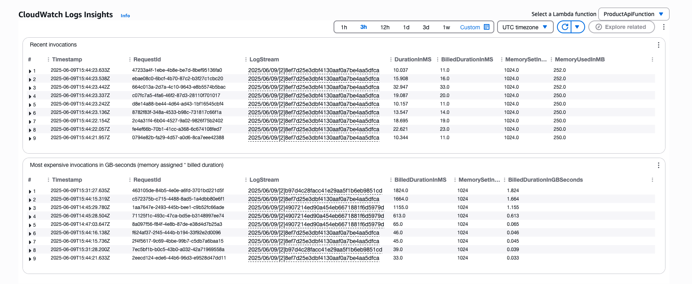

# API Deployment on AWS

<!-- TOC -->
* [API Deployment on AWS](#api-deployment-on-aws)
  * [Introduction](#introduction)
  * [Deployment using ECS](#deployment-using-ecs)
    * [Simplistic implementation](#simplistic-implementation)
      * [Architecture Diagram](#architecture-diagram)
    * [More Private Implementation](#more-private-implementation)
      * [Architectural Diagram](#architectural-diagram)
  * [Deployment using lambda](#deployment-using-lambda)
    * [AWS Serverless Application Model (SAM)](#aws-serverless-application-model-sam)
      * [Step 1 - sam init](#step-1---sam-init)
      * [Step 2 - sam pipeline init --bootstrap](#step-2---sam-pipeline-init---bootstrap)
      * [Step 2 - sam validate](#step-2---sam-validate)
      * [Step 3 - deploy and check lambda](#step-3---deploy-and-check-lambda)
      * [Step 4 - test the API](#step-4---test-the-api)
      * [Step 5 - update the Hello world API to function like the product API](#step-5---update-the-hello-world-api-to-function-like-the-product-api)
    * [Lambda using a Spring Cloud Function app](#lambda-using-a-spring-cloud-function-app)
      * [Step 1 - Set up a basic gradle project](#step-1---set-up-a-basic-gradle-project)
      * [Step 2 - copy the relevant code from `boot-ddb-product-api`](#step-2---copy-the-relevant-code-from-boot-ddb-product-api)
      * [Step 3 - implement the function / handler](#step-3---implement-the-function--handler)
      * [Step 4 - Fix up sam template](#step-4---fix-up-sam-template)
      * [Step 5 - Test locally](#step-5---test-locally)
      * [Step 6 - Troubleshoot the sam build](#step-6---troubleshoot-the-sam-build)
      * [Step 7 - Rerun local tests](#step-7---rerun-local-tests)
      * [Step 7 - Closing notes](#step-7---closing-notes)
        * [JARs](#jars)
        * [Performance](#performance)
    * [Spring Cloud Function app with SnapStart and `sam local start-api`](#spring-cloud-function-app-with-snapstart-and-sam-local-start-api)
      * [1. Fixing local performance](#1-fixing-local-performance)
      * [2. Framework & Code Optimizations (Good Hygiene)](#2-framework--code-optimizations-good-hygiene)
      * [3. SnapStart for remote performance](#3-snapstart-for-remote-performance)
        * [Aside on memory usage](#aside-on-memory-usage)
      * [4. GraalVM](#4-graalvm)
    * [Direct/Minimalised migration of boot app](#directminimalised-migration-of-boot-app)
      * [Step 1 - Copy the source Spring Boot app](#step-1---copy-the-source-spring-boot-app)
      * [Step 2 - Configure 'Shaded' JAR](#step-2---configure-shaded-jar)
      * [Step 3 -](#step-3---)
  * [Conclusion](#conclusion)
<!-- TOC -->

## Introduction

Here we look at deploying a simple RESTful API to AWS. We will explore various different mechanisms to achieve this. 
The API is written using Spring boot and provides the following:

- `POST /api/v1/products` - Create a new product
- `GET /api/v1/products/{id}` - Retrieve a specific product by ID
- `GET /api/v1/products` - List all products
- `PUT /api/v1/products/{id}` - Update an existing product
- `DELETE /api/v1/products/{id}` - Delete a product by ID

The database is DynamoDB and these operations are tested in the script [test-api.sh](./api/scripts/test-api.sh)

## Deployment using ECS

Elastic Container Service (ECS) is a container orchestration service provided by AWS. It integrates easily with other AWS services such as:
- VPC
- IAM
- CloudWatch
- DynamoDB

In addition to the option of running your containers on ECS using EC2 VMs, ECS also supports both AWS Fargate for a serverless option. This can reduce operational burden and costs depending on the nature of the running container.

### Simplistic implementation

To get started I developed the cloudformation template [ecs-deploy.cfn](ecs-deployments/cloudformation/ecs-deploy.cfn) which has the following resources:

- Network Resources
    - VPC
    - 2 Public Subnets - In different AZs for high availability
    - Internet Gateway - Allows internet access
    - Route Table - Routes traffic through IGW
- Container Infrastructure
    - ECS Cluster - Manages Fargate tasks
    - Task Definition 
      - image from ECR
      - cloudwatch logging
      -  health check on /actuator/health
      -  fargate launch type
      -  configuration (environment variables)
      -  IAM roles links 
- ECS Service
    - Defined to runs in public subnets
    - Public IP enabled
    - Security group to allow traffic in on port 8080 and out - not best practice but this is a simple getting started config
- DynamoDB Table 
  - Hash key on `id`
  - Pay-per-request billing
  - Accessed by ECS tasks via TaskRole
- Security - IAM Roles
    - ExecutionRole - Allows ECS to pull images and create logs
    - TaskRole - Allows containers to access DynamoDB and CloudWatch

#### Architecture Diagram



With the infrastructure defined we can now deploy and test via script:

```bash
cd ecs-deployments/scripts
# Cloudformation Deployment:
./deploy.sh ecs-deploy
# Testing:
./ecs-api-test.sh
```

### More Private Implementation

The cloudformation template [ecs-deploy-private.cfn](ecs-deployments/cloudformation/ecs-deploy-private.cfn) improves security and adds API Gateway integration with these resources:

- Network Resources
    - VPC
    - 2 Private Subnets - For ECS tasks
    - Network Load Balancer - to share load across the ECS tasks
    - Private Route Tables - private subnet -> VPC Endpoint routing
- Container Infrastructure
    - ECS Cluster - Manages Fargate tasks
    - Task Definition 
      - Image from ECR
      - CloudWatch logging
      - Health check on /actuator/health
      - Fargate launch type
      - Environment variables
      - IAM role links
- API Gateway - for now simply provides a public endpoint and proxies traffic to the NLB
- DynamoDB Table - as above
- ECS Service
    - Defined to runs in private subnets
    - Public IP disabled
- VPC Endpoints (PrivateLink)
    - DynamoDB Gateway endpoint
    - ECR API/Docker endpoints
    - Logs - S3 / Cloudwatch
- Security
    - IAM Roles
      - ExecutionRole - Pull images and create logs
      - TaskRole - Access DynamoDB and CloudWatch
    - Security Groups
      - ECS & VPC Endpoints - Only allow inbound only from VPC
    - WAF Rate Limiting
      - 2000 requests per 5 minutes per IP

This implementation improves on the basic version by:

1. Isolating ECS tasks in private subnets
2. Adding API Gateway as a managed API layer
3. Using VPC endpoints for private AWS service access
  - interface endpoints that create an ENI in the subnets to access AWS services over a private IP
  - gateway endpoints for S3 and dynamo that rely on route tables to route the traffic privately despite referencing the public IPs of those services
4. Implementing basic rate limiting via WAF
5. Providing cross AZ load balancing across the ECS tasks

The network flow is as follows:

```text
Client -> Internet -> API Gateway -> VPC Link -> Private NLB -> ECS Tasks (across AZs)
```

#### Architectural Diagram



Though this deployment is much better than the basic one it still has a number of shortcomings most notably the 
API Gateway deployment should leverage robust authentication & authorization, likely using a Cognito user pool.

These shortcomings could be addressed in a future iteration

## Deployment using lambda

Next we are going to explore doing the same thing using AWS Lambda which should simplify things significantly for such a basic application.
To simplify things further we will use some pre-baked serverless patterns described on [serverlessland](https://serverlessland.com/patterns/)

### AWS Serverless Application Model (SAM)

According to the documentation:

> AWS Serverless Application Model (AWS SAM) is an open-source framework for building serverless applications using infrastructure as code (IaC).

Here we will try from scratch to create a lambda application using AWS SAM

#### Step 1 - sam init

To get started we install SAM as per the [documentation](https://docs.aws.amazon.com/serverless-application-model/latest/developerguide/install-sam-cli.html) and run `sam init` which then proceeds with an interactive workflow:

```text
Which template source would you like to use? 1 - AWS Quick Start Templates
Choose an AWS Quick Start application template: 1 - Hello World Example
Use the most popular runtime and package type? (python3.13 and zip) [y/N]: n
Which runtime would you like to use?: 7 - java21
What package type would you like to use?: 1 - Zip
Which dependency manager would you like to use?: 1 - gradle
Would you like to enable X-Ray tracing on the function(s) in your application? [y/N]: y
Would you like to enable monitoring using CloudWatch Application Insights? [y/N]: y
Would you like to set Structured Logging in JSON format on your Lambda functions? [y/N]:  y
Project name [sam-app]: java-ddb-product-api
```

This then works some magic and creates the application structure for you with the following displayed in the terminal:

```text
    -----------------------
    Generating application:
    -----------------------
    Name: java-ddb-product-api
    Runtime: java21
    Architectures: x86_64
    Dependency Manager: gradle
    Application Template: hello-world
    Output Directory: .
    Configuration file: java-ddb-product-api/samconfig.toml
    
    Next steps can be found in the README file at java-ddb-product-api/README.md
        

Commands you can use next
=========================
[*] Create pipeline: cd java-ddb-product-api && sam pipeline init --bootstrap
[*] Validate SAM template: cd java-ddb-product-api && sam validate
[*] Test Function in the Cloud: cd java-ddb-product-api && sam sync --stack-name {stack-name} --watch
```

#### Step 2 - sam pipeline init --bootstrap

We want to run the deployment via a GH actions pipeline so we can initiate the deployment that via the command:

```bash
cd java-ddb-product-api && sam pipeline init --bootstrap 
```

which ran another interactive workflow (some bits removed for brevity/security):

```text
Select a pipeline template to get started: 1 - AWS Quick Start Pipeline Templates
Select CI/CD system: 3 - GitHub Actions

You are using the 2-stage pipeline template.
 _________    _________ 
|         |  |         |
| Stage 1 |->| Stage 2 |
|_________|  |_________|

Do you want to go through stage setup process now? [Y/n]: y

Stage 1 Setup

[1] Stage definition
Stage configuration name: dev

[2] Account details
Select a credential source to associate with this stage: 3
Associated account <AWS Acc ID> with configuration dev.
Enter the region in which you want these resources to be created [eu-west-2]: 
Select a user permissions provider: 1 - IAM (default)
Enter the pipeline IAM user ARN if you have previously created one, or we will create one for you []: 

[3] Reference application build resources
Enter the pipeline execution role ARN if you have previously created one, or we will create one for you []: 
Enter the CloudFormation execution role ARN if you have previously created one, or we will create one for you []: 
Please enter the artifact bucket ARN for your Lambda function. If you do not have a bucket, we will create one for you []: 
Does your application contain any IMAGE type Lambda functions? [y/N]: n

[4] Summary
Below is the summary of the answers:
        1 - Account: <AWS Acc ID>
        2 - Stage configuration name: dev
        3 - Region: eu-west-2
        4 - Pipeline user: [to be created]
        5 - Pipeline execution role: [to be created]
        6 - CloudFormation execution role: [to be created]
        7 - Artifacts bucket: [to be created]
        8 - ECR image repository: [skipped]
Press enter to confirm the values above, or select an item to edit the value: 

The following resources were created in your account:
        - Pipeline execution role
        - CloudFormation execution role
        - Artifact bucket
        - Pipeline IAM user

Stage 2 Setup

[1] Stage definition
Stage configuration name: prod

[2] Account details
Select a credential source to associate with this stage: 3
Associated account <AWS Acc ID> with configuration prod.
Enter the region in which you want these resources to be created [eu-west-2]: 

[3] Reference application build resources
Enter the pipeline execution role ARN if you have previously created one, or we will create one for you []: 
Enter the CloudFormation execution role ARN if you have previously created one, or we will create one for you []: 
Please enter the artifact bucket ARN for your Lambda function. If you do not have a bucket, we will create one for you []: 
Does your application contain any IMAGE type Lambda functions? [y/N]: n

[4] Summary
Below is the summary of the answers:
        1 - Account: <AWS Acc ID>
        2 - Stage configuration name: prod
        3 - Region: eu-west-2
        4 - Pipeline user ARN: arn:aws:iam::<AWS Acc ID>:user/aws-sam-cli-managed-dev-pipeline-resou-PipelineUser-ZHzmXqcFjxRG
        5 - Pipeline execution role: [to be created]
        6 - CloudFormation execution role: [to be created]
        7 - Artifacts bucket: [to be created]
        8 - ECR image repository: [skipped]
Press enter to confirm the values above, or select an item to edit the value: 

The following resources were created in your account:
        - Pipeline execution role
        - CloudFormation execution role
        - Artifact bucket

This template configures a pipeline that deploys a serverless application to a testing and a production stage.

What is the GitHub secret name for pipeline user account access key ID? [AWS_ACCESS_KEY_ID]: SAM_AWS_ACCESS_KEY_ID_1
What is the GitHub Secret name for pipeline user account access key secret? [AWS_SECRET_ACCESS_KEY]: SAM_AWS_SECRET_ACCESS_KEY_1
What is the git branch used for production deployments? [main]: 
What is the template file path? [template.yaml]: api-deployment/sam/java-ddb-product-api/template.yaml
We use the stage configuration name to automatically retrieve the bootstrapped resources created when you ran `sam pipeline bootstrap`.

Here are the stage configuration names detected in .aws-sam/pipeline/pipelineconfig.toml:
        1 - dev
        2 - prod
Select an index or enter the stage 1's configuration name (as provided during the bootstrapping): 1
What is the sam application stack name for stage 1? [sam-app]: sam-java-ddb-product-api-dev
Stage 1 configured successfully, configuring stage 2.

Here are the stage configuration names detected in .aws-sam/pipeline/pipelineconfig.toml:
        1 - dev
        2 - prod
Select an index or enter the stage 2's configuration name (as provided during the bootstrapping): 2
What is the sam application stack name for stage 2? [sam-app]: sam-java-ddb-product-api-prod
Stage 2 configured successfully.

SUMMARY
We will generate a pipeline config file based on the following information:
        Select a user permissions provider.: AWS IAM
        What is the GitHub secret name for pipeline user account access key ID?: SAM_AWS_ACCESS_KEY_ID_1
        What is the GitHub Secret name for pipeline user account access key secret?: SAM_AWS_SECRET_ACCESS_KEY_1
        What is the git branch used for production deployments?: main
        What is the template file path?: api-deployment/sam/java-ddb-product-api/template.yaml
        Select an index or enter the stage 1's configuration name (as provided during the bootstrapping): 1
        What is the sam application stack name for stage 1?: sam-java-ddb-product-api-dev
        What is the pipeline execution role ARN for stage 1?: arn:aws:iam::<AWS Acc ID>:role/aws-sam-cli-managed-dev-pipel-PipelineExecutionRole-8ZelUvsUDiJN
        What is the CloudFormation execution role ARN for stage 1?: arn:aws:iam::<AWS Acc ID>:role/aws-sam-cli-managed-dev-p-CloudFormationExecutionRo-Xik3IuCAnyTL
        What is the S3 bucket name for artifacts for stage 1?: aws-sam-cli-managed-dev-pipeline-r-artifactsbucket-xkn3f3fg8zin
        What is the ECR repository URI for stage 1?: 
        What is the AWS region for stage 1?: eu-west-2
        Select an index or enter the stage 2's configuration name (as provided during the bootstrapping): 2
        What is the sam application stack name for stage 2?: sam-java-ddb-product-api-prod
        What is the pipeline execution role ARN for stage 2?: arn:aws:iam::<AWS Acc ID>:role/aws-sam-cli-managed-prod-pipe-PipelineExecutionRole-aqksMyhWnm11
        What is the CloudFormation execution role ARN for stage 2?: arn:aws:iam::<AWS Acc ID>:role/aws-sam-cli-managed-prod--CloudFormationExecutionRo-kXNxTMH8NQQN
        What is the S3 bucket name for artifacts for stage 2?: aws-sam-cli-managed-prod-pipeline--artifactsbucket-kmex6rxriwjz
        What is the ECR repository URI for stage 2?: 
        What is the AWS region for stage 2?: eu-west-2
Successfully created the pipeline configuration file(s):
        - .github/workflows/pipeline.yaml
```

I then moved this to the root of the repo:

```bash
mv .github/workflows/pipeline.yaml <repo root>/.github/workflows/java-ddb-product-api.yaml
```

#### Step 2 - sam validate

Before proceeding further we can validate the template:

```bash
sam validate
/Users/edoatley/source/aws-notes/api-deployment/sam/java-ddb-product-api/template.yaml is a valid SAM Template
```

#### Step 3 - deploy and check lambda

Firstly we can commit the code to main to check the pipeline works. On doing this a workflow triggered in GitHub:



Secondly we can run a build locally:

```bash
❯ sam build                                                                                                                                                                                                                                                                                                              12:47:19
sam deploy --guided
Starting Build use cache                                                                                                                                                                                                                                                                                                                                                                                                         
Cache is invalid, running build and copying resources for following functions (HelloWorldFunction)                                                                                                                                                                                                                                                                                                                               
Building codeuri: /Users/edoatley/source/aws-notes/api-deployment/sam/java-ddb-product-api/HelloWorldFunction runtime: java21 architecture: x86_64 functions: HelloWorldFunction                                                                                                                                                                                                                                                 
 Running JavaGradleWorkflow:GradleBuild                                                                                                                                                                                                                                                                                                                                                                                          
 Running JavaGradleWorkflow:JavaGradleCopyArtifacts                                                                                                                                                                                                                                                                                                                                                                              
 Running JavaGradleWorkflow:CleanUp                                                                                                                                                                                                                                                                                                                                                                                              
 Running JavaGradleWorkflow:JavaCopyDependencies                                                                                                                                                                                                                                                                                                                                                                                 

Build Succeeded

Built Artifacts  : .aws-sam/build
Built Template   : .aws-sam/build/template.yaml

Commands you can use next
=========================
[*] Validate SAM template: sam validate
[*] Invoke Function: sam local invoke
[*] Test Function in the Cloud: sam sync --stack-name {{stack-name}} --watch
[*] Deploy: sam deploy --guided

Configuring SAM deploy
======================

        Looking for config file [samconfig.toml] :  Found
        Reading default arguments  :  Success

        Setting default arguments for 'sam deploy'
        =========================================
        Stack Name [java-ddb-product-api]: 
        AWS Region [eu-west-2]: 
        #Shows you resources changes to be deployed and require a 'Y' to initiate deploy
        Confirm changes before deploy [Y/n]: n
        #SAM needs permission to be able to create roles to connect to the resources in your template
        Allow SAM CLI IAM role creation [Y/n]: y
        #Preserves the state of previously provisioned resources when an operation fails
        Disable rollback [y/N]: 
        HelloWorldFunction has no authentication. Is this okay? [y/N]: y
        Save arguments to configuration file [Y/n]: y
        SAM configuration file [samconfig.toml]: 
        SAM configuration environment [default]: local

        Looking for resources needed for deployment:
        Creating the required resources...
        Successfully created!

        Managed S3 bucket: aws-sam-cli-managed-default-samclisourcebucket-iwqvvtsbytfu
        Auto resolution of buckets can be turned off by setting resolve_s3=False
        To use a specific S3 bucket, set --s3-bucket=<bucket_name>
        Above settings can be stored in samconfig.toml

        Saved arguments to config file
        Running 'sam deploy' for future deployments will use the parameters saved above.
        The above parameters can be changed by modifying samconfig.toml
        Learn more about samconfig.toml syntax at 
        https://docs.aws.amazon.com/serverless-application-model/latest/developerguide/serverless-sam-cli-config.html

        Uploading to java-ddb-product-api/93c7d69105961b6385a3429bc37c18a5  875089 / 875089  (100.00%)

        Deploying with following values
        ===============================
        Stack name                   : java-ddb-product-api
        Region                       : eu-west-2
        Confirm changeset            : False
        Disable rollback             : False
        Deployment s3 bucket         : aws-sam-cli-managed-default-samclisourcebucket-iwqvvtsbytfu
        Capabilities                 : ["CAPABILITY_IAM"]
        Parameter overrides          : {}
        Signing Profiles             : {}

Initiating deployment
=====================

        Uploading to java-ddb-product-api/f7d4ea2596068f27406c8df4821ad23c.template  1960 / 1960  (100.00%)


Waiting for changeset to be created..

CloudFormation stack changeset
-----------------------------------------------------------------------------------------------------------------------------------------------------------------------------------------------------------------------------------------------------------------------------------------------------------------------------------------------------------------------------------------------------------------------------
Operation                                                                                               LogicalResourceId                                                                                       ResourceType                                                                                            Replacement                                                                                           
-----------------------------------------------------------------------------------------------------------------------------------------------------------------------------------------------------------------------------------------------------------------------------------------------------------------------------------------------------------------------------------------------------------------------------
+ Add                                                                                                   ApplicationInsightsMonitoring                                                                           AWS::ApplicationInsights::Application                                                                   N/A                                                                                                   
+ Add                                                                                                   ApplicationResourceGroup                                                                                AWS::ResourceGroups::Group                                                                              N/A                                                                                                   
+ Add                                                                                                   HelloWorldFunctionHelloWorldPermissionProd                                                              AWS::Lambda::Permission                                                                                 N/A                                                                                                   
+ Add                                                                                                   HelloWorldFunctionRole                                                                                  AWS::IAM::Role                                                                                          N/A                                                                                                   
+ Add                                                                                                   HelloWorldFunction                                                                                      AWS::Lambda::Function                                                                                   N/A                                                                                                   
+ Add                                                                                                   ServerlessRestApiDeployment47fc2d5f9d                                                                   AWS::ApiGateway::Deployment                                                                             N/A                                                                                                   
+ Add                                                                                                   ServerlessRestApiProdStage                                                                              AWS::ApiGateway::Stage                                                                                  N/A                                                                                                   
+ Add                                                                                                   ServerlessRestApi                                                                                       AWS::ApiGateway::RestApi                                                                                N/A                                                                                                   
-----------------------------------------------------------------------------------------------------------------------------------------------------------------------------------------------------------------------------------------------------------------------------------------------------------------------------------------------------------------------------------------------------------------------------


Changeset created successfully. arn:aws:cloudformation:eu-west-2:503561418276:changeSet/samcli-deploy1748173812/2745b667-0bac-4663-afa5-049aca70a253


2025-05-25 12:50:17 - Waiting for stack create/update to complete

CloudFormation events from stack operations (refresh every 5.0 seconds)
-----------------------------------------------------------------------------------------------------------------------------------------------------------------------------------------------------------------------------------------------------------------------------------------------------------------------------------------------------------------------------------------------------------------------------
ResourceStatus                                                                                          ResourceType                                                                                            LogicalResourceId                                                                                       ResourceStatusReason                                                                                  
-----------------------------------------------------------------------------------------------------------------------------------------------------------------------------------------------------------------------------------------------------------------------------------------------------------------------------------------------------------------------------------------------------------------------------
CREATE_IN_PROGRESS                                                                                      AWS::CloudFormation::Stack                                                                              java-ddb-product-api                                                                                    User Initiated                                                                                        
CREATE_IN_PROGRESS                                                                                      AWS::IAM::Role                                                                                          HelloWorldFunctionRole                                                                                  -                                                                                                     
CREATE_IN_PROGRESS                                                                                      AWS::ResourceGroups::Group                                                                              ApplicationResourceGroup                                                                                -                                                                                                     
CREATE_IN_PROGRESS                                                                                      AWS::ResourceGroups::Group                                                                              ApplicationResourceGroup                                                                                Resource creation Initiated                                                                           
CREATE_IN_PROGRESS                                                                                      AWS::IAM::Role                                                                                          HelloWorldFunctionRole                                                                                  Resource creation Initiated                                                                           
CREATE_COMPLETE                                                                                         AWS::ResourceGroups::Group                                                                              ApplicationResourceGroup                                                                                -                                                                                                     
CREATE_IN_PROGRESS                                                                                      AWS::ApplicationInsights::Application                                                                   ApplicationInsightsMonitoring                                                                           -                                                                                                     
CREATE_IN_PROGRESS                                                                                      AWS::ApplicationInsights::Application                                                                   ApplicationInsightsMonitoring                                                                           Resource creation Initiated                                                                           
CREATE_COMPLETE                                                                                         AWS::IAM::Role                                                                                          HelloWorldFunctionRole                                                                                  -                                                                                                     
CREATE_IN_PROGRESS                                                                                      AWS::Lambda::Function                                                                                   HelloWorldFunction                                                                                      -                                                                                                     
CREATE_IN_PROGRESS                                                                                      AWS::Lambda::Function                                                                                   HelloWorldFunction                                                                                      Resource creation Initiated                                                                           
CREATE_IN_PROGRESS - CONFIGURATION_COMPLETE                                                             AWS::Lambda::Function                                                                                   HelloWorldFunction                                                                                      Eventual consistency check initiated                                                                  
CREATE_IN_PROGRESS                                                                                      AWS::ApiGateway::RestApi                                                                                ServerlessRestApi                                                                                       -                                                                                                     
CREATE_IN_PROGRESS                                                                                      AWS::ApiGateway::RestApi                                                                                ServerlessRestApi                                                                                       Resource creation Initiated                                                                           
CREATE_COMPLETE                                                                                         AWS::ApiGateway::RestApi                                                                                ServerlessRestApi                                                                                       -                                                                                                     
CREATE_IN_PROGRESS                                                                                      AWS::Lambda::Permission                                                                                 HelloWorldFunctionHelloWorldPermissionProd                                                              -                                                                                                     
CREATE_IN_PROGRESS                                                                                      AWS::ApiGateway::Deployment                                                                             ServerlessRestApiDeployment47fc2d5f9d                                                                   -                                                                                                     
CREATE_IN_PROGRESS                                                                                      AWS::Lambda::Permission                                                                                 HelloWorldFunctionHelloWorldPermissionProd                                                              Resource creation Initiated                                                                           
CREATE_IN_PROGRESS                                                                                      AWS::ApiGateway::Deployment                                                                             ServerlessRestApiDeployment47fc2d5f9d                                                                   Resource creation Initiated                                                                           
CREATE_COMPLETE                                                                                         AWS::Lambda::Permission                                                                                 HelloWorldFunctionHelloWorldPermissionProd                                                              -                                                                                                     
CREATE_COMPLETE                                                                                         AWS::ApiGateway::Deployment                                                                             ServerlessRestApiDeployment47fc2d5f9d                                                                   -                                                                                                     
CREATE_COMPLETE                                                                                         AWS::Lambda::Function                                                                                   HelloWorldFunction                                                                                      -                                                                                                     
CREATE_IN_PROGRESS                                                                                      AWS::ApiGateway::Stage                                                                                  ServerlessRestApiProdStage                                                                              -                                                                                                     
CREATE_IN_PROGRESS                                                                                      AWS::ApiGateway::Stage                                                                                  ServerlessRestApiProdStage                                                                              Resource creation Initiated                                                                           
CREATE_IN_PROGRESS - CONFIGURATION_COMPLETE                                                             AWS::ApplicationInsights::Application                                                                   ApplicationInsightsMonitoring                                                                           Eventual consistency check initiated                                                                  
CREATE_COMPLETE                                                                                         AWS::ApplicationInsights::Application                                                                   ApplicationInsightsMonitoring                                                                           -                                                                                                     
CREATE_COMPLETE                                                                                         AWS::ApiGateway::Stage                                                                                  ServerlessRestApiProdStage                                                                              -                                                                                                     
CREATE_COMPLETE                                                                                         AWS::CloudFormation::Stack                                                                              java-ddb-product-api                                                                                    -                                                                                                     
-----------------------------------------------------------------------------------------------------------------------------------------------------------------------------------------------------------------------------------------------------------------------------------------------------------------------------------------------------------------------------------------------------------------------------

CloudFormation outputs from deployed stack
------------------------------------------------------------------------------------------------------------------------------------------------------------------------------------------------------------------------------------------------------------------------------------------------------------------------------------------------------------------------------------------------------------------------------
Outputs                                                                                                                                                                                                                                                                                                                                                                                                                      
------------------------------------------------------------------------------------------------------------------------------------------------------------------------------------------------------------------------------------------------------------------------------------------------------------------------------------------------------------------------------------------------------------------------------
Key                 HelloWorldFunctionIamRole                                                                                                                                                                                                                                                                                                                                                                                
Description         Implicit IAM Role created for Hello World function                                                                                                                                                                                                                                                                                                                                                       
Value               arn:aws:iam::503561418276:role/java-ddb-product-api-HelloWorldFunctionRole-3YjfTSL0zt6b                                                                                                                                                                                                                                                                                                                  

Key                 HelloWorldApi                                                                                                                                                                                                                                                                                                                                                                                            
Description         API Gateway endpoint URL for Prod stage for Hello World function                                                                                                                                                                                                                                                                                                                                         
Value               https://7u44o3udy0.execute-api.eu-west-2.amazonaws.com/Prod/hello/                                                                                                                                                                                                                                                                                                                                       

Key                 HelloWorldFunction                                                                                                                                                                                                                                                                                                                                                                                       
Description         Hello World Lambda Function ARN                                                                                                                                                                                                                                                                                                                                                                          
Value               arn:aws:lambda:eu-west-2:503561418276:function:java-ddb-product-api-HelloWorldFunction-SJX8fTLQtTg3                                                                                                                                                                                                                                                                                                      
------------------------------------------------------------------------------------------------------------------------------------------------------------------------------------------------------------------------------------------------------------------------------------------------------------------------------------------------------------------------------------------------------------------------------


Successfully created/updated stack - java-ddb-product-api in eu-west-2
```

Looking at what has been created we can look at CloudFormation:

```bash
aws cloudformation list-stacks --region eu-west-2 --stack-status-filter CREATE_COMPLETE --output table
# amended the output to remove some extraneous detail
+-----------------------------------------------------------------------------------------------------------------------------------------------------------------+
||                                                                        StackSummaries                                                                         ||
|+-------------------------+-------------------------------------------------------------------------------------------------------------------------------------+|
||  CreationTime           |  2025-05-25T11:50:12.437000+00:00                                                                                                   ||
||  LastUpdatedTime        |  2025-05-25T11:50:17.821000+00:00                                                                                                   ||
||  StackId                |  arn:aws:cloudformation:eu-west-2:503561418276:stack/java-ddb-product-api/6a6a8440-395e-11f0-8bba-06f845de0133                      ||
||  StackName              |  java-ddb-product-api                                                                                                               ||
||  StackStatus            |  CREATE_COMPLETE                                                                                                                    ||
||  TemplateDescription    |  java-ddb-product-api
|+------------------------+--------------------------------------------------------------------------------------------------------------------------------------+|
||  CreationTime          |  2025-05-25T11:49:25.286000+00:00                                                                                                    ||
||  LastUpdatedTime       |  2025-05-25T11:49:40.737000+00:00                                                                                                    ||
||  StackId               |  arn:aws:cloudformation:eu-west-2:503561418276:stack/aws-sam-cli-managed-default/4e568f10-395e-11f0-9b9f-02403da432b3                ||
||  StackName             |  aws-sam-cli-managed-default                                                                                                         ||
||  StackStatus           |  CREATE_COMPLETE                                                                                                                     ||
||  TemplateDescription   |  Managed Stack for AWS SAM CLI                                                                                                       ||
|+------------------------+--------------------------------------------------------------------------------------------------------------------------------------+|
|+------------------------+--------------------------------------------------------------------------------------------------------------------------------------+|
||  CreationTime          |  2025-05-25T11:48:48.791000+00:00                                                                                                    ||
||  LastUpdatedTime       |  2025-05-25T11:48:54.520000+00:00                                                                                                    ||
||  StackId               |  arn:aws:cloudformation:eu-west-2:503561418276:stack/sam-java-ddb-product-api-prod/38898110-395e-11f0-bfc9-027355a9c2b9              ||
||  StackName             |  sam-java-ddb-product-api-prod                                                                                                       ||
||  StackStatus           |  CREATE_COMPLETE                                                                                                                     ||
||  TemplateDescription   |  java-ddb-product-api                                                                                                                ||
|+------------------------+--------------------------------------------------------------------------------------------------------------------------------------+|
||  CreationTime          |  2025-05-25T11:47:28.918000+00:00                                                                                                    ||
||  LastUpdatedTime       |  2025-05-25T11:47:34.712000+00:00                                                                                                    ||
||  StackId               |  arn:aws:cloudformation:eu-west-2:503561418276:stack/sam-java-ddb-product-api-dev/08eb41f0-395e-11f0-8db6-060b56d3a3dd               ||
||  StackName             |  sam-java-ddb-product-api-dev                                                                                                        ||
||  StackStatus           |  CREATE_COMPLETE                                                                                                                     ||
||  TemplateDescription   |  java-ddb-product-api                                                                                                                ||
|+------------------------+--------------------------------------------------------------------------------------------------------------------------------------+|
|+---------------------+-----------------------------------------------------------------------------------------------------------------------------------------+|
||  CreationTime       |  2025-05-25T11:16:09.052000+00:00                                                                                                       ||
||  LastUpdatedTime    |  2025-05-25T11:16:24.512000+00:00                                                                                                       ||
||  StackId            |  arn:aws:cloudformation:eu-west-2:503561418276:stack/aws-sam-cli-managed-prod-pipeline-resources/a87b4990-3959-11f0-9ff9-061e7c95a79b   ||
||  StackName          |  aws-sam-cli-managed-prod-pipeline-resources                                                                                            ||
||  StackStatus        |  CREATE_COMPLETE                                                                                                                        ||
||  TemplateDescription|                                                                                                                                         ||
|+---------------------+-----------------------------------------------------------------------------------------------------------------------------------------+|
||  CreationTime       |  2025-05-25T11:13:49.662000+00:00                                                                                                       ||
||  LastUpdatedTime    |  2025-05-25T11:14:05.127000+00:00                                                                                                       ||
||  StackId            |  arn:aws:cloudformation:eu-west-2:503561418276:stack/aws-sam-cli-managed-dev-pipeline-resources/5566d300-3959-11f0-bc94-0286de70d613    ||
||  StackName          |  aws-sam-cli-managed-dev-pipeline-resources                                                                                             ||
||  StackStatus        |  CREATE_COMPLETE                                                                                                                        ||
||  TemplateDescription|                                                                                                                                         ||
|+---------------------+-----------------------------------------------------------------------------------------------------------------------------------------+|
```

So we now have a stack for the local, dev and prod stacks plus one for the aws sam cli and a dev and prod pipeline resources one. The API ones look like this:



while the sam cli one looks like this:



and the pipeline resources like this:



#### Step 4 - test the API

Now we have the locally deployed plus the dev and prod stages deployed via the GitHub actions we can try to test them.

Firstly we need the endpoints to test via API Gateway
```bash
for stack in $(aws cloudformation list-stacks --region eu-west-2 --stack-status-filter CREATE_COMPLETE --query "StackSummaries[*].{StackName: StackName}" --output text); do
  ep=$(aws cloudformation describe-stacks --stack-name "${stack}" \
    --query "Stacks[0].{HelloWorldApi: Outputs[?OutputKey=='HelloWorldApi'].OutputValue, HelloWorldFunction: Outputs[?OutputKey=='HelloWorldFunction'].OutputValue}" \
    --output text \
    --region eu-west-2)
  echo $ep
done
```

Which is a bit clunky but gives this:

```output
HELLOWORLDAPI           https://7u44o3udy0.execute-api.eu-west-2.amazonaws.com/Prod/hello/
HELLOWORLDFUNCTION      arn:aws:lambda:eu-west-2:503561418276:function:java-ddb-product-api-HelloWorldFunction-SJX8fTLQtTg3
HELLOWORLDAPI           https://4ck52bvc5k.execute-api.eu-west-2.amazonaws.com/Prod/hello/
HELLOWORLDFUNCTION      arn:aws:lambda:eu-west-2:503561418276:function:sam-java-ddb-product-api-prod-HelloWorldFunction-xHHYGrg1JVE9
HELLOWORLDAPI           https://09ro33fp8l.execute-api.eu-west-2.amazonaws.com/Prod/hello/
HELLOWORLDFUNCTION      arn:aws:lambda:eu-west-2:503561418276:function:sam-java-ddb-product-api-dev-HelloWorldFunction-MvarrmekKyql
```

So lets start eacy and just curl the endpoints:

```text
api_identifiers=(7u44o3udy0 4ck52bvc5k 09ro33fp8l)
for api_id in "${api_identifiers[@]}"; do
  echo "Testing ${api_id}:"
  curl -sX GET "https://${api_id}.execute-api.eu-west-2.amazonaws.com/Prod/hello/" | jq
done
```

Which works nicely giving:

```output
Testing 7u44o3udy0:
{
  "message": "hello world",
  "location": "35.177.124.4"
}
Testing 4ck52bvc5k:
{
  "message": "hello world",
  "location": "18.175.177.35"
}
Testing 09ro33fp8l:
{
  "message": "hello world",
  "location": "18.134.155.168"
}
```

Now to invoke the lambda functions directly. Firstly we create a minimal [event](./sam/java-ddb-product-api/events/hello.json)

We can test this event  locally with:

```bash
# Replace HelloWorldFunction with the logical ID from your template.yaml
sam local invoke HelloWorldFunction -e event.json-e events/hello.json  --region eu-west-2    
Invoking helloworld.App::handleRequest (java21)                                                                                                                                                                                                                                                                                                                                                                                  
Local image was not found.                                                                                                                                                                                                                                                                                                                                                                                                       
Removing rapid images for repo public.ecr.aws/sam/emulation-java21                                                                                                                                                                                                                                                                                                                                                               
Building image........................
Using local image: public.ecr.aws/lambda/java:21-rapid-x86_64.                                                                                                                                                                                                                                                                                                                                                                   
                                                                                                                                                                                                                                                                                                                                                                                                                                 
Mounting /Users/edoatley/source/aws-notes/api-deployment/sam/java-ddb-product-api/.aws-sam/build/HelloWorldFunction as /var/task:ro,delegated, inside runtime container                                                                                                                                                                                                                                                          
START RequestId: 07024244-2819-49a8-8b7d-1b1ffca65a78 Version: $LATEST
END RequestId: 4f0ae3ae-97da-47f1-98f4-e7de1b1b4c48
REPORT RequestId: 4f0ae3ae-97da-47f1-98f4-e7de1b1b4c48  Init Duration: 0.08 ms  Duration: 1188.15 ms    Billed Duration: 1189 ms        Memory Size: 512 MB     Max Memory Used: 512 MB 
{"statusCode": 200, "headers": {"X-Custom-Header": "application/json", "Content-Type": "application/json"}, "body": "{ \"message\": \"hello world\", \"location\": \"84.71.84.203\" }"}
```

Finally we can invoke the functions already deployed to AWS using the HELLOWORLDFUNCTION values above

HELLOWORLDAPI           https://7u44o3udy0.execute-api.eu-west-2.amazonaws.com/Prod/hello/
HELLOWORLDFUNCTION      arn:aws:lambda:eu-west-2:503561418276:function:java-ddb-product-api-HelloWorldFunction-SJX8fTLQtTg3
HELLOWORLDAPI           https://4ck52bvc5k.execute-api.eu-west-2.amazonaws.com/Prod/hello/
HELLOWORLDFUNCTION      arn:aws:lambda:eu-west-2:503561418276:function:sam-java-ddb-product-api-prod-HelloWorldFunction-xHHYGrg1JVE9
HELLOWORLDAPI           https://09ro33fp8l.execute-api.eu-west-2.amazonaws.com/Prod/hello/
HELLOWORLDFUNCTION      arn:aws:lambda:eu-west-2:503561418276:function:sam-java-ddb-product-api-dev-HelloWorldFunction-MvarrmekKyql

```bash
stack_ids=( java-ddb-product-api sam-java-ddb-product-api-dev sam-java-ddb-product-api-prod)
FUNCTION_LOGICAL_ID="HelloWorldFunction" # From template.yaml
for sid in "${stack_ids[@]}"; do
    echo "Testing ${sid}"
    echo ""
    sam remote invoke "${FUNCTION_LOGICAL_ID}" \
        --event-file events/hello.json \
        --stack-name "${sid}" \
        --region eu-west-2 | jq '.body'
    echo ""
done        
```

#### Step 5 - update the Hello world API to function like the product API

Now we have the hello world version working, and we can test what we have it is time to amend our API to meet the contract we had in **boot-ddb-products-api**

The first step is to update the code to provide the endpoints we had and write a JUnit test which is all in `api-deployment/sam/java-ddb-product-api/ProductApiFunction`
and update the [template](./sam/java-ddb-product-api/template.yaml) to add the different paths:

```yaml
      Events:
        GetSpecificProduct:
          Type: Api
          Properties:
            Path: /api/v1/products/{id}
            Method: get
        GetAllProducts:
          Type: Api
          Properties:
            Path: /api/v1/products
            Method: get
        AddNewProduct:
          Type: Api
          Properties:
            Path: /api/v1/products
            Method: post
        UpdateProduct:
          Type: Api
          Properties:
            Path: /api/v1/products/{id}
            Method: put
        DeleteProduct:
          Type: Api
          Properties:
            Path: /api/v1/products/{id}
            Method: delete
```

and define the table and IAM role:

```yaml
      Policies:
        - DynamoDBCrudPolicy:
            TableName: !Ref ProductDDBTable

  ProductDDBTable:
    Type: AWS::Serverless::SimpleTable
    Properties:
      TableName: products
      PrimaryKey:
        Name: id
        Type: String
```

With the unit tests working and the template defined we can test locally by running `sam local invoke` which is scripted
in [local-test.sh](./sam/java-ddb-product-api/scripts/local-test.sh) which gives the following output (cleaned for clarity):

```output
  ~/source/aws-notes/api-deployment/sam/java-ddb-product-api   feature/sam-hello-world ⇡2 +5 !4 ❯ ./scripts/local-test.sh                                                                                                                                                                      47s  17:04:30
Building SAM application from: /Users/edoatley/source/aws-notes/api-deployment/sam/java-ddb-product-api                                                                                                                                                                                                             

Build Succeeded

Built Artifacts  : .aws-sam/build
Built Template   : .aws-sam/build/template.yaml

---------------------------------------------------------------------
Initial scan of DynamoDB table: products-local (first 5 items)
{"description":{"S":"An updated test product"},"id":{"S":"test-id-x"},"price":{"N":"19.99"},"name":{"S":"Updated Product"}}
{"description":{"S":"Description 2"},"id":{"S":"2"},"price":{"N":"149.99"},"name":{"S":"Product 2"}}
{"description":{"S":"Test Description"},"id":{"S":"1"},"price":{"N":"99.99"},"name":{"S":"Test Product"}}
{"description":{"S":"A fantastic product created via POST"},"id":{"S":"fe66d3f5-652f-40e9-9c8e-0d5724cfa394"},"price":{"N":"49.99"},"name":{"S":"Brand New Product"}}
---------------------------------------------------------------------

Testing POST new product using event file: events/post_product.json
---------------------------------------------------------------------
Invoking product.ProductApiFunctionHandler::handleRequest (java21)                                                                                                                                                                                                                                                 
Mounting /Users/edoatley/source/aws-notes/api-deployment/sam/java-ddb-product-api/.aws-sam/build/ProductApiFunction as /var/task:ro,delegated, inside runtime container                                                                                                                                            
START RequestId: 3e776bc2-282b-4332-bd85-b321d2f8a3a6 Version: $LATEST
SLF4J: Failed to load class "org.slf4j.impl.StaticLoggerBinder".
SLF4J: Defaulting to no-operation (NOP) logger implementation
SLF4J: See http://www.slf4j.org/codes.html#StaticLoggerBinder for further details.
{"timestamp":"2025-05-28T16:25:36.463Z","message":"Received POST request for path: /api/v1/products","level":"UNDEFINED","AWSRequestId":"fb68ed97-3b84-424b-96a0-a0bf2ee44a63"}
END RequestId: fb68ed97-3b84-424b-96a0-a0bf2ee44a63
REPORT RequestId: fb68ed97-3b84-424b-96a0-a0bf2ee44a63  Init Duration: 0.03 ms  Duration: 3229.50 ms    Billed Duration: 3230 ms        Memory Size: 512 MB     Max Memory Used: 512 MB 

POST Response:
{"statusCode": 201, "headers": {"Content-Type": "application/json"}, "body": "{\"id\":\"cd8239b8-e4fb-40db-babe-1832c58dec78\",\"name\":\"Brand New Product\",\"description\":\"A fantastic product created via POST\",\"price\":49.99}"}
---------------------------------------------------------------------

Captured PRODUCT_ID: cd8239b8-e4fb-40db-babe-1832c58dec78
---------------------------------------------------------------------

Testing GET specific product for ID: cd8239b8-e4fb-40db-babe-1832c58dec78
---------------------------------------------------------------------
Reading invoke payload from stdin (you can also pass it from file with --event)                                                                                                                                                                                                                                    
Invoking product.ProductApiFunctionHandler::handleRequest (java21)                                                                                                                                                                                                                                                 
Mounting /Users/edoatley/source/aws-notes/api-deployment/sam/java-ddb-product-api/.aws-sam/build/ProductApiFunction as /var/task:ro,delegated, inside runtime container                                                                                                                                            
START RequestId: 6af4971a-4188-4435-882a-e8460bafeff6 Version: $LATEST
SLF4J: Failed to load class "org.slf4j.impl.StaticLoggerBinder".
SLF4J: Defaulting to no-operation (NOP) logger implementation
SLF4J: See http://www.slf4j.org/codes.html#StaticLoggerBinder for further details.
{"timestamp":"2025-05-28T16:25:44.273Z","message":"Received GET request for path: /api/v1/products/cd8239b8-e4fb-40db-babe-1832c58dec78","level":"UNDEFINED","AWSRequestId":"7b15bcdd-89f6-4ee9-a4cf-801926238a79"}
{"timestamp":"2025-05-28T16:25:44.278Z","message":"Fetching product by ID: cd8239b8-e4fb-40db-babe-1832c58dec78","level":"UNDEFINED","AWSRequestId":"7b15bcdd-89f6-4ee9-a4cf-801926238a79"}
END RequestId: 7b15bcdd-89f6-4ee9-a4cf-801926238a79
REPORT RequestId: 7b15bcdd-89f6-4ee9-a4cf-801926238a79  Init Duration: 0.05 ms  Duration: 3134.36 ms    Billed Duration: 3135 ms        Memory Size: 512 MB     Max Memory Used: 512 MB 
{"statusCode": 200, "headers": {"Content-Type": "application/json"}, "body": "{\"id\":\"cd8239b8-e4fb-40db-babe-1832c58dec78\",\"name\":\"Brand New Product\",\"description\":\"A fantastic product created via POST\",\"price\":49.99}"}
---------------------------------------------------------------------

Testing PUT (update) specific product for ID: cd8239b8-e4fb-40db-babe-1832c58dec78
---------------------------------------------------------------------
Reading invoke payload from stdin (you can also pass it from file with --event)                                                                                                                                                                                                                                    
Invoking product.ProductApiFunctionHandler::handleRequest (java21)                                                                                                                                                                                                                                                 
Mounting /Users/edoatley/source/aws-notes/api-deployment/sam/java-ddb-product-api/.aws-sam/build/ProductApiFunction as /var/task:ro,delegated, inside runtime container                                                                                                                                            
START RequestId: 33f75b38-c9fd-46ee-bab6-34e068730d8c Version: $LATEST
SLF4J: Failed to load class "org.slf4j.impl.StaticLoggerBinder".
SLF4J: Defaulting to no-operation (NOP) logger implementation
SLF4J: See http://www.slf4j.org/codes.html#StaticLoggerBinder for further details.
{"timestamp":"2025-05-28T16:25:52.026Z","message":"Received PUT request for path: /api/v1/products/cd8239b8-e4fb-40db-babe-1832c58dec78","level":"UNDEFINED","AWSRequestId":"dfd1cd59-c5c4-4cdc-8901-4a8f63d0d15e"}
END RequestId: dfd1cd59-c5c4-4cdc-8901-4a8f63d0d15e
REPORT RequestId: dfd1cd59-c5c4-4cdc-8901-4a8f63d0d15e  Init Duration: 0.04 ms  Duration: 3377.81 ms    Billed Duration: 3378 ms        Memory Size: 512 MB     Max Memory Used: 512 MB 
{"statusCode": 200, "headers": {"Content-Type": "application/json"}, "body": "{\"id\":\"cd8239b8-e4fb-40db-babe-1832c58dec78\",\"name\":\"Updated Product\",\"description\":\"An updated test product\",\"price\":19.99}"}
---------------------------------------------------------------------

Testing GET ALL products using event file: events/get_all_products.json
---------------------------------------------------------------------
Invoking product.ProductApiFunctionHandler::handleRequest (java21)                                                                                                                                                                                                                                                 
Mounting /Users/edoatley/source/aws-notes/api-deployment/sam/java-ddb-product-api/.aws-sam/build/ProductApiFunction as /var/task:ro,delegated, inside runtime container                                                                                                                                            
START RequestId: 2530bac4-773a-4f13-884d-74dc22ea3684 Version: $LATEST
SLF4J: Failed to load class "org.slf4j.impl.StaticLoggerBinder".
SLF4J: Defaulting to no-operation (NOP) logger implementation
SLF4J: See http://www.slf4j.org/codes.html#StaticLoggerBinder for further details.
{"timestamp":"2025-05-28T16:25:59.833Z","message":"Received GET request for path: /api/v1/products","level":"UNDEFINED","AWSRequestId":"ae5c9f71-6593-4219-a071-163bf837cd7a"}
{"timestamp":"2025-05-28T16:25:59.839Z","message":"Fetching all products.","level":"UNDEFINED","AWSRequestId":"ae5c9f71-6593-4219-a071-163bf837cd7a"}
END RequestId: ae5c9f71-6593-4219-a071-163bf837cd7a
REPORT RequestId: ae5c9f71-6593-4219-a071-163bf837cd7a  Init Duration: 0.13 ms  Duration: 3152.17 ms    Billed Duration: 3153 ms        Memory Size: 512 MB     Max Memory Used: 512 MB 
{"statusCode": 200, "headers": {"Content-Type": "application/json"}, "body": "[{\"id\":\"test-id-x\",\"name\":\"Updated Product\",\"description\":\"An updated test product\",\"price\":19.99},{\"id\":\"2\",\"name\":\"Product 2\",\"description\":\"Description 2\",\"price\":149.99},{\"id\":\"1\",\"name\":\"Test Product\",\"description\":\"Test Description\",\"price\":99.99},{\"id\":\"cd8239b8-e4fb-40db-babe-1832c58dec78\",\"name\":\"Updated Product\",\"description\":\"An updated test product\",\"price\":19.99},{\"id\":\"fe66d3f5-652f-40e9-9c8e-0d5724cfa394\",\"name\":\"Brand New Product\",\"description\":\"A fantastic product created via POST\",\"price\":49.99}]"}
---------------------------------------------------------------------

Testing DELETE specific product for ID: cd8239b8-e4fb-40db-babe-1832c58dec78
---------------------------------------------------------------------
Reading invoke payload from stdin (you can also pass it from file with --event)                                                                                                                                                                                                                                    
Invoking product.ProductApiFunctionHandler::handleRequest (java21)                                                                                                                                                                                                                                                 
Mounting /Users/edoatley/source/aws-notes/api-deployment/sam/java-ddb-product-api/.aws-sam/build/ProductApiFunction as /var/task:ro,delegated, inside runtime container                                                                                                                                            
START RequestId: 3343dd91-2691-4752-9332-5a98702c44c6 Version: $LATEST
SLF4J: Failed to load class "org.slf4j.impl.StaticLoggerBinder".
SLF4J: Defaulting to no-operation (NOP) logger implementation
SLF4J: See http://www.slf4j.org/codes.html#StaticLoggerBinder for further details.
{"timestamp":"2025-05-28T16:26:07.547Z","message":"Received DELETE request for path: /api/v1/products/cd8239b8-e4fb-40db-babe-1832c58dec78","level":"UNDEFINED","AWSRequestId":"f4bafc0a-bf07-4942-a167-bdb7bec55ae5"}
END RequestId: f4bafc0a-bf07-4942-a167-bdb7bec55ae5
REPORT RequestId: f4bafc0a-bf07-4942-a167-bdb7bec55ae5  Init Duration: 0.05 ms  Duration: 3109.38 ms    Billed Duration: 3110 ms        Memory Size: 512 MB     Max Memory Used: 512 MB 
{"statusCode": 204, "headers": {"Content-Type": "application/json"}, "body": ""}
---------------------------------------------------------------------

Testing GET specific product (after delete) for ID: cd8239b8-e4fb-40db-babe-1832c58dec78
---------------------------------------------------------------------
Reading invoke payload from stdin (you can also pass it from file with --event)                                                                                                                                                                                                                                    
Invoking product.ProductApiFunctionHandler::handleRequest (java21)                                                                                                                                                                                                                                                 
Mounting /Users/edoatley/source/aws-notes/api-deployment/sam/java-ddb-product-api/.aws-sam/build/ProductApiFunction as /var/task:ro,delegated, inside runtime container                                                                                                                                            
START RequestId: 04aa625d-e66b-4078-9e80-2e4d64090513 Version: $LATEST
SLF4J: Failed to load class "org.slf4j.impl.StaticLoggerBinder".
SLF4J: Defaulting to no-operation (NOP) logger implementation
SLF4J: See http://www.slf4j.org/codes.html#StaticLoggerBinder for further details.
{"timestamp":"2025-05-28T16:26:15.211Z","message":"Received GET request for path: /api/v1/products/cd8239b8-e4fb-40db-babe-1832c58dec78","level":"UNDEFINED","AWSRequestId":"a908639e-a09f-4b41-8a31-6c9e1cc88623"}
{"timestamp":"2025-05-28T16:26:15.217Z","message":"Fetching product by ID: cd8239b8-e4fb-40db-babe-1832c58dec78","level":"UNDEFINED","AWSRequestId":"a908639e-a09f-4b41-8a31-6c9e1cc88623"}
{"timestamp":"2025-05-28T16:26:16.023Z","message":"Product Not Found: Product not found with id cd8239b8-e4fb-40db-babe-1832c58dec78","level":"UNDEFINED","AWSRequestId":"a908639e-a09f-4b41-8a31-6c9e1cc88623"}
{"timestamp":"2025-05-28T16:26:16.029Z","message":"Error response: 404 - Product not found with id cd8239b8-e4fb-40db-babe-1832c58dec78","level":"UNDEFINED","AWSRequestId":"a908639e-a09f-4b41-8a31-6c9e1cc88623"}
END RequestId: a908639e-a09f-4b41-8a31-6c9e1cc88623
REPORT RequestId: a908639e-a09f-4b41-8a31-6c9e1cc88623  Init Duration: 0.05 ms  Duration: 3092.06 ms    Billed Duration: 3093 ms        Memory Size: 512 MB     Max Memory Used: 512 MB 
{"statusCode": 404, "headers": {"Content-Type": "application/json"}, "body": "{\"error\": \"Product not found with id cd8239b8-e4fb-40db-babe-1832c58dec78\"}"}
```

With this working we can commit on our feature branch and let the pipeline deploy our lambda/API gateway resources to AWS. 
To find the endpoint we can run:

```bash
# basic details
region="eu-west-2"
stage_name="Prod"
api_base_path="/api/v1/products/"

# get the feature branch name with the feature/ removed
branch_name=$(git branch --show-current | cut -f2 -d/)

#find a rest api with the name of the feature branch
rest_api_id=$(aws apigateway get-rest-apis --region eu-west-2 --query "items[?name=='${branch_name}'].id" --output text)

# Construct the base invoke URL for the stage
invoke_url_stage_base="https://${rest_api_id}.execute-api.${region}.amazonaws.com/${stage_name}"

# construct the full base endpoint for your product API
full_api_endpoint="${invoke_url_stage_base}${api_base_path}"
echo $full_api_endpoint
```

We can then run all the tests for real using [remote-test.sh](./sam/java-ddb-product-api/scripts/remote-test.sh)

### Lambda using a Spring Cloud Function app

#### Step 1 - Set up a basic gradle project

First we create our basic [build.gradle](./sam/java-ddb-product-api/ProductApiSpringCloudFunc/build.gradle)

The key things to note are:

1. the use of the [Spring Cloud Function Adapter](https://docs.spring.io/spring-cloud-function/reference/adapters/aws-intro.html)
   with the dependency `org.springframework.cloud:spring-cloud-function-adapter-aws`
2. the use of the various plugins to create:
```groovy
plugins {
    id 'java'
    id 'org.springframework.boot' version "$springBootVersion"
    id 'io.spring.dependency-management' version "$dependencyManagementVersion"
    id 'com.github.johnrengelman.shadow' version '8.1.1'
    id 'maven-publish'
    id 'org.springframework.boot.experimental.thin-launcher' version "1.0.31.RELEASE"
} 
```

#### Step 2 - copy the relevant code from `boot-ddb-product-api`

Here we copy the contents of the `boot-ddb-product-api` to `ProductApiSpringCloudFunc` selecting from `src/main/java/com/example/api/`:
- config (containing DynamoDBConfig.java and DynamoProperties.java)
- model (containing Product.java)
- repository (containing ProductRepository.java)

We also moved the `application.yml` and amended a bit setting:

- `dynamo.access-key-id`
- `dynamo.secret-key`
- `dynamo.table-name`
- `spring.main.web-application-type: none`

#### Step 3 - implement the function / handler

Here we create a function within `ProductHandlerFunction` with the signature:

```java
Function<APIGatewayProxyRequestEvent, APIGatewayProxyResponseEvent>
```

This is what Lambda will use to handle requests - see [ProductHandlerFunction](./sam/java-ddb-product-api/ProductApiSpringCloudFunc/src/main/java/uk/edoatley/springfunction/product/api/function/ProductHandlerFunction.java) 
for the full implementation.

#### Step 4 - Fix up sam template

This just updates the references in `template.yaml`

```yaml
Resources:
  ProductApiFunction:
    Type: AWS::Serverless::Function
    Properties:
      CodeUri: ProductApiSpringCloudFunc # source code location
      Handler: org.springframework.cloud.function.adapter.aws.FunctionInvoker::handleRequest # spring cloud function hook
      FunctionName: handleProductRequest # name of function bean method in the app

      Environment: 
        Variables:
          DYNAMO_TABLENAME: !Ref ProductDDBTable
          MAIN_CLASS: uk.edoatley.springfunction.product.api.ProductApiApplication # Important to stop Spring failing to find the main class
```
#### Step 5 - Test locally

Here as before we first run some JUnit tests defined in `ProductApiTest` and we run the [local-test.sh(./sam/java-ddb-product-api/scripts/local-test.sh)
to run the various sam local invoke tests.

#### Step 6 - Troubleshoot the sam build

It is here I experienced some issues with the error:

```bash
  ~/s/aws-notes/api-deployment/sam/java-ddb-product-api   springf-and-snapstart !3 ?3 ❯ sam build                                                                                                  13:18:52
Starting Build use cache                                                                                                                                                                                         
Cache is invalid, running build and copying resources for following functions (ProductApiFunction)                                                                                                               
Building codeuri: /Users/edoatley/source/aws-notes/api-deployment/sam/java-ddb-product-api/ProductApiSpringCloudFunc runtime: java21 architecture: x86_64 functions: ProductApiFunction                          
 Running JavaGradleWorkflow:GradleBuild                                                                                                                                                                          

Build Failed
Error: JavaGradleWorkflow:GradleBuild - Gradle Failed: FAILURE: Build failed with an exception.

* Where:
Initialization script '/var/folders/_n/60jwg_ln5k78bwvr4p4x1sn40000gn/T/tmprwblnx0q/lambda-build-init.gradle' line: 63

* What went wrong:
Execution failed for task ':build'.
> Failed to notify task execution listener.
   > /var/folders/_n/60jwg_ln5k78bwvr4p4x1sn40000gn/T/tmprwblnx0q/bbaf94c96c13c970ac6b35706c4ad5594def9d6f/build/libs/ProductApiSpringCloudFunc-0.0.1-SNAPSHOT-plain.jar (No such file or directory)

* Try:
> Run with --stacktrace option to get the stack trace.
> Run with --info or --debug option to get more log output.
> Run with --scan to get full insights.
> Get more help at https://help.gradle.org.

BUILD FAILED in 17s

  ~/s/aws-notes/a/sam/java-ddb-product-api   springf-and-snapstart !3 ?3 ❯ ls -lh /Users/edoatley/source/aws-notes/api-deployment/sam/java-ddb-product-api/ProductApiSpringCloudFunc/build/libs
total 70840
-rw-r--r--@ 1 edoatley  staff    34M Jun  7 13:12 ProductApiSpringCloudFunc-0.0.1-SNAPSHOT-aws.jar
-rw-r--r--@ 1 edoatley  staff    23K Jun  7 13:12 ProductApiSpringCloudFunc-0.0.1-SNAPSHOT.jar
```

This was despite following the [official Spring Cloud documentation](https://docs.spring.io/spring-cloud-function/reference/adapters/aws-intro.html)

To resolve this was relatively simple in the end I just needed to configure the thinJar task to use plain as the qualifier for the
jar file:

```groovy
thinJar {
    archiveClassifier = 'plain'
}
```

with this in place it all worked

#### Step 7 - Rerun local tests

With the build fixed the lcoal tests worked as expected with the following selected output:

```bash

Testing POST new product using event file: events/post_product.json

2025-06-07T12:59:30.705Z  INFO 12 --- [product-api-lambda] [           main] o.s.c.f.a.aws.CustomRuntimeInitializer   : AWS Handler: org.springframework.cloud.function.adapter.aws.FunctionInvoker
2025-06-07T12:59:30.714Z  INFO 12 --- [product-api-lambda] [           main] u.e.s.product.api.ProductApiApplication  : Starting ProductApiApplication using Java 21.0.6 with PID 12 (/var/task started by root in /var/task)
2025-06-07T12:59:30.715Z  INFO 12 --- [product-api-lambda] [           main] u.e.s.product.api.ProductApiApplication  : No active profile set, falling back to 1 default profile: "default"
2025-06-07T12:59:32.011Z  WARN 12 --- [product-api-lambda] [           main] u.e.s.product.api.config.DynamoDBConfig  : ========= Using static credentials for DynamoDB client =========
2025-06-07T12:59:33.308Z  WARN 12 --- [product-api-lambda] [           main] u.e.s.p.a.repository.ProductRepository   : ========= Using DynamoDB table: products-local =========
2025-06-07T12:59:33.821Z  INFO 12 --- [product-api-lambda] [           main] u.e.s.product.api.ProductApiApplication  : Started ProductApiApplication in 4.315 seconds (process running for 5.19)
2025-06-07T12:59:33.827Z  INFO 12 --- [product-api-lambda] [           main] o.s.c.f.adapter.aws.FunctionInvoker      : Locating function: 'null'
2025-06-07T12:59:33.829Z  WARN 12 --- [product-api-lambda] [           main] c.f.c.c.BeanFactoryAwareFunctionRegistry : Failed to locate function 'handleProductRequest' for function definition 'handleProductRequest'. Returning null.
2025-06-07T12:59:33.837Z  INFO 12 --- [product-api-lambda] [           main] o.s.c.f.adapter.aws.FunctionInvoker      : Located function: 'handleProductRequest'
2025-06-07T12:59:33.925Z  INFO 12 --- [product-api-lambda] [           main] o.s.c.f.adapter.aws.AWSLambdaUtils       : Received: {"httpMethod":"POST","path":"/api/v1/products","queryStringParameters":null,"headers":{"Content-Type":"application/json"},"body":"{\"name\":\"Brand New Product\",\"description\":\"A fantastic product created via POST\",\"price\":49.99}","isBase64Encoded":false}
2025-06-07T12:59:34.321Z  INFO 12 --- [product-api-lambda] [           main] u.e.s.p.a.f.ProductHandlerFunction       : Received POST request for path: /api/v1/products with id: null
END RequestId: 1576b14a-4aa7-40bb-8c81-af85b5108f65
REPORT RequestId: 1576b14a-4aa7-40bb-8c81-af85b5108f65  Init Duration: 0.06 ms  Duration: 6771.17 ms    Billed Duration: 6772 ms        Memory Size: 1024 MB    Max Memory Used: 1024 MB        
POST Response:
{"statusCode": 201, "headers": {"Content-Type": "application/json"}, "multiValueHeaders": null, "body": "{\"id\":\"e7c9bd93-054d-43fc-af27-3ccf844bffbb\",\"name\":\"Brand New Product\",\"description\":\"A fantastic product created via POST\",\"price\":49.99}", "isBase64Encoded": null}
---------------------------------------------------------------------

---------------------------------------------------------------------
Captured PRODUCT_ID: e7c9bd93-054d-43fc-af27-3ccf844bffbb
---------------------------------------------------------------------

Testing GET specific product for ID: e7c9bd93-054d-43fc-af27-3ccf844bffbb

2025-06-07T12:59:41.941Z  INFO 11 --- [product-api-lambda] [           main] o.s.c.f.a.aws.CustomRuntimeInitializer   : AWS Handler: org.springframework.cloud.function.adapter.aws.FunctionInvoker
2025-06-07T12:59:41.959Z  INFO 11 --- [product-api-lambda] [           main] u.e.s.product.api.ProductApiApplication  : Starting ProductApiApplication using Java 21.0.6 with PID 11 (/var/task started by root in /var/task)
2025-06-07T12:59:41.961Z  INFO 11 --- [product-api-lambda] [           main] u.e.s.product.api.ProductApiApplication  : No active profile set, falling back to 1 default profile: "default"
2025-06-07T12:59:43.148Z  WARN 11 --- [product-api-lambda] [           main] u.e.s.product.api.config.DynamoDBConfig  : ========= Using static credentials for DynamoDB client =========
2025-06-07T12:59:44.198Z  WARN 11 --- [product-api-lambda] [           main] u.e.s.p.a.repository.ProductRepository   : ========= Using DynamoDB table: products-local =========
2025-06-07T12:59:44.678Z  INFO 11 --- [product-api-lambda] [           main] u.e.s.product.api.ProductApiApplication  : Started ProductApiApplication in 3.814 seconds (process running for 4.622)
2025-06-07T12:59:44.685Z  INFO 11 --- [product-api-lambda] [           main] o.s.c.f.adapter.aws.FunctionInvoker      : Locating function: 'null'
2025-06-07T12:59:44.687Z  WARN 11 --- [product-api-lambda] [           main] c.f.c.c.BeanFactoryAwareFunctionRegistry : Failed to locate function 'handleProductRequest' for function definition 'handleProductRequest'. Returning null.
2025-06-07T12:59:44.696Z  INFO 11 --- [product-api-lambda] [           main] o.s.c.f.adapter.aws.FunctionInvoker      : Located function: 'handleProductRequest'
2025-06-07T12:59:44.783Z  INFO 11 --- [product-api-lambda] [           main] o.s.c.f.adapter.aws.AWSLambdaUtils       : Received: {"httpMethod":"GET","path":"/api/v1/products/e7c9bd93-054d-43fc-af27-3ccf844bffbb","pathParameters":{"id":"e7c9bd93-054d-43fc-af27-3ccf844bffbb"},"queryStringParameters":null,"headers":null,"body":null,"isBase64Encoded":false}
2025-06-07T12:59:44.962Z  INFO 11 --- [product-api-lambda] [           main] u.e.s.p.a.f.ProductHandlerFunction       : Received GET request for path: /api/v1/products/e7c9bd93-054d-43fc-af27-3ccf844bffbb with id: e7c9bd93-054d-43fc-af27-3ccf844bffbb
END RequestId: fffc2a23-512d-43d0-a893-b33693ba0995
REPORT RequestId: fffc2a23-512d-43d0-a893-b33693ba0995  Init Duration: 0.04 ms  Duration: 5765.17 ms    Billed Duration: 5766 ms        Memory Size: 1024 MB    Max Memory Used: 1024 MB        
{"statusCode": 200, "headers": {"Content-Type": "application/json"}, "multiValueHeaders": null, "body": "{\"id\":\"e7c9bd93-054d-43fc-af27-3ccf844bffbb\",\"name\":\"Brand New Product\",\"description\":\"A fantastic product created via POST\",\"price\":49.99}", "isBase64Encoded": null}
---------------------------------------------------------------------

Testing PUT (update) specific product for ID: e7c9bd93-054d-43fc-af27-3ccf844bffbb

2025-06-07T12:59:52.262Z  INFO 11 --- [product-api-lambda] [           main] o.s.c.f.a.aws.CustomRuntimeInitializer   : AWS Handler: org.springframework.cloud.function.adapter.aws.FunctionInvoker
2025-06-07T12:59:52.282Z  INFO 11 --- [product-api-lambda] [           main] u.e.s.product.api.ProductApiApplication  : Starting ProductApiApplication using Java 21.0.6 with PID 11 (/var/task started by root in /var/task)
2025-06-07T12:59:52.283Z  INFO 11 --- [product-api-lambda] [           main] u.e.s.product.api.ProductApiApplication  : No active profile set, falling back to 1 default profile: "default"
2025-06-07T12:59:53.539Z  WARN 11 --- [product-api-lambda] [           main] u.e.s.product.api.config.DynamoDBConfig  : ========= Using static credentials for DynamoDB client =========
2025-06-07T12:59:54.562Z  WARN 11 --- [product-api-lambda] [           main] u.e.s.p.a.repository.ProductRepository   : ========= Using DynamoDB table: products-local =========
2025-06-07T12:59:55.090Z  INFO 11 --- [product-api-lambda] [           main] u.e.s.product.api.ProductApiApplication  : Started ProductApiApplication in 3.919 seconds (process running for 4.719)
2025-06-07T12:59:55.096Z  INFO 11 --- [product-api-lambda] [           main] o.s.c.f.adapter.aws.FunctionInvoker      : Locating function: 'null'
2025-06-07T12:59:55.100Z  WARN 11 --- [product-api-lambda] [           main] c.f.c.c.BeanFactoryAwareFunctionRegistry : Failed to locate function 'handleProductRequest' for function definition 'handleProductRequest'. Returning null.
2025-06-07T12:59:55.112Z  INFO 11 --- [product-api-lambda] [           main] o.s.c.f.adapter.aws.FunctionInvoker      : Located function: 'handleProductRequest'
2025-06-07T12:59:55.196Z  INFO 11 --- [product-api-lambda] [           main] o.s.c.f.adapter.aws.AWSLambdaUtils       : Received: {"httpMethod":"PUT","path":"/api/v1/products/e7c9bd93-054d-43fc-af27-3ccf844bffbb","pathParameters":{"id":"e7c9bd93-054d-43fc-af27-3ccf844bffbb"},"queryStringParameters":null,"headers":{"Content-Type":"application/json"},"body":"{\"id\":\"57e3e2ee-5569-4d49-a4d0-bd067f3008a0\",\"name\":\"Updated Product\",\"description\":\"An updated test product\",\"price\":19.99}","isBase64Encoded":false}
2025-06-07T12:59:55.387Z  INFO 11 --- [product-api-lambda] [           main] u.e.s.p.a.f.ProductHandlerFunction       : Received PUT request for path: /api/v1/products/e7c9bd93-054d-43fc-af27-3ccf844bffbb with id: e7c9bd93-054d-43fc-af27-3ccf844bffbb
END RequestId: 5bb57292-2a18-483e-b26b-5136bcde1f13
REPORT RequestId: 5bb57292-2a18-483e-b26b-5136bcde1f13  Init Duration: 0.05 ms  Duration: 5957.59 ms    Billed Duration: 5958 ms        Memory Size: 1024 MB    Max Memory Used: 1024 MB        
{"statusCode": 200, "headers": {"Content-Type": "application/json"}, "multiValueHeaders": null, "body": "{\"id\":\"e7c9bd93-054d-43fc-af27-3ccf844bffbb\",\"name\":\"Updated Product\",\"description\":\"An updated test product\",\"price\":19.99}", "isBase64Encoded": null}
---------------------------------------------------------------------

Testing GET ALL products using event file: events/get_all_products.json

2025-06-07T13:00:02.923Z  INFO 10 --- [product-api-lambda] [           main] o.s.c.f.a.aws.CustomRuntimeInitializer   : AWS Handler: org.springframework.cloud.function.adapter.aws.FunctionInvoker
2025-06-07T13:00:02.942Z  INFO 10 --- [product-api-lambda] [           main] u.e.s.product.api.ProductApiApplication  : Starting ProductApiApplication using Java 21.0.6 with PID 10 (/var/task started by root in /var/task)
2025-06-07T13:00:02.943Z  INFO 10 --- [product-api-lambda] [           main] u.e.s.product.api.ProductApiApplication  : No active profile set, falling back to 1 default profile: "default"
2025-06-07T13:00:04.098Z  WARN 10 --- [product-api-lambda] [           main] u.e.s.product.api.config.DynamoDBConfig  : ========= Using static credentials for DynamoDB client =========
2025-06-07T13:00:05.125Z  WARN 10 --- [product-api-lambda] [           main] u.e.s.p.a.repository.ProductRepository   : ========= Using DynamoDB table: products-local =========
2025-06-07T13:00:05.618Z  INFO 10 --- [product-api-lambda] [           main] u.e.s.product.api.ProductApiApplication  : Started ProductApiApplication in 3.741 seconds (process running for 4.585)
2025-06-07T13:00:05.625Z  INFO 10 --- [product-api-lambda] [           main] o.s.c.f.adapter.aws.FunctionInvoker      : Locating function: 'null'
2025-06-07T13:00:05.627Z  WARN 10 --- [product-api-lambda] [           main] c.f.c.c.BeanFactoryAwareFunctionRegistry : Failed to locate function 'handleProductRequest' for function definition 'handleProductRequest'. Returning null.
2025-06-07T13:00:05.638Z  INFO 10 --- [product-api-lambda] [           main] o.s.c.f.adapter.aws.FunctionInvoker      : Located function: 'handleProductRequest'
2025-06-07T13:00:05.721Z  INFO 10 --- [product-api-lambda] [           main] o.s.c.f.adapter.aws.AWSLambdaUtils       : Received: {"httpMethod":"GET","path":"/api/v1/products","queryStringParameters":null,"headers":null,"body":null,"isBase64Encoded":false}
2025-06-07T13:00:05.903Z  INFO 10 --- [product-api-lambda] [           main] u.e.s.p.a.f.ProductHandlerFunction       : Received GET request for path: /api/v1/products with id: null
END RequestId: 1c4993e0-3685-4d6e-b6cb-66d6c9c31f40
REPORT RequestId: 1c4993e0-3685-4d6e-b6cb-66d6c9c31f40  Init Duration: 0.04 ms  Duration: 5738.06 ms    Billed Duration: 5739 ms        Memory Size: 1024 MB    Max Memory Used: 1024 MB        
{"statusCode": 200, "headers": {"Content-Type": "application/json"}, "multiValueHeaders": null, "body": "[{\"id\":\"test-id-x\",\"name\":\"Updated Product\",\"description\":\"An updated test product\",\"price\":19.99},{\"id\":\"2\",\"name\":\"Product 2\",\"description\":\"Description 2\",\"price\":149.99},{\"id\":\"1\",\"name\":\"Test Product\",\"description\":\"Test Description\",\"price\":99.99},{\"id\":\"fe66d3f5-652f-40e9-9c8e-0d5724cfa394\",\"name\":\"Brand New Product\",\"description\":\"A fantastic product created via POST\",\"price\":49.99},{\"id\":\"e7c9bd93-054d-43fc-af27-3ccf844bffbb\",\"name\":\"Updated Product\",\"description\":\"An updated test product\",\"price\":19.99}]", "isBase64Encoded": null}
---------------------------------------------------------------------

Testing DELETE specific product for ID: e7c9bd93-054d-43fc-af27-3ccf844bffbb

2025-06-07T13:00:14.151Z  INFO 11 --- [product-api-lambda] [           main] o.s.c.f.a.aws.CustomRuntimeInitializer   : AWS Handler: org.springframework.cloud.function.adapter.aws.FunctionInvoker
2025-06-07T13:00:14.162Z  INFO 11 --- [product-api-lambda] [           main] u.e.s.product.api.ProductApiApplication  : Starting ProductApiApplication using Java 21.0.6 with PID 11 (/var/task started by root in /var/task)
2025-06-07T13:00:14.163Z  INFO 11 --- [product-api-lambda] [           main] u.e.s.product.api.ProductApiApplication  : No active profile set, falling back to 1 default profile: "default"
2025-06-07T13:00:15.444Z  WARN 11 --- [product-api-lambda] [           main] u.e.s.product.api.config.DynamoDBConfig  : ========= Using static credentials for DynamoDB client =========
2025-06-07T13:00:16.580Z  WARN 11 --- [product-api-lambda] [           main] u.e.s.p.a.repository.ProductRepository   : ========= Using DynamoDB table: products-local =========
2025-06-07T13:00:17.135Z  INFO 11 --- [product-api-lambda] [           main] u.e.s.product.api.ProductApiApplication  : Started ProductApiApplication in 4.296 seconds (process running for 5.117)
2025-06-07T13:00:17.143Z  INFO 11 --- [product-api-lambda] [           main] o.s.c.f.adapter.aws.FunctionInvoker      : Locating function: 'null'
2025-06-07T13:00:17.147Z  WARN 11 --- [product-api-lambda] [           main] c.f.c.c.BeanFactoryAwareFunctionRegistry : Failed to locate function 'handleProductRequest' for function definition 'handleProductRequest'. Returning null.
2025-06-07T13:00:17.158Z  INFO 11 --- [product-api-lambda] [           main] o.s.c.f.adapter.aws.FunctionInvoker      : Located function: 'handleProductRequest'
2025-06-07T13:00:17.271Z  INFO 11 --- [product-api-lambda] [           main] o.s.c.f.adapter.aws.AWSLambdaUtils       : Received: {"httpMethod":"DELETE","path":"/api/v1/products/e7c9bd93-054d-43fc-af27-3ccf844bffbb","pathParameters":{"id":"e7c9bd93-054d-43fc-af27-3ccf844bffbb"},"queryStringParameters":null,"headers":null,"body":null,"isBase64Encoded":false}
2025-06-07T13:00:17.466Z  INFO 11 --- [product-api-lambda] [           main] u.e.s.p.a.f.ProductHandlerFunction       : Received DELETE request for path: /api/v1/products/e7c9bd93-054d-43fc-af27-3ccf844bffbb with id: e7c9bd93-054d-43fc-af27-3ccf844bffbb
END RequestId: feb98f45-342a-4905-8d97-d1109c81f87b
REPORT RequestId: feb98f45-342a-4905-8d97-d1109c81f87b  Init Duration: 0.17 ms  Duration: 6420.73 ms    Billed Duration: 6421 ms        Memory Size: 1024 MB    Max Memory Used: 1024 MB        
{"statusCode": 204, "headers": {"Content-Type": "application/json"}, "multiValueHeaders": null, "body": "", "isBase64Encoded": null}
---------------------------------------------------------------------

Testing GET specific product (after delete) for ID: e7c9bd93-054d-43fc-af27-3ccf844bffbb

2025-06-07T13:00:25.905Z  INFO 11 --- [product-api-lambda] [           main] o.s.c.f.a.aws.CustomRuntimeInitializer   : AWS Handler: org.springframework.cloud.function.adapter.aws.FunctionInvoker
2025-06-07T13:00:25.919Z  INFO 11 --- [product-api-lambda] [           main] u.e.s.product.api.ProductApiApplication  : Starting ProductApiApplication using Java 21.0.6 with PID 11 (/var/task started by root in /var/task)
2025-06-07T13:00:25.921Z  INFO 11 --- [product-api-lambda] [           main] u.e.s.product.api.ProductApiApplication  : No active profile set, falling back to 1 default profile: "default"
2025-06-07T13:00:27.173Z  WARN 11 --- [product-api-lambda] [           main] u.e.s.product.api.config.DynamoDBConfig  : ========= Using static credentials for DynamoDB client =========
2025-06-07T13:00:28.383Z  WARN 11 --- [product-api-lambda] [           main] u.e.s.p.a.repository.ProductRepository   : ========= Using DynamoDB table: products-local =========
2025-06-07T13:00:28.890Z  INFO 11 --- [product-api-lambda] [           main] u.e.s.product.api.ProductApiApplication  : Started ProductApiApplication in 4.145 seconds (process running for 5.088)
2025-06-07T13:00:28.896Z  INFO 11 --- [product-api-lambda] [           main] o.s.c.f.adapter.aws.FunctionInvoker      : Locating function: 'null'
2025-06-07T13:00:28.899Z  WARN 11 --- [product-api-lambda] [           main] c.f.c.c.BeanFactoryAwareFunctionRegistry : Failed to locate function 'handleProductRequest' for function definition 'handleProductRequest'. Returning null.
2025-06-07T13:00:28.908Z  INFO 11 --- [product-api-lambda] [           main] o.s.c.f.adapter.aws.FunctionInvoker      : Located function: 'handleProductRequest'
2025-06-07T13:00:28.986Z  INFO 11 --- [product-api-lambda] [           main] o.s.c.f.adapter.aws.AWSLambdaUtils       : Received: {"httpMethod":"GET","path":"/api/v1/products/e7c9bd93-054d-43fc-af27-3ccf844bffbb","pathParameters":{"id":"e7c9bd93-054d-43fc-af27-3ccf844bffbb"},"queryStringParameters":null,"headers":null,"body":null,"isBase64Encoded":false}
2025-06-07T13:00:29.169Z  INFO 11 --- [product-api-lambda] [           main] u.e.s.p.a.f.ProductHandlerFunction       : Received GET request for path: /api/v1/products/e7c9bd93-054d-43fc-af27-3ccf844bffbb with id: e7c9bd93-054d-43fc-af27-3ccf844bffbb
END RequestId: a975f70c-ae17-4c3f-a184-7ea3b40a1fcc
REPORT RequestId: a975f70c-ae17-4c3f-a184-7ea3b40a1fcc  Init Duration: 0.06 ms  Duration: 6184.09 ms    Billed Duration: 6185 ms        Memory Size: 1024 MB    Max Memory Used: 1024 MB        
{"statusCode": 404, "headers": {"Content-Type": "application/json"}, "multiValueHeaders": null, "body": "{\"error\":\"Product not found\"}", "isBase64Encoded": null}
---------------------------------------------------------------------

All local tests completed.
```

#### Step 7 - Closing notes

Two things to cover off here

1. Jar challenges / explanations
2. Performance

##### JARs

Let's break down the two JARs the build now creates (...-plain.jar and ...-aws.jar), why they are different, and the specific role each one plays in the ecosystem of Spring Boot, Lambda, and the SAM CLI.

1. The "Fat" JAR (e.g., ProductApiSpringCloudFunc-0.0.1-SNAPSHOT-aws.jar)

This is the traditional, self-contained "uber-jar" created by the ShadowJar plugin.

- **What's inside?** It contains everything. Your application's compiled .class files are bundled together with all the dependency .class files from every library you need (Spring Boot, Spring Cloud Function, Jackson, Netty, etc.).
- **Purpose:** Its primary purpose is to be simple and portable. You can take this single JAR file, put it on any machine with a Java runtime, and execute it with a simple java -jar <file-name>.jar command. Everything it needs to run is already inside it.
- **The Downside for Lambda**: While simple, this approach has drawbacks for a serverless platform like Lambda:
        Large Size: A typical Spring Boot fat JAR can be 50-100 MB or more. Every time you change a single line of your own code, you have to re-upload this entire large package.
        Slower "Cold Starts": When a Lambda function is invoked for the first time (or after being idle), it experiences a "cold start." The Lambda service has to download your deployment package and initialize the environment. Downloading and unzipping a large 80MB file takes significantly more time than a 100KB file, contributing to slower startup performance.
  
2. The "Thin" JAR (e.g., ProductApiSpringCloudFunc-0.0.1-SNAPSHOT-plain.jar)

This is the lightweight JAR created by the Thin-Launcher plugin, which you configured to have the -plain classifier.

- **What's inside?** It contains only your application's own code. It does not contain any of the Spring Boot or other third-party dependencies. It simply holds the unique business logic that you have written.
- **Purpose:** Its purpose is to separate your code from its dependencies. This separation is the key to high-performance serverless deployments.

How They Work Together with Lambda and SAM?

This is where the magic happens. The two-JAR strategy is a best practice specifically designed to overcome the downsides 
of the "fat" JAR on Lambda.

1. **App Code (The Thin JAR)**: The `sam build` command is specifically designed to recognize this pattern. It sees the small 
`...-plain.jar` and knows this is the core function code. Because it's tiny, deploying updates to your business logic is incredibly fast.
2. **The Dependencies (Lambda Layers)**: So where do the dependencies go? They are packaged into an AWS Lambda Layer. A Layer 
is a separate .zip file containing libraries that can be attached to one or more Lambda functions.

Here’s the workflow that SAM CLI enables:

- During the sam build process, SAM examines your project to determine all its dependencies (Spring Boot, etc.).
- It bundles all those dependency JARs into a separate package, which is then deployed as a Lambda Layer.
- It bundles your thin JAR (...-plain.jar) as the main function code.
- Finally, it automatically "attaches" the dependency Layer to your function.


##### Performance

As you can see in [Step 7 - Rerun local tests](#step-7---rerun-local-tests) the tests pass but are very very slow!

The ProductApiFunction performance was typically:

```text
Init Duration: 0.04 ms  Duration: 3377.81 ms    Billed Duration: 3378 ms
```

Whereas here with `ProductApiSpringCloudFunc` we see:

```text
 Init Duration: 0.06 ms Duration: 6184.09 ms Billed Duration: 6185 ms
```

We also see in the log the statement:

```text
2025-06-07T13:00:28.890Z  INFO 11 --- [product-api-lambda] [           main] u.e.s.product.api.ProductApiApplication  : Started ProductApiApplication in 4.145 seconds (process running for 5.088)
```

So 4 seconds of 'cold start'. This line tells us that of the total 6.2-second duration, over 4 seconds were spent just starting the Spring Boot application context. This process involves:

- Scanning your classpath for components (@Service, @Repository, etc.)
- Creating and wiring all the necessary beans (Dependency Injection)
- Processing configurations
- Setting up the DynamoDB client

The performance is consistently bad as with `sam local invoke`, you are simulating a cold start every single time you run the command

We will try to address this next with SnapStart

### Spring Cloud Function app with SnapStart and `sam local start-api`

As we saw in the attempt above the performance can be dreadful both locally and likely on AWS. We can fix this though

#### 1. Fixing local performance

We will amend our tests so that they do not need a cold start each time by running:

```bash
sam local start-api
```

I updated the original test script to do this in [local-test-api.sh](./sam/java-ddb-product-api/scripts/local-test-api.sh)
amd these run much faster:

```bash
Starting SAM local API in background...
...
SAM local API should be ready.
---------------------------------------------------------------------

Testing POST new product using event file: events/post_product.json
Targeting endpoint: http://127.0.0.1:3000/api/v1/products                                                                                                                                                                                                                                                                                                                                                                            
2025-06-07 16:19:50 127.0.0.1 - - [07/Jun/2025 16:19:50] "POST /api/v1/products HTTP/1.1" 201 -
POST Response:
{
  "id": "730847a0-2611-4cbb-8c69-a8c8133520fb",
  "name": "Brand New Product",
  "description": "A fantastic product created via POST",
  "price": 49.99
}

---------------------------------------------------------------------
Captured PRODUCT_ID: 730847a0-2611-4cbb-8c69-a8c8133520fb
---------------------------------------------------------------------

Testing GET specific product for ID: 730847a0-2611-4cbb-8c69-a8c8133520fb
Targeting endpoint: http://127.0.0.1:3000/api/v1/products/730847a0-2611-4cbb-8c69-a8c8133520fb                                                                                                                                                                                                                                                                                                                                                                         
2025-06-07 16:19:50 127.0.0.1 - - [07/Jun/2025 16:19:50] "GET /api/v1/products/730847a0-2611-4cbb-8c69-a8c8133520fb HTTP/1.1" 200 -
{
  "id": "730847a0-2611-4cbb-8c69-a8c8133520fb",
  "name": "Brand New Product",
  "description": "A fantastic product created via POST",
  "price": 49.99
}
---------------------------------------------------------------------

Testing PUT (update) specific product for ID: 730847a0-2611-4cbb-8c69-a8c8133520fb
Using request body from: events/put_products.json
Targeting endpoint: http://127.0.0.1:3000/api/v1/products/730847a0-2611-4cbb-8c69-a8c8133520fb                                                                                                                                                                                                                                                                                                                                                                         
2025-06-07 16:19:50 127.0.0.1 - - [07/Jun/2025 16:19:50] "PUT /api/v1/products/730847a0-2611-4cbb-8c69-a8c8133520fb HTTP/1.1" 200 -
{
  "id": "730847a0-2611-4cbb-8c69-a8c8133520fb",
  "name": "Updated Product",
  "description": "An updated test product",
  "price": 19.99
}
---------------------------------------------------------------------

Testing GET ALL products
Targeting endpoint: http://127.0.0.1:3000/api/v1/products                                                                                                                                                                                                                                                                                                                                                                         
2025-06-07 16:19:50 127.0.0.1 - - [07/Jun/2025 16:19:50] "GET /api/v1/products HTTP/1.1" 200 -
[
  {
    "id": "test-id-x",
    "name": "Updated Product",
    "description": "An updated test product",
    "price": 19.99
  },
  ...
  {
    "id": "58134534-88e5-4cfc-885a-921e21d87b8c",
    "name": "Brand New Product",
    "description": "A fantastic product created via POST",
    "price": 49.99
  }
]
---------------------------------------------------------------------

Testing DELETE specific product for ID: 730847a0-2611-4cbb-8c69-a8c8133520fb
Targeting endpoint: http://127.0.0.1:3000/api/v1/products/730847a0-2611-4cbb-8c69-a8c8133520fb                                                                                                                                                                                                                                                                                                                                                                         
2025-06-07 16:19:50 127.0.0.1 - - [07/Jun/2025 16:19:50] "DELETE /api/v1/products/730847a0-2611-4cbb-8c69-a8c8133520fb HTTP/1.1" 204 -
DELETE request sent, response body is empty (as expected for 204 No Content).
---------------------------------------------------------------------

Testing GET specific product (after delete) for ID: 730847a0-2611-4cbb-8c69-a8c8133520fb
Targeting endpoint: http://127.0.0.1:3000/api/v1/products/730847a0-2611-4cbb-8c69-a8c8133520fb                                                                                                                                                                                                                                                                                                                                                                               
2025-06-07 16:19:50 127.0.0.1 - - [07/Jun/2025 16:19:50] "GET /api/v1/products/730847a0-2611-4cbb-8c69-a8c8133520fb HTTP/1.1" 404 -
{
  "error": "Product not found"
}
---------------------------------------------------------------------

All local tests completed.
```

#### 2. Framework & Code Optimizations (Good Hygiene)

a) Enable Lazy Initialization

```properties
spring.main.lazy-initialization=true
```

b) Reduce Component Scanning

Ensure Spring isn't scanning unnecessary packages. Be explicit about where your functions, configurations, and components are.
For example:

```java
// Be as specific as possible in your scanBasePackages
@SpringBootApplication(scanBasePackages = "com.example.serverless.product.api")
public class ProductApiApplication {
    // ...
}
```

I'll try the lazy initialization but honestly not sure these will make much of a difference here.

#### 3. SnapStart for remote performance

SnapStart is an AWS feature designed specifically to solve the cold start issue for Java-based Lambdas.

**How it Works:**

Instead of starting your application from scratch on every cold start, SnapStart does the following:

- When you deploy your function, AWS initializes it once—letting Spring Boot do its full 4-second startup.
- It then takes a snapshot of the entire memory and disk state of the initialized function and encrypts it.
- When a cold start request comes in, Lambda doesn't run your code from the beginning. It simply resumes the function from the saved snapshot, which is dramatically faster (often reducing startup time by up to 90%).

**How to Implement It:**

This is purely a configuration change in your `template.yaml` file. It requires no code changes just this:

```yaml
Resources:
  ProductApiFunction:
    Type: AWS::Serverless::Function # More info about Function Resource: https://github.com/awslabs/serverless-application-model/blob/master/versions/2016-10-31.md#awsserverlessfunction
    Properties:
      ...
      SnapStart:
        ApplyOn: PublishedVersions # Enable SnapStart for published versions of the function
      AutoPublishAlias: live # This is required by SnapStart to manage versions
```

With this implemented we can now deploy the lambda:

```bash
sam deploy
-------------------------------------------------------------------------------------------------------------------------------------------------------------------------------------------------------------------------------------------------------------------------------------------------------------------------------------------------------------------------------------------------------------------------------------
                                                                                                                                                                                                                                                                                                                                                                                                                                           
CloudFormation outputs from deployed stack
----------------------------------------------------------------------------------------------------------------------------------------------------------------------------------------------------------------------------------------------------------------------------------------------------------------------------------------------------------------------------------------------------------------------------------------
Outputs                                                                                                                                                                                                                                                                                                                                                                                                                                
----------------------------------------------------------------------------------------------------------------------------------------------------------------------------------------------------------------------------------------------------------------------------------------------------------------------------------------------------------------------------------------------------------------------------------------
Key                 ProductApi                                                                                                                                                                                                                                                                                                                                                                                                         
Description         API Gateway endpoint URL for Prod stage for Product API function                                                                                                                                                                                                                                                                                                                                                   
Value               https://nrp0rnk230.execute-api.eu-west-2.amazonaws.com/Prod/api/v1/products/                                                                                                                                                                                                                                                                                                                                       

Key                 ProductApiFunction                                                                                                                                                                                                                                                                                                                                                                                                 
Description         Product API Lambda Function ARN                                                                                                                                                                                                                                                                                                                                                                                    
Value               arn:aws:lambda:eu-west-2:503561418276:function:handleProductRequest                                                                                                                                                                                                                                                                                                                                                

Key                 ProductApiFunctionIamRole                                                                                                                                                                                                                                                                                                                                                                                          
Description         Implicit IAM Role created for Product API function                                                                                                                                                                                                                                                                                                                                                                 
Value               arn:aws:iam::503561418276:role/java-ddb-product-api-ProductApiFunctionRole-xmeCW5gSTHGF                                                                                                                                                                                                                                                                                                                            
----------------------------------------------------------------------------------------------------------------------------------------------------------------------------------------------------------------------------------------------------------------------------------------------------------------------------------------------------------------------------------------------------------------------------------------
                                                                                                                                                                                                                                                                                                                                                                                                                                          
```

We can then test using the API id from the URL (`nrp0rnk230` above):

```bash
❯ ./scripts/remote-test.sh nrp0rnk230                                                                                                                                                                                                                                                                                        3s  19:48:57
https://nrp0rnk230.execute-api.eu-west-2.amazonaws.com/Prod/api/v1/products/
Create a new product
Product ID is 08ed6f0e-621f-4329-b728-43c715192978
Retrieve the product
{
  "id": "08ed6f0e-621f-4329-b728-43c715192978",
  "name": "A Product Name",
  "description": "Description of product",
  "price": 149.99
}
Update the product
{"id":"08ed6f0e-621f-4329-b728-43c715192978","name":"An UPDATED Product Name","description":"UPDATED desc of product","price":249.99}Retrieve the updated product
{
  "id": "08ed6f0e-621f-4329-b728-43c715192978",
  "name": "An UPDATED Product Name",
  "description": "UPDATED desc of product",
  "price": 249.99
}
Delete the product
Retrieve the deleted product and fetch http status
```

So it seems to be all good - lets check in AWS (CloudWatch) for the performance:



Note how the first call takes 1s which is still a lot better than local tests, but after that the calls are rapid in the 12-31ms range

After leaving it overnight I ran the test again to see if the good performance was maintained:



We can see the cold start one of 788ms is better than the original one of 1159ms so this could be SnapStart showing an 
improvement.

##### Aside on memory usage

Interestingly the stats in the logs show the memory used is a lot less than defined so it may be beneficial to try 1GB 
or even less to reduce costs given the main reason for setting it this high was to aid startup.

#### 4. GraalVM

For the absolute best performance, we can compile the Spring Boot application into a native executable
using GraalVM. This does all the classpath scanning and dependency injection at build time, resulting in a binary that 
starts in milliseconds.

However, this is a more advanced path that requires significant changes to the build process, but it is the ultimate 
solution for eliminating JVM cold starts.

### Direct/Minimalised migration of boot app

Here we will follow https://www.baeldung.com/spring-boot-aws-lambda to migrate [boot-ddb-product-api](boot-ddb-product-api)

#### Step 1 - Copy the source Spring Boot app

Firstly copy the [boot-ddb-product-api](boot-ddb-product-api) to [wrapped-boot-ddb-product-api](sam/java-ddb-product-api/wrapped-boot-ddb-product-api)
excluding scripts and Dockerfile and updating the name in [settings.gradle](sam/java-ddb-product-api/wrapped-boot-ddb-product-api/settings.gradle):

```grooy
rootProject.name = 'wrapped-boot-ddb-product-api'
```

We can then run a gradlew clean build to check it all works ok after this.

#### Step 2 - Configure 'Shaded' JAR

The term "shaded JAR" is used to describe a "fat" or "uber" JAR that bundles your application's code along with all of its 
dependencies into a single JAR file.

To do this we need to bring in some plugins and build script like we did with [ProductApiSpringCloudFunc](./sam/java-ddb-product-api/ProductApiSpringCloudFunc)

The plugins we need are:

```groovy
    // creates the shaded (fat) jar
    id 'com.github.johnrengelman.shadow' version '8.1.1'
    // creates a thin executable jar with just the application code and register of the dependencies
    id 'org.springframework.boot.experimental.thin-launcher' version "1.0.31.RELEASE"
```

Note, thin jars are discussed more [here](https://www.baeldung.com/spring-boot-thin-jar):

> The Spring Boot Thin Launcher is a small library that reads an artifact’s dependencies from a file bundled in the archive itself, downloads them from a Maven repository and finally launches the main class of the application
> The whole point of thin jars is to avoid bundling the dependencies with the application. However, dependencies don’t magically disappear, they’re simply stored elsewhere.

In our case we want the dependency jars to be in the lambda layer

The full gradle config is like in our Spring Cloud Function example ProductApiSpringCloudFunc

#### Step 3 - create a class that implements a RequestHandler

For this we create a class to proxy lambda requests to the Sping Boot applciation called [LambdaHandler](./sam/java-ddb-product-api/wrapped-boot-ddb-product-api/src/main/java/com/example/api/handler/LambdaHandler.java).

We could potentially also have implemented in a way to asynchronously initialise to improve performance which would make
the code almost the same:

```java
public class AsynchronousLambdaHandler implements RequestHandler<AwsProxyRequest, AwsProxyResponse> {
    private static SpringBootLambdaContainerHandler<AwsProxyRequest, AwsProxyResponse> handler;

    public AsynchronousLambdaHandler() throws ContainerInitializationException {
        handler = (SpringBootLambdaContainerHandler<AwsProxyRequest, AwsProxyResponse>)
                new SpringBootProxyHandlerBuilder()
                        .springBootApplication(ProductApiApplication.class)
                        .asyncInit()
                        .buildAndInitialize();
    }

    @Override
    public AwsProxyResponse handleRequest(AwsProxyRequest input, Context context) {
        return handler.proxy(input, context);
    }
}
```

#### Step 4 - run some tests

Here we reran the same tests as from the source Spring Boot app to test the controller but also wrote [LambdaProductTest](./sam/java-ddb-product-api/wrapped-boot-ddb-product-api/src/test/java/com/example/api/lambda/LambdaProductTest.java)
to check that we can send Lambda events to the app and it proxy them to the controller.

The test results look good:



#### Step 5 - update the sam template and build

For this there are few changes to the template we have been using - essentially we set:

```yaml
Resources:
  ProductApiFunction:
    Type: AWS::Serverless::Function # More info about Function Resource: https://github.com/awslabs/serverless-application-model/blob/master/versions/2016-10-31.md#awsserverlessfunction
    Properties:
      CodeUri: wrapped-boot-ddb-product-api
      Handler: com.example.api.handler.LambdaHandler::handleRequest
# END Values for wrapped-boot-ddb-product-api
      Runtime: java21
      SnapStart:
        ApplyOn: PublishedVersions # Enable SnapStart for published versions of the function
      AutoPublishAlias: live # This is required by SnapStart to manage versions
      Architectures:
      - x86_64
      Environment: # More info about Env Vars: https://github.com/awslabs/serverless-application-model/blob/master/versions/2016-10-31.md#environment-object
        Variables:
          DYNAMO_TABLENAME: !Ref ProductDDBTable
          JAVA_TOOL_OPTIONS: -XX:+TieredCompilation -XX:TieredStopAtLevel=1
```

Note for the `JAVA_TOOL_OPTIONS` see https://aws.amazon.com/blogs/compute/optimizing-aws-lambda-function-performance-for-java/
for explanation.

We can now run `sam build` and when that works run our local tests script. 


#### Step 6 - event format

At this point I got the error:

```output
com.amazonaws.serverless.exceptions.InvalidRequestEventException: The incoming event is not a valid request from Amazon API Gateway or an Application Load Balancer
```

I eventually discovered that this could be an issue with the library as described here https://github.com/aws/serverless-java-container/issues/259

Essentially in my controller I have

```java
@ResponseBody Product product;
```

The mapping is not working well due to the issue abvoe and so we can workaround as suggested by changing to a String for example by amending the post to:

```java
    @PostMapping
    public ResponseEntity<Product> createProduct(@RequestBody String productString) {
        Product product = null;
        try {
            product = mapper.readValue(productString, Product.class);
        } catch (JsonProcessingException e) {
            log.error("Error parsing product JSON", e);
            return ResponseEntity.badRequest().build();
        }
        // If the product ID is not provided in the request body, generate one.
        if (product.getId() == null || product.getId().trim().isEmpty()) {
            product.setId(UUID.randomUUID().toString());
        }
        Product savedProduct = productRepository.save(product);
        return ResponseEntity.ok(savedProduct);
    }
```

In addition, because the Lambda expects to map a `AwsProxyRequest` to the Spring Boot app then back to a `AwsProxyResponse`
we need to amend the events we use in the local invoke. I created these events in [this apigw folder](./sam/java-ddb-product-api/events/apigw)
and a specialised script [local-test-apigw.sh](./sam/java-ddb-product-api/scripts/local-test-apigw.sh) to use them.

#### Step 7 - sam deploy and remote tests

With everything working locally we can run `sam deploy` and our remote tests script.

This seems to work good but not perform as well as above though the SnapStart helps!



## Conclusion

Both ECS and Lamdba offer alternative approaches to running Java applications with different pros and cons

In my experimentation here I have tried the following approaches:

|    | Approach                                                                                                    | Platform | Comments                                                                                                                                                                                                                                                                                 | Link above                                                                                                                              |
|----|-------------------------------------------------------------------------------------------------------------|----------|------------------------------------------------------------------------------------------------------------------------------------------------------------------------------------------------------------------------------------------------------------------------------------------|-----------------------------------------------------------------------------------------------------------------------------------------|
| 1. | Simple approach with public ECS tasks exposed over public IPs                                               | ECS      | Very basic set up mainly to learn about running containers in ECS, would not use in production but relatively simple to implement                                                                                                                                                        | [Simplistic implementation](#simplistic-implementation)                                                                                 |
| 2. | More realistic ECS deployment with private networking (to/from ECS), and an API Gateway for public exposure | ECS      | Works well and provides a nice way to deploy a containerised application. Use of Fargate allows costs to be minimised and autoscaling.                                                                                                                                                   | [More Private Implementation](#more-private-implementation)                                                                             |
| 3. | Building the same Product API from the ground up leveraging AWS SAM.                                        | Lambda   | The resulting code here is simple and lightweight compared with later where we try to pull in a Spring Boot application. This is likely harder when the app you are mimicking is not trivial. The sam pipeline capability lets you get building and deploying with automation with ease. | [AWS Serverless Application Model (SAM)](#aws-serverless-application-model-sam)                                                         |
| 4. | Wrapping (most of) a Spring Boot app with Spring Cloud Functions                                            | Lambda   | Here we kept most of the code except the REST controller logic which was replaced with a function bean and the Spring Cloud Function library. Worked well but with a long cold start.                                                                                                    | [Lambda using a Spring Cloud Function app](#lambda-using-a-spring-cloud-function-app)                                                   |
| 5. | Using SnapStart to improve the slow cold start of the Spring Cloud Function lambda                          | Lambda   | SnapStart was very effective at improving lambda performance and is crucial for a real world scenario                                                                                                                                                                                    | [Spring Cloud Function app with SnapStart and `sam local start-api`](#spring-cloud-function-app-with-snapstart-and-sam-local-start-api) |
| 6. | Wrap a Spring Boot application with a container                                                             | Lambda   | Here we wrap the spring boot application ina  container so the app is largely unchange other than pulling in the container library                                                                                                                                                       | [Direct/Minimalised migration of boot app](#directminimalised-migration-of-boot-app)                                                    |

In conclusion, I would say:

1. if you have a very complicated containerised application then approach **2.** is ideal 
2. approach **5.** could save cost if there is spiky load
3. for a simple or greenfield app **3.** seems to reduce the code required but of course is not valid if you need Spring Boot abilities.