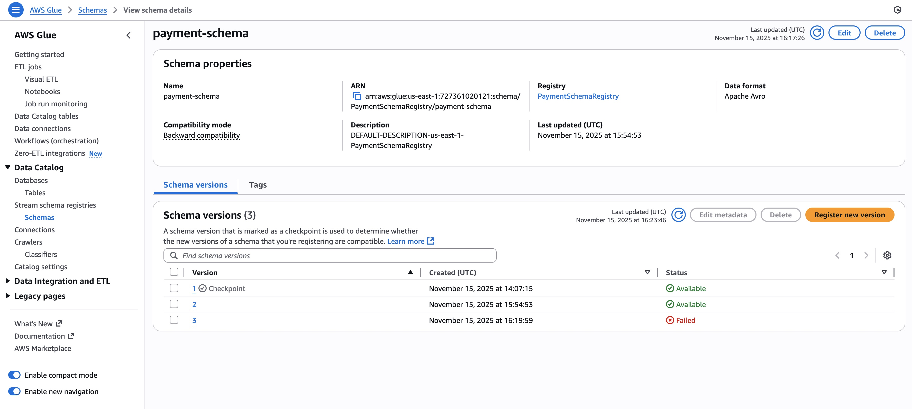

# AWS Glue Schema Registry Testbed

## Objective

This project is a minimal, low-cost proof-of-concept (PoC) to test and document the core functionalities of the **AWS Glue Schema Registry**. The project demonstrates schema registration, serialization, and deserialization using a Kafka-based messaging system for both **AVRO** and **JSON Schema** data formats.

The infrastructure is deployed using AWS CloudFormation and includes:
- AWS Glue Schema Registry
- Amazon MSK Serverless (event bus)
- AWS EC2 instance (t3.micro) for running test applications
- VPC and networking components
- IAM roles and permissions

## Prerequisites

Before deploying this infrastructure, ensure you have:

1. **AWS CLI** installed and configured with appropriate credentials
   ```bash
   aws --version
   aws configure list
   ```

2. **AWS SSM Session Manager Plugin** installed (for connecting to EC2 instance)
   
   **macOS Installation:**
   ```bash
   brew install --cask session-manager-plugin
   ```
   
   **Linux Installation:**
   ```bash
   curl "https://s3.amazonaws.com/session-manager-downloads/plugin/latest/linux_64bit/session-manager-plugin.rpm" -o "session-manager-plugin.rpm"
   sudo yum install -y session-manager-plugin.rpm
   ```
   
   **Verify Installation:**
   ```bash
   session-manager-plugin
   ```
   
   If you see version information, the plugin is installed correctly. If you get "command not found", follow the installation steps above or see the [AWS documentation](https://docs.aws.amazon.com/systems-manager/latest/userguide/session-manager-working-with-install-plugin.html).

3. **Java 11** (optional, for local development)
   - The EC2 instance will have Java 11 pre-installed via UserData

4. **Git** (for cloning the repository on the EC2 instance)

5. **AWS Account** with permissions to create:
   - VPC, Subnets, Internet Gateway, Route Tables
   - EC2 instances and Security Groups
   - MSK Serverless clusters
   - Glue Schema Registry
   - IAM roles and policies

## Step-by-Step Instructions

### Step 1: Deploy Infrastructure

Deploy all infrastructure using CloudFormation:

```bash
cd /Users/edoatley/source/aws-notes/data/glue-schema-registry

aws cloudformation deploy \
  --template-file template.yaml \
  --stack-name glue-schema-registry-testbed \
  --capabilities CAPABILITY_NAMED_IAM \
  --region us-east-1 \
  --profile streaming
```

**Note:** The deployment may take 10-15 minutes, as MSK Serverless clusters require time to provision.

#### Get MSK Bootstrap Server String

**Important:** MSK Serverless clusters don't expose `BootstrapServerString` as a CloudFormation attribute. You need to retrieve it using the AWS CLI after the cluster is in `ACTIVE` state.

First, get the MSK cluster ARN from CloudFormation outputs:

```bash
MSK_ARN=$(aws cloudformation describe-stacks \
  --stack-name glue-schema-registry-testbed \
  --region us-east-1 \
  --profile streaming \
  --query 'Stacks[0].Outputs[?OutputKey==`MSKClusterArn`].OutputValue' \
  --output text)

echo "MSK Cluster ARN: $MSK_ARN"
```

Then, wait for the cluster to be in `ACTIVE` state (this can take 10-15 minutes):

```bash
aws kafka describe-cluster-v2 \
  --cluster-arn "$MSK_ARN" \
  --region us-east-1 \
  --query ClusterInfo.State \
  --output text \
  --profile streaming
```

**Note:** MSK Serverless clusters don't support the `describe-cluster` API. Use `describe-cluster-v2` instead. The status should be `ACTIVE` before you can retrieve bootstrap servers.

Once the cluster is `ACTIVE`, retrieve the bootstrap servers:

```bash
# First, see the full response to understand available endpoints
aws kafka get-bootstrap-brokers \
  --cluster-arn $MSK_ARN \
  --region us-east-1 \
  --profile streaming
```

For MSK Serverless with IAM authentication, use the `BootstrapBrokerStringSaslIam` field:

```bash
# Get bootstrap servers (IAM/SASL endpoint - use this for IAM authentication)
BOOTSTRAP_SERVERS=$(aws kafka get-bootstrap-brokers \
  --cluster-arn $MSK_ARN \
  --region us-east-1 \
  --profile streaming \
  --query 'BootstrapBrokerStringSaslIam' \
  --output text)

echo "Bootstrap Servers: $BOOTSTRAP_SERVERS"
```

**Expected Format:** The bootstrap server string will be in the format:
```
boot-xxxxxx.yy.kafka-serverless.us-east-1.amazonaws.com:9098
```

The port `9098` is the TLS port used for IAM-authenticated connections to MSK Serverless.

**Note:** 
- For IAM authentication, always use `BootstrapBrokerStringSaslIam`
- If `BootstrapBrokerStringSaslIam` is not available in the response, check that the cluster is fully `ACTIVE` and IAM authentication is properly configured
- The bootstrap server string already includes the port number - use it as-is in your Kafka client configuration

Save this bootstrap server string - you'll need it for the Kafka producer and consumer applications configured with IAM authentication.

#### Kafka Client Configuration for IAM Authentication

When configuring your Kafka producer and consumer applications to connect to MSK Serverless with IAM authentication, you'll need to set the following properties (as shown in the [AWS blog post](https://aws.amazon.com/blogs/big-data/build-a-secure-serverless-streaming-pipeline-with-amazon-msk-serverless-amazon-emr-serverless-and-iam/)):

**Required Kafka Client Properties:**
- `bootstrap.servers`: Use the bootstrap server string retrieved above (includes port 9098)
- `security.protocol`: `SASL_SSL`
- `sasl.mechanism`: `AWS_MSK_IAM`
- `sasl.jaas.config`: `software.amazon.msk.auth.iam.IAMLoginModule required;`
- `sasl.client.callback.handler.class`: `software.amazon.msk.auth.iam.IAMClientCallbackHandler`

The EC2 instance role (`GlueSchemaRegistryEC2InstanceRole`) already has the necessary IAM permissions for MSK (`kafka-cluster:WriteData`, `kafka-cluster:ReadData`, etc.), so your applications running on the EC2 instance will automatically use IAM authentication without needing additional credentials.

**Note:** For Java applications, you'll need to include the `aws-msk-iam-auth` library in your dependencies. This will be configured in the Gradle project in Epic 2.

Alternatively, get all CloudFormation outputs:

```bash
aws cloudformation describe-stacks \
  --stack-name glue-schema-registry-testbed \
  --region us-east-1 \
  --profile streaming \
  --query 'Stacks[0].Outputs'
```

### Step 2: Connect to the Test Instance

Connect to the EC2 instance using AWS Systems Manager Session Manager:

```bash
# First, get the EC2 instance ID
INSTANCE_ID=$(aws cloudformation describe-stacks \
  --stack-name glue-schema-registry-testbed \
  --region us-east-1 \
  --profile streaming \
  --query 'Stacks[0].Outputs[?OutputKey==`EC2InstanceId`].OutputValue' \
  --output text)

# Connect via SSM
aws ssm start-session \
  --target $INSTANCE_ID \
  --region us-east-1 \
  --profile streaming
```

**Note:** If you get an error, wait a few minutes for the instance to fully initialize and the SSM agent to be ready.

### Step 3: Setup EC2 Host

Once connected to the EC2 instance, verify the environment. First invoke bash and switch to `ec2-user`:

```bash
sh-5.2$ bash
[ssm-user@ip-10-0-1-77 bin]$ sudo su - ec2-user
[ec2-user@ip-10-0-1-77 ~]$
```

Then validate as follows:


```bash
# Verify Java 11 is installed
java -version
# Should show: openjdk version "11.x.x" (Amazon Corretto)

# Verify Gradle is installed
gradle -v
# Should show Gradle version 8.5

# Verify Git is installed
git --version
```

expected output:

```output:
openjdk version "11.0.29" 2025-10-21 LTS
OpenJDK Runtime Environment Corretto-11.0.29.7.1 (build 11.0.29+7-LTS)
OpenJDK 64-Bit Server VM Corretto-11.0.29.7.1 (build 11.0.29+7-LTS, mixed mode)

------------------------------------------------------------
Gradle 8.5
------------------------------------------------------------

Build time:   2023-11-29 14:08:57 UTC
Revision:     28aca86a7180baa17117e0e5ba01d8ea9feca598

Kotlin:       1.9.20
Groovy:       3.0.17
Ant:          Apache Ant(TM) version 1.10.13 compiled on January 4 2023
JVM:          11.0.29 (Amazon.com Inc. 11.0.29+7-LTS)
OS:           Linux 6.1.158-178.288.amzn2023.x86_64 amd64

git version 2.50.1
```

If any of these are missing, check the UserData logs:

```bash
sudo tail -f /var/log/user-data.log
```

**Troubleshooting Gradle Installation:**

If Gradle is not found, the UserData script may have installed SDKMAN in the root user's home directory (since UserData runs as root). Try these options:

**Option 1: Check if SDKMAN is in root's home directory**
```bash
# Check if SDKMAN was installed for root
sudo ls /root/.sdkman/

# If it exists, source it and check Gradle
sudo -i
source /root/.sdkman/bin/sdkman-init.sh
gradle -v
exit
```

**Option 2: Install SDKMAN for ec2-user (Recommended)**
```bash
# Switch to ec2-user
sudo su - ec2-user

# Install SDKMAN
curl -s "https://get.sdkman.io" | bash
source "$HOME/.sdkman/bin/sdkman-init.sh"

# Install Gradle
sdk install gradle 8.5 -y

# Verify
gradle -v
```

**Option 3: Install SDKMAN for your current user (ssm-user)**
```bash
# Install SDKMAN
curl -s "https://get.sdkman.io" | bash
source "$HOME/.sdkman/bin/sdkman-init.sh"

# Install Gradle
sdk install gradle 8.5 -y

# Verify
gradle -v
```

**Option 4: Use the Gradle wrapper (when project is available)**
If the project includes a Gradle wrapper (`gradlew`), you can use it directly without needing Gradle installed:
```bash
./gradlew build
```

### Step 4: Build Project

Once connected to the EC2 instance, clone the repository and build the project:

```bash
# Clone the repository (if not already cloned)
git clone https://github.com/edoatley/aws-notes.git
# Checkout the appropriate branch
cd aws-notes && git checkout aws-glue && git pull
# Move to our glue folder
cd data/glue-schema-registry

# Build the project using Gradle wrapper
./gradlew build shadowJar
```

**What this does:**
- Compiles Java source files
- Generates Java classes from AVRO schema files
- Creates a "fat JAR" with all dependencies at `build/libs/glue-schema-registry-testbed-all.jar`

**Expected Output:**
- Build should complete successfully with `BUILD SUCCESSFUL`
- JAR file should be created at `build/libs/glue-schema-registry-testbed-all.jar`

### Step 5: Run AVRO Producer-Consumer Test

This test demonstrates AVRO serialization/deserialization using AWS Glue Schema Registry.

**Prerequisites:**
- MSK bootstrap server string (retrieved in Step 1)
- Project built successfully (Step 4)

**Setup Properties File:**

Create a properties file with your configuration values:

```bash
# Copy the template
cp application.properties.template application.properties

# Edit the file with your values
nano application.properties  # or use vi, vim, etc.
```

Update the `bootstrap.servers` value in `application.properties` with your MSK bootstrap server string:

```properties
bootstrap.servers=boot-z77hod6c.c2.kafka-serverless.us-east-1.amazonaws.com:9098
aws.region=us-east-1
registry.name=PaymentSchemaRegistry
schema.name=payment-schema
```

**Note:** The `application.properties` file contains all necessary configuration. The applications will read from this file.

**Instructions:**

**Important:** The topic `payments-avro` must exist before messages can be sent or consumed. The producer will automatically create the topic, but for the first run, it's recommended to create it explicitly.

1. **Open two SSM terminal sessions** (one for consumer, one for producer)

2. **Terminal 1: Create the Topic (First Run Only)**
   ```bash
   # Connect to EC2 instance
   aws ssm start-session --target <EC2_INSTANCE_ID> --region us-east-1 --profile streaming
   
   # Navigate to project directory
   cd <project-directory>/data/glue-schema-registry
   
   # Create the topic
   java -cp build/libs/glue-schema-registry-testbed-all.jar com.example.CreateTopic application.properties
   ```
   
   **Note:** The producer will also create the topic automatically if it doesn't exist, but creating it first ensures it's ready before starting the consumer.

3. **Terminal 1: Start the Consumer** (after topic exists)
   ```bash
   # Connect to EC2 instance (if not already connected)
   aws ssm start-session --target <EC2_INSTANCE_ID> --region us-east-1 --profile streaming
   
   # Navigate to project directory
   cd <project-directory>/data/glue-schema-registry
   
   # Run the consumer (using properties file)
   java -cp build/libs/glue-schema-registry-testbed-all.jar com.example.AvroConsumer application.properties
   ```
   
   **Optional:** You can override bootstrap servers if needed:
   ```bash
   java -cp build/libs/glue-schema-registry-testbed-all.jar com.example.AvroConsumer application.properties boot-xxxxxx.yy.kafka-serverless.us-east-1.amazonaws.com:9098
   ```
   
   The consumer will start and wait for messages. You should see:
   ```
   Consumer started, waiting for messages...
   ```

4. **Terminal 2: Start the Producer**
   ```bash
   # Connect to EC2 instance in a new terminal
   aws ssm start-session --target <EC2_INSTANCE_ID> --region us-east-1 --profile streaming
   
   # Navigate to project directory
   cd <project-directory>/data/glue-schema-registry
   
   # Run the producer (it will create the topic automatically if it doesn't exist)
   java -cp build/libs/glue-schema-registry-testbed-all.jar com.example.AvroProducer application.properties
   ```
   
   **Optional:** You can override bootstrap servers if needed:
   ```bash
   java -cp build/libs/glue-schema-registry-testbed-all.jar com.example.AvroProducer application.properties boot-xxxxxx.yy.kafka-serverless.us-east-1.amazonaws.com:9098
   ```
   
   The producer will send 10 messages and then exit. You should see:
   ```
   Sent payment: paymentId=payment-1, amount=100.50
   Sent payment: paymentId=payment-2, amount=200.75
   ...
   Producer completed. Sent 10 messages.
   ```

4. **Verify Results:**
   - **Terminal 1 (Consumer):** Should display 10 deserialized payment messages:
     ```
     Received payment: paymentId=payment-1, amount=100.50, timestamp=1234567890
     Received payment: paymentId=payment-2, amount=200.75, timestamp=1234567891
     ...
     Consumer completed. Received 10 messages.
     ```
   
   - **AWS Glue Console:** Navigate to AWS Glue → Schema Registry → `PaymentSchemaRegistry` → `payment-schema`
     - You should see Schema Version 1 registered
     - Schema definition should match the `Payment.avsc` file

**Troubleshooting:**
- If consumer doesn't receive messages, ensure producer ran successfully first
- If schema registration fails, verify IAM permissions on EC2 instance role
- If connection fails, verify MSK cluster is in `ACTIVE` state and bootstrap servers are correct
- If you see `UNKNOWN_TOPIC_OR_PARTITION`, create the topic first using `CreateTopic` utility
- If you see `AccessDeniedException` for Glue operations, wait 30-60 seconds after stack update for IAM permissions to propagate

### Step 6: Run AVRO Schema Evolution Tests

This section demonstrates schema evolution scenarios using AWS Glue Schema Registry.

**Prerequisites:**
- Epic 2 completed successfully (V1 producer/consumer working)
- Schema Version 1 exists in Glue Schema Registry

**Important:** If you've just added the new V2 and V3 schema files and Java classes, you must rebuild the project first:

```bash
# On the EC2 instance, navigate to the project directory
cd ~/aws-notes/data/glue-schema-registry

# Rebuild the project to generate PaymentV2 and PaymentV3 classes from the new schema files
./gradlew build shadowJar
```

This will:
- Generate `PaymentV2` and `PaymentV3` Java classes from the new `.avsc` schema files
- Compile the new `AvroProducerV2.java` and `AvroProducerV3.java` classes
- Create an updated JAR file with all new classes

**Expected Output:**
- Build should complete successfully with `BUILD SUCCESSFUL`
- You should see generated classes in `build/generated-main-avro-java/com/example/PaymentV2.java` and `PaymentV3.java`

#### Test Case 1: Backward Compatibility Test

This test verifies that adding an optional field is backward-compatible.

**Procedure Using tmux (Recommended - More Stable):**

Using `tmux` in a single SSM session is more stable than trying to maintain two separate SSM sessions. Here's how to do it:

1. **Connect to EC2 and Start tmux:**
   ```bash
   # Connect to EC2 instance
   aws ssm start-session --target <EC2_INSTANCE_ID> --region us-east-1 --profile streaming
   
   # Switch to ec2-user
   bash
   sudo su - ec2-user
   
   # Install tmux if not already installed (Amazon Linux 2023 may not have it by default)
   sudo dnf install -y tmux
   
   # Navigate to project directory
   cd ~/aws-notes/data/glue-schema-registry
   
   # Start tmux
   tmux
   ```

2. **Split the tmux window into two panes:**
   - Press `Ctrl+b` (release both keys), then press `"` (double quote) to split horizontally
   - **On Mac:** You may need to press `Shift+"` to get the double quote character
   - You'll now have two panes: top and bottom

3. **Navigate between panes:**
   - Press `Ctrl+b` then arrow keys to switch between panes
   - Or: `Ctrl+b` then `o` to cycle through panes

4. **Top Pane - Start the Consumer:**
   ```bash
   # Make sure you're in the project directory
   cd ~/aws-notes/data/glue-schema-registry
   
   # Start the original consumer (uses V1 schema)
   java -cp build/libs/glue-schema-registry-testbed-all.jar com.example.AvroConsumer application.properties
   ```
   The consumer will wait for messages.

5. **Bottom Pane - Run the Producer:**
   - Switch to the bottom pane (Ctrl+b then down arrow)
   ```bash
   # Make sure you're in the project directory
   cd ~/aws-notes/data/glue-schema-registry
   
   # Run the V2 producer
   java -cp build/libs/glue-schema-registry-testbed-all.jar com.example.AvroProducerV2 application.properties
   ```
   The producer will send 10 messages with the new schema (including optional `description` field) and exit.

**Useful tmux Commands:**
- `Ctrl+b` then `"` (or `Shift+"` on Mac) - Split pane horizontally
- `Ctrl+b` then `%` (or `Shift+5` on Mac) - Split pane vertically
- `Ctrl+b` then arrow keys - Navigate between panes
- `Ctrl+b` then `x` - Close current pane (after confirming)
- `Ctrl+b` then `d` - Detach from tmux (sessions keep running)
- `tmux attach` - Reattach to existing tmux session
- `Ctrl+b` then `z` - Zoom/unzoom current pane (full screen toggle)

**Note for Mac Users:** 
- The tmux commands run on the remote EC2 instance (Linux), but your Mac keyboard layout affects which keys you press
- For special characters like `"` and `%`, you may need to use `Shift` to get the correct character
- Try: `Ctrl+b` then `Shift+"` for horizontal split, or `Ctrl+b` then `Shift+5` for vertical split

**Alternative: Using Two Separate SSM Sessions**

If you prefer separate terminals (though less stable with SSM):

1. **Terminal 1: Start the Original Consumer (V1 Schema)**
   ```bash
   # Connect to EC2 instance
   aws ssm start-session --target <EC2_INSTANCE_ID> --region us-east-1 --profile streaming
   
   # Navigate to project directory
   cd ~/aws-notes/data/glue-schema-registry
   
   # Start the original consumer (uses V1 schema)
   java -cp build/libs/glue-schema-registry-testbed-all.jar com.example.AvroConsumer application.properties
   ```
   
   The consumer will wait for messages.

2. **Terminal 2: Run V2 Producer (New Schema with Optional Field)**
   ```bash
   # Connect to EC2 instance in a new terminal
   aws ssm start-session --target <EC2_INSTANCE_ID> --region us-east-1 --profile streaming
   
   # Navigate to project directory
   cd ~/aws-notes/data/glue-schema-registry
   
   # Run the V2 producer
   java -cp build/libs/glue-schema-registry-testbed-all.jar com.example.AvroProducerV2 application.properties
   ```
   
   The producer will send 10 messages with the new schema (including optional `description` field) and exit.

6. **Verify Results:**
   - **Top Pane (Consumer):** Should display 10 deserialized payment messages (without `description` field, as expected)
   - **AWS Glue Console:** Navigate to AWS Glue → Schema Registry → `PaymentSchemaRegistry` → `payment-schema`
     - You should see Schema Version 2 registered
     - Version 2 should include the new optional `description` field

**Expected Behavior:**
- V2 producer successfully sends messages
- Schema Version 2 is registered in Glue Schema Registry
- Original V1 consumer successfully reads all V2 messages (ignoring the new `description` field)
- This demonstrates backward compatibility

**Note:** The consumer uses `GENERIC_RECORD` mode instead of `SPECIFIC_RECORD` to enable backward compatibility. This allows the consumer to read messages with any schema version by accessing fields by name. The consumer will only access the fields it knows about (`paymentId`, `amount`, `timestamp`) and will ignore the new `description` field from V2 messages.

**Actual Beahviour**

V2 publisher produced messages with new description field:

```output
[main] INFO com.example.AvroProducerV2 - Sent payment V2: paymentId=payment-v2-1, amount=150.5, description=Payment for order #1, timestamp=1763223659160
[main] INFO com.example.AvroProducerV2 - Sent payment V2: paymentId=payment-v2-2, amount=301.0, description=Payment for order #2, timestamp=1763223659844
[main] INFO com.example.AvroProducerV2 - Sent payment V2: paymentId=payment-v2-3, amount=451.5, description=Payment for order #3, timestamp=1763223659945
[main] INFO com.example.AvroProducerV2 - Sent payment V2: paymentId=payment-v2-4, amount=602.0, description=Payment for order #4, timestamp=1763223660047
[main] INFO com.example.AvroProducerV2 - Sent payment V2: paymentId=payment-v2-5, amount=752.5, description=Payment for order #5, timestamp=1763223660148
[main] INFO com.example.AvroProducerV2 - Sent payment V2: paymentId=payment-v2-6, amount=903.0, description=Payment for order #6, timestamp=1763223660249
[main] INFO com.example.AvroProducerV2 - Sent payment V2: paymentId=payment-v2-7, amount=1053.5, description=Payment for order #7, timestamp=1763223660350
[main] INFO com.example.AvroProducerV2 - Sent payment V2: paymentId=payment-v2-8, amount=1204.0, description=Payment for order #8, timestamp=1763223660451
[main] INFO com.example.AvroProducerV2 - Sent payment V2: paymentId=payment-v2-9, amount=1354.5, description=Payment for order #9, timestamp=1763223660551
[main] INFO com.example.AvroProducerV2 - Sent payment V2: paymentId=payment-v2-10, amount=1505.0, description=Payment for order #10, timestamp=1763223660652
```

the consumer then read just the V1 fields it can use:

```output
[main] INFO com.example.AvroConsumer - Received payment: paymentId=payment-v2-1, amount=150.5, timestamp=1763223659160
[main] INFO com.example.AvroConsumer - Received payment: paymentId=payment-v2-2, amount=301.0, timestamp=1763223659844
[main] INFO com.example.AvroConsumer - Received payment: paymentId=payment-v2-3, amount=451.5, timestamp=1763223659945
[main] INFO com.example.AvroConsumer - Received payment: paymentId=payment-v2-4, amount=602.0, timestamp=1763223660047
[main] INFO com.example.AvroConsumer - Received payment: paymentId=payment-v2-5, amount=752.5, timestamp=1763223660148
[main] INFO com.example.AvroConsumer - Received payment: paymentId=payment-v2-6, amount=903.0, timestamp=1763223660249
[main] INFO com.example.AvroConsumer - Received payment: paymentId=payment-v2-7, amount=1053.5, timestamp=1763223660350
[main] INFO com.example.AvroConsumer - Received payment: paymentId=payment-v2-8, amount=1204.0, timestamp=1763223660451
[main] INFO com.example.AvroConsumer - Received payment: paymentId=payment-v2-9, amount=1354.5, timestamp=1763223660551
[main] INFO com.example.AvroConsumer - Received payment: paymentId=payment-v2-10, amount=1505.0, timestamp=1763223660652
```

Looking at the scema registry we can see `arn:aws:glue:us-east-1:727361020121:schema/PaymentSchemaRegistry/payment-schema`, version 1:

```json
{
  "type": "record",
  "name": "Payment",
  "namespace": "com.example",
  "fields": [
    {
      "name": "paymentId",
      "type": {
        "type": "string",
        "avro.java.string": "String"
      }
    },
    {
      "name": "amount",
      "type": "double"
    },
    {
      "name": "timestamp",
      "type": "long"
    }
  ]
}
```

and also version 2:

```json
```json
{
  "type": "record",
  "name": "PaymentV2",
  "namespace": "com.example",
  "fields": [
    {
      "name": "paymentId",
      "type": {
        "type": "string",
        "avro.java.string": "String"
      }
    },
    {
      "name": "amount",
      "type": "double"
    },
    {
      "name": "timestamp",
      "type": "long"
    },
    {
      "name": "description",
      "type": [
        "null",
        {
          "type": "string",
          "avro.java.string": "String"
        }
      ],
      "default": null
    }
  ]
}
```


#### Test Case 2: Incompatible Change Test

This test verifies that renaming a required field breaks backward compatibility and is rejected by the registry.

**Procedure:**

1. **Run V3 Producer (Incompatible Schema)**
   ```bash
   # Connect to EC2 instance
   aws ssm start-session --target <EC2_INSTANCE_ID> --region us-east-1 --profile streaming
   
   # Navigate to project directory
   cd ~/aws-notes/data/glue-schema-registry
   
   # Run the V3 producer (will fail as expected)
   java -cp build/libs/glue-schema-registry-testbed-all.jar com.example.AvroProducerV3 application.properties
   ```

2. **Verify Results:**
   - **Terminal Output:** Should show an exception indicating schema compatibility failure:
     ```
     ERROR: Schema registration failed due to incompatible change
     Exception: Schema compatibility check failed. The new schema is not backward compatible with the existing schema version.
     This is expected behavior - renaming a required field breaks BACKWARD compatibility
     ```
   - **AWS Glue Console:** Navigate to AWS Glue → Schema Registry → `PaymentSchemaRegistry` → `payment-schema`
     - Schema Version 3 should NOT exist
     - Only Version 1 (and Version 2 if Test Case 1 was run) should exist

**Expected Behavior:**
- V3 producer fails with a compatibility exception
- No messages are sent to Kafka
- Schema Version 3 is NOT registered in Glue Schema Registry
- This demonstrates that incompatible changes are rejected by the registry

**actual behaviour**

In the logs we see this failure:

```output
Caused by: com.amazonaws.services.schemaregistry.exception.AWSSchemaRegistryException: Failed to get schemaVersionId by schema definition for schema name = payment-schema 
        at com.amazonaws.services.schemaregistry.common.AWSSchemaRegistryClient.getSchemaVersionIdByDefinition(AWSSchemaRegistryClient.java:148)
        at com.amazonaws.services.schemaregistry.common.SchemaByDefinitionFetcher$SchemaDefinitionToVersionCache.load(SchemaByDefinitionFetcher.java:110)
        at com.amazonaws.services.schemaregistry.common.SchemaByDefinitionFetcher$SchemaDefinitionToVersionCache.load(SchemaByDefinitionFetcher.java:106)
        at com.google.common.cache.LocalCache$LoadingValueReference.loadFuture(LocalCache.java:3529)
        at com.google.common.cache.LocalCache$Segment.loadSync(LocalCache.java:2278)
        at com.google.common.cache.LocalCache$Segment.lockedGetOrLoad(LocalCache.java:2155)
        at com.google.common.cache.LocalCache$Segment.get(LocalCache.java:2045)
        at com.google.common.cache.LocalCache.get(LocalCache.java:3951)
        at com.google.common.cache.LocalCache.getOrLoad(LocalCache.java:3974)
        at com.google.common.cache.LocalCache$LocalLoadingCache.get(LocalCache.java:4935)
        at com.amazonaws.services.schemaregistry.common.SchemaByDefinitionFetcher.getORRegisterSchemaVersionId(SchemaByDefinitionFetcher.java:74)
        ... 7 more
Caused by: com.amazonaws.services.schemaregistry.exception.AWSSchemaRegistryException: Schema Found but status is FAILURE
        at com.amazonaws.services.schemaregistry.common.AWSSchemaRegistryClient.returnSchemaVersionIdIfAvailable(AWSSchemaRegistryClient.java:195)
        at com.amazonaws.services.schemaregistry.common.AWSSchemaRegistryClient.getSchemaVersionIdByDefinition(AWSSchemaRegistryClient.java:145)
        ... 17 more
```

and in the schema registry we see the schema:

```json
{
  "type": "record",
  "name": "PaymentV3",
  "namespace": "com.example",
  "fields": [
    {
      "name": "paymentId",
      "type": {
        "type": "string",
        "avro.java.string": "String"
      }
    },
    {
      "name": "paymentAmount",
      "type": "double"
    },
    {
      "name": "timestamp",
      "type": "long"
    }
  ]
}
```

but also that it failed:




**Troubleshooting:**
- If V3 producer succeeds unexpectedly, verify that compatibility mode is set to `BACKWARD` in the producer configuration
- If exception message is unclear, check AWS Glue Schema Registry logs in CloudWatch

### Step 7: Run JSON Schema Producer-Consumer Test

This test demonstrates JSON Schema serialization/deserialization using AWS Glue Schema Registry.

**Prerequisites:**
- MSK bootstrap server string (retrieved in Step 1)
- Project built successfully (Step 4)
- Epic 4 code implemented (JsonProducer, JsonConsumer, SensorReading POJO, SensorReading.json schema)

**Setup Properties File:**

Create a JSON-specific properties file with your configuration values:

```bash
# Copy the template
cp application-json.properties.template application-json.properties

# Edit the file with your values
nano application-json.properties  # or use vi, vim, etc.
```

Update the properties in `application-json.properties` with your MSK bootstrap server string and JSON-specific settings:

```properties
bootstrap.servers=boot-xxxxxx.yy.kafka-serverless.us-east-1.amazonaws.com:9098
aws.region=us-east-1
registry.name=PaymentSchemaRegistry
schema.name=sensor-schema
data.format=JSON
schema.auto.registration.enabled=true
compatibility=BACKWARD
consumer.group.id=sensor-consumer-group
security.protocol=SASL_SSL
sasl.mechanism=AWS_MSK_IAM
sasl.jaas.config=software.amazon.msk.auth.iam.IAMLoginModule required;
sasl.client.callback.handler.class=software.amazon.msk.auth.iam.IAMClientCallbackHandler
```

**Key Differences from AVRO Properties:**
- `data.format=JSON` (instead of `AVRO`)
- `schema.name=sensor-schema` (instead of `payment-schema`)
- `consumer.group.id=sensor-consumer-group` (instead of `payment-consumer-group`)
- No `avro.record.type` property (AVRO-specific)

**Note:** The `application-json.properties` file contains all necessary configuration for JSON Schema. The applications will read from this file.

**Instructions:**

**Important:** The topic `sensors-json` must exist before messages can be sent or consumed. The producer will automatically create the topic, but for the first run, it's recommended to create it explicitly.

**Procedure Using tmux (Recommended - More Stable):**

Using `tmux` in a single SSM session is more stable than trying to maintain two separate SSM sessions. Here's how to do it:

1. **Connect to EC2 and Start tmux:**
   ```bash
   # Connect to EC2 instance
   aws ssm start-session --target <EC2_INSTANCE_ID> --region us-east-1 --profile streaming
   
   # Switch to ec2-user
   bash
   sudo su - ec2-user
   
   # Install tmux if not already installed
   sudo dnf install -y tmux
   
   # Navigate to project directory
   cd ~/aws-notes/data/glue-schema-registry
   
   # Start tmux
   tmux
   ```

2. **Split the tmux window into two panes:**
   - Press `Ctrl+b` (release both keys), then press `"` (double quote) to split horizontally
   - **On Mac:** You may need to press `Shift+"` to get the double quote character
   - You'll now have two panes: top and bottom

3. **Navigate between panes:**
   - Press `Ctrl+b` then arrow keys to switch between panes
   - Or: `Ctrl+b` then `o` to cycle through panes

4. **Top Pane - Create the Topic (First Run Only):**
   ```bash
   # Make sure you're in the project directory
   cd ~/aws-notes/data/glue-schema-registry
   
   # Create the topic
   java -cp build/libs/glue-schema-registry-testbed-all.jar com.example.CreateTopic application-json.properties
   ```
   
   **Note:** The producer will also create the topic automatically if it doesn't exist, but creating it first ensures it's ready before starting the consumer.

5. **Top Pane - Start the Consumer:**
   ```bash
   # Make sure you're in the project directory
   cd ~/aws-notes/data/glue-schema-registry
   
   # Start the consumer
   java -cp build/libs/glue-schema-registry-testbed-all.jar com.example.JsonConsumer application-json.properties
   ```
   
   **Optional:** You can override bootstrap servers if needed:
   ```bash
   java -cp build/libs/glue-schema-registry-testbed-all.jar com.example.JsonConsumer application-json.properties boot-xxxxxx.yy.kafka-serverless.us-east-1.amazonaws.com:9098
   ```
   
   The consumer will start and wait for messages. You should see:
   ```
   Consumer started, waiting for messages...
   ```

6. **Bottom Pane - Start the Producer:**
   - Switch to the bottom pane (Ctrl+b then down arrow)
   ```bash
   # Make sure you're in the project directory
   cd ~/aws-notes/data/glue-schema-registry
   
   # Run the producer (it will create the topic automatically if it doesn't exist)
   java -cp build/libs/glue-schema-registry-testbed-all.jar com.example.JsonProducer application-json.properties
   ```
   
   **Optional:** You can override bootstrap servers if needed:
   ```bash
   java -cp build/libs/glue-schema-registry-testbed-all.jar com.example.JsonProducer application-json.properties boot-xxxxxx.yy.kafka-serverless.us-east-1.amazonaws.com:9098
   ```
   
   The producer will send 10 messages and then exit. You should see:
   ```
   Sent sensor reading: sensorId=sensor-1, temperature=22.5, humidity=45.0, timestamp=1234567890
   Sent sensor reading: sensorId=sensor-2, temperature=23.1, humidity=46.5, timestamp=1234567891
   ...
   Producer completed. Sent 10 messages.
   ```

**Useful tmux Commands:**
- `Ctrl+b` then `"` (or `Shift+"` on Mac) - Split pane horizontally
- `Ctrl+b` then `%` (or `Shift+5` on Mac) - Split pane vertically
- `Ctrl+b` then arrow keys - Navigate between panes
- `Ctrl+b` then `x` - Close current pane (after confirming)
- `Ctrl+b` then `d` - Detach from tmux (sessions keep running)
- `tmux attach` - Reattach to existing tmux session
- `Ctrl+b` then `z` - Zoom/unzoom current pane (full screen toggle)

**Alternative: Using Two Separate SSM Sessions**

If you prefer separate terminals (though less stable with SSM):

1. **Terminal 1: Create the Topic (First Run Only)**
   ```bash
   # Connect to EC2 instance
   aws ssm start-session --target <EC2_INSTANCE_ID> --region us-east-1 --profile streaming
   
   # Navigate to project directory
   cd ~/aws-notes/data/glue-schema-registry
   
   # Create the topic
   java -cp build/libs/glue-schema-registry-testbed-all.jar com.example.CreateTopic application-json.properties
   ```

2. **Terminal 1: Start the Consumer** (after topic exists)
   ```bash
   # Connect to EC2 instance (if not already connected)
   aws ssm start-session --target <EC2_INSTANCE_ID> --region us-east-1 --profile streaming
   
   # Navigate to project directory
   cd ~/aws-notes/data/glue-schema-registry
   
   # Run the consumer (using properties file)
   java -cp build/libs/glue-schema-registry-testbed-all.jar com.example.JsonConsumer application-json.properties
   ```
   
   The consumer will start and wait for messages. You should see:
   ```
   Consumer started, waiting for messages...
   ```

3. **Terminal 2: Start the Producer**
   ```bash
   # Connect to EC2 instance in a new terminal
   aws ssm start-session --target <EC2_INSTANCE_ID> --region us-east-1 --profile streaming
   
   # Navigate to project directory
   cd ~/aws-notes/data/glue-schema-registry
   
   # Run the producer (it will create the topic automatically if it doesn't exist)
   java -cp build/libs/glue-schema-registry-testbed-all.jar com.example.JsonProducer application-json.properties
   ```
   
   The producer will send 10 messages and then exit.

4. **Verify Results:**
   - **Terminal 1 (Consumer):** Should display 10 deserialized sensor reading messages:
     ```
     Received sensor reading: sensorId=sensor-1, temperature=22.5, humidity=45.0, timestamp=1234567890
     Received sensor reading: sensorId=sensor-2, temperature=23.1, humidity=46.5, timestamp=1234567891
     ...
     Consumer completed. Received 10 messages.
     ```
   
   - **AWS Glue Console:** Navigate to AWS Glue → Schema Registry → `PaymentSchemaRegistry` → `sensor-schema`
     - You should see Schema Version 1 registered
     - Schema definition should match the `SensorReading.json` file
     - Verify the schema shows JSON Schema format (not AVRO)

**Expected Behavior:**
- JSON producer successfully sends 10 messages with sensor reading data
- Schema Version 1 is registered in Glue Schema Registry with JSON Schema format
- JSON consumer successfully reads all 10 messages and deserializes them correctly
- Consumer logs show all fields: `sensorId`, `temperature`, `humidity`, `timestamp`
- Schema appears in Glue console with JSON Schema structure

**Troubleshooting:**
- If consumer doesn't receive messages, ensure producer ran successfully first
- If schema registration fails, verify IAM permissions on EC2 instance role
- If connection fails, verify MSK cluster is in `ACTIVE` state and bootstrap servers are correct
- If you see `UNKNOWN_TOPIC_OR_PARTITION`, create the topic first using `CreateTopic` utility
- If you see `AccessDeniedException` for Glue operations, wait 30-60 seconds after stack update for IAM permissions to propagate
- If deserialization fails, verify that `SensorReading.java` POJO class matches the JSON Schema structure exactly
- If you see JSON parsing errors, verify the JSON Schema file is valid and properly formatted
- If properties file is not found, ensure you're using `application-json.properties` (not `application.properties`)

## CRITICAL: Cleanup

**IMPORTANT:** To avoid ongoing charges, destroy all infrastructure immediately after testing:

```bash
aws cloudformation delete-stack \
  --stack-name glue-schema-registry-testbed \
  --region us-east-1 \
  --profile streaming
```

Verify deletion:

```bash
aws cloudformation describe-stacks \
  --stack-name glue-schema-registry-testbed \
  --region us-east-1 \
  --profile streaming
```

This should return an error indicating the stack does not exist.

**Note:** MSK Serverless cluster deletion may take several minutes. Monitor the stack deletion status:

```bash
aws cloudformation describe-stacks \
  --stack-name glue-schema-registry-testbed \
  --region us-east-1 \
  --profile streaming \
  --query 'Stacks[0].StackStatus'
```

## Cost Considerations

This project is designed to minimize costs:

- **VPC Components:** Free (no charges)
- **EC2 t3.micro:** Free Tier eligible (750 hours/month for first 12 months)
- **MSK Serverless:** Pay-per-use, no idle charges
- **Glue Schema Registry:** Free tier (1,000 requests/month)
- **Data Transfer:** Minimal (within same region)

**Target:** Stay under $10 for the entire test.

**Remember:** Always delete the stack after testing to prevent ongoing charges!

## Troubleshooting

### Wrong AWS Profile

If the AWS CLI gives an error like this:

```output
An error occurred (InvalidClientTokenId) when calling the ValidateTemplate operation: The security token included in the request is invalid.
```

it is likely the wrong profile is set. We can fix this as follows:

```bash
unset AWS_ACCESS_KEY_ID
unset AWS_SECRET_ACCESS_KEY
export AWS_PROFILE=streaming     
```

Note the `unset` is required

### Stack Creation Fails

1. Check CloudFormation events:
   ```bash
   aws cloudformation describe-stack-events \
     --stack-name glue-schema-registry-testbed \
     --region us-east-1 \
     --max-items 10
   ```

2. Verify MSK Serverless is available in your region:
   ```bash
   aws kafka list-clusters --region us-east-1
   ```

### Cannot Connect to EC2 Instance

1. Wait 5-10 minutes after stack creation for UserData to complete
2. Verify SSM agent is running:
   ```bash
   aws ssm describe-instance-information \
     --filters "Key=InstanceIds,Values=$INSTANCE_ID" \
     --region us-east-1
   ```
3. Check IAM role has `AmazonSSMManagedInstanceCore` policy attached

### SSM Session Completely Unresponsive - Restart Instance

If SSM sessions are completely unresponsive or won't start, restart the EC2 instance:

```bash
# Get the instance ID
INSTANCE_ID=$(aws cloudformation describe-stacks \
  --stack-name glue-schema-registry-testbed \
  --region us-east-1 \
  --profile streaming \
  --query 'Stacks[0].Outputs[?OutputKey==`EC2InstanceId`].OutputValue' \
  --output text)

echo "Instance ID: $INSTANCE_ID"

# Stop the instance
echo "Stopping instance..."
aws ec2 stop-instances \
  --instance-ids $INSTANCE_ID \
  --region us-east-1 \
  --profile streaming

# Wait for instance to stop (this may take 1-2 minutes)
echo "Waiting for instance to stop..."
aws ec2 wait instance-stopped \
  --instance-ids $INSTANCE_ID \
  --region us-east-1 \
  --profile streaming

echo "Instance stopped. Starting instance..."

# Start the instance
aws ec2 start-instances \
  --instance-ids $INSTANCE_ID \
  --region us-east-1 \
  --profile streaming

# Wait for instance to be running
echo "Waiting for instance to be running..."
aws ec2 wait instance-running \
  --instance-ids $INSTANCE_ID \
  --region us-east-1 \
  --profile streaming

# Wait a bit more for SSM agent to be ready (usually 30-60 seconds)
echo "Waiting for SSM agent to be ready..."
sleep 60

# Verify SSM agent is ready
echo "Checking SSM agent status..."
aws ssm describe-instance-information \
  --filters "Key=InstanceIds,Values=$INSTANCE_ID" \
  --region us-east-1 \
  --profile streaming \
  --query 'InstanceInformationList[0].[PingStatus,LastPingDateTime]' \
  --output table

echo "Instance restarted. You can now try connecting via SSM:"
echo "aws ssm start-session --target $INSTANCE_ID --region us-east-1 --profile streaming"
```

**Note:** After restart, you may need to wait 1-2 minutes for the SSM agent to fully initialize before connecting.

### MSK Bootstrap Servers Not Available

MSK Serverless clusters can take 10-15 minutes to become `ACTIVE`. Wait and check:

```bash
# Check cluster status (MSK Serverless uses describe-cluster-v2)
aws kafka describe-cluster-v2 \
  --cluster-arn "$MSK_ARN" \
  --region us-east-1 \
  --profile streaming \
  --query 'ClusterInfo.State' \
  --output text
```

**Note:** MSK Serverless doesn't support `describe-cluster`. Use `describe-cluster-v2` instead.

### Session Manager Plugin Not Found

If you get the error `SessionManagerPlugin is not found`, you need to install the Session Manager plugin:

**macOS:**
```bash
brew install --cask session-manager-plugin
```

**Linux:**
```bash
curl "https://s3.amazonaws.com/session-manager-downloads/plugin/latest/linux_64bit/session-manager-plugin.rpm" -o "session-manager-plugin.rpm"
sudo yum install -y session-manager-plugin.rpm
```

**Verify installation:**
```bash
session-manager-plugin --version
```

For more installation options, see the [AWS Session Manager Plugin documentation](https://docs.aws.amazon.com/systems-manager/latest/userguide/session-manager-working-with-install-plugin.html).

### Gradle Command Not Found

If you get `bash: gradle: command not found`, the UserData script may have installed SDKMAN in the root user's home directory (since UserData runs as root), or the installation may have failed.

**Check if SDKMAN exists in root's home:**
```bash
sudo ls /root/.sdkman/
```

**If SDKMAN exists in /root, use it:**
```bash
sudo -i
source /root/.sdkman/bin/sdkman-init.sh
gradle -v
exit
```

**If SDKMAN doesn't exist, install it for ec2-user:**
```bash
sudo su - ec2-user
curl -s "https://get.sdkman.io" | bash
source "$HOME/.sdkman/bin/sdkman-init.sh"
sdk install gradle 8.5 -y
gradle -v
```

**Or install for your current user (ssm-user):**
```bash
curl -s "https://get.sdkman.io" | bash
source "$HOME/.sdkman/bin/sdkman-init.sh"
sdk install gradle 8.5 -y
gradle -v
```

**Note:** When the Gradle project is available (Epic 2), you can use the Gradle wrapper (`./gradlew`) which doesn't require Gradle to be in your PATH.

### UNKNOWN_TOPIC_OR_PARTITION Error

If you see this error when running the producer or consumer:

```output
Error while fetching metadata with correlation id X : {payments-avro=UNKNOWN_TOPIC_OR_PARTITION}
```

**Cause:** MSK Serverless doesn't auto-create topics. The topic must be created explicitly.

**Solution:** Create the topic first using the `CreateTopic` utility:

```bash
java -cp build/libs/glue-schema-registry-testbed-all.jar com.example.CreateTopic application.properties
```

Alternatively, the producer will automatically create the topic when it sends the first message, but creating it first ensures it's ready before starting the consumer.

### Glue Permission Errors

If you see errors like:

```output
User: arn:aws:sts::...:assumed-role/GlueSchemaRegistryEC2InstanceRole/... is not authorized to perform: glue:GetSchemaByDefinition
```

**Cause:** IAM permissions may not have propagated yet, or the CloudFormation template needs to be updated.

**Solution:**
1. Wait 30-60 seconds after updating the CloudFormation stack for IAM permissions to propagate
2. Verify the IAM role includes all required Glue permissions:
   - `glue:RegisterSchemaVersion`
   - `glue:CreateSchema`
   - `glue:GetSchemaVersion`
   - `glue:GetSchema`
   - `glue:GetSchemaByDefinition`
   - `glue:ListSchemaVersions`
3. If permissions are missing, update the CloudFormation template and redeploy

### SSM Session Management

If SSM sessions become unresponsive or locked:

**List active sessions:**
```bash
aws ssm describe-sessions \
  --state Active \
  --region us-east-1 \
  --profile streaming \
  --query 'Sessions[*].[SessionId,Target,Status]' \
  --output table
```

**Terminate a specific session:**
```bash
aws ssm terminate-session \
  --session-id <SESSION_ID> \
  --region us-east-1 \
  --profile streaming
```

**Terminate all sessions for your instance:**
```bash
# Get instance ID
INSTANCE_ID=$(aws cloudformation describe-stacks \
  --stack-name glue-schema-registry-testbed \
  --region us-east-1 \
  --profile streaming \
  --query 'Stacks[0].Outputs[?OutputKey==`EC2InstanceId`].OutputValue' \
  --output text)

# List and terminate all active sessions
for session in $(aws ssm describe-sessions \
  --state Active \
  --region us-east-1 \
  --profile streaming \
  --query 'Sessions[?Target==`'$INSTANCE_ID'`].SessionId' \
  --output text); do
  aws ssm terminate-session --session-id "$session" --region us-east-1 --profile streaming
done
```

**Tip:** Use `tmux` inside SSM sessions to persist work if the session disconnects and to run multiple commands simultaneously:
```bash
# Start tmux
tmux

# If session disconnects, reconnect and run:
tmux attach
```

**Using tmux for Producer/Consumer Tests:**

When running producer and consumer tests, using `tmux` with split panes is more stable than maintaining two separate SSM sessions:

```bash
# After connecting via SSM and starting tmux:
# 1. Split pane: Ctrl+b then "
# 2. Top pane: Run consumer
# 3. Bottom pane: Run producer
# 4. Navigate: Ctrl+b then arrow keys
```

See Step 6 Test Case 1 for detailed tmux instructions.

### MSK IAM Authentication Errors

If you see `SaslAuthenticationException: Access denied` or `TopicAuthorizationException`:

**Cause:** IAM permissions for MSK may be incorrect or not propagated.

**Solution:**
1. Verify the IAM role has permissions for:
   - Cluster-level: `kafka-cluster:Connect`, `kafka-cluster:DescribeCluster`
   - Topic-level: `kafka-cluster:CreateTopic`, `kafka-cluster:WriteData`, `kafka-cluster:ReadData`, `kafka-cluster:DescribeTopic`
   - Group-level: `kafka-cluster:AlterGroup`, `kafka-cluster:DescribeGroup`
2. Ensure the CloudFormation template uses the exact MSK cluster ARN (not wildcards)
3. Wait 30-60 seconds after stack updates for permissions to propagate
4. Restart your application to pick up new credentials

## Next Steps

Epic 1 (Infrastructure Deployment), Epic 2 (AVRO Producer-Consumer Flow), Epic 3 (AVRO Schema Evolution & Error Scenarios), and Epic 4 (JSON Schema Producer-Consumer Flow) are complete:

1. ✅ Infrastructure deployed
2. ✅ MSK Bootstrap Servers retrieved
3. ✅ Connected to EC2 instance
4. ✅ Verified Java 11 and Gradle installation
5. ✅ AVRO Producer-Consumer Flow implemented and tested
6. ✅ Glue Schema Registry integration working
7. ✅ End-to-end message flow validated
8. ✅ Backward compatibility testing (optional field addition)
9. ✅ Incompatible change rejection testing (field renaming)
10. ✅ JSON Schema Producer-Consumer Flow implemented and tested
11. ✅ JSON Schema serialization/deserialization validated

**Future enhancements:**
- JSON Schema evolution scenarios (similar to Epic 3)
- Performance benchmarking (AVRO vs JSON Schema)
- Multi-region schema replication testing
- Additional schema formats (Protobuf, etc.)

## Additional Resources

- [AWS Glue Schema Registry Documentation](https://docs.aws.amazon.com/glue/latest/dg/schema-registry.html)
- [Amazon MSK Serverless Documentation](https://docs.aws.amazon.com/msk/latest/developerguide/serverless.html)
- [AWS Glue Schema Registry SerDe Library](https://github.com/awslabs/aws-glue-schema-registry)
