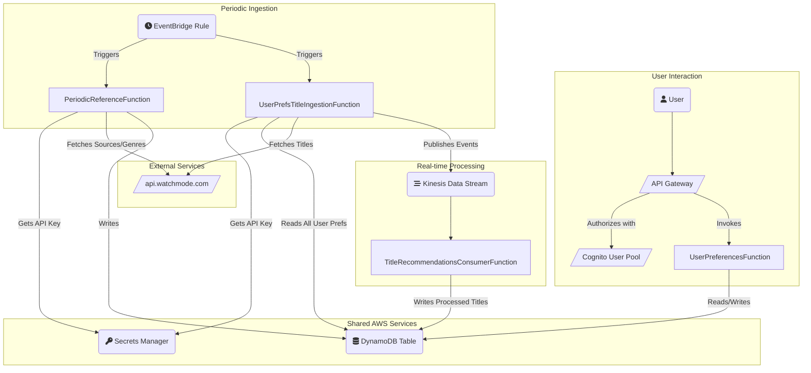

# Event Streaming app

## Table of contents

<!-- TOC -->
* [Event Streaming app](#event-streaming-app)
  * [Table of contents](#table-of-contents)
  * [Rough plan](#rough-plan)
  * [Target Architecture diagram](#target-architecture-diagram)
  * [Step 1 - Initial set up](#step-1---initial-set-up)
  * [Step 2 - Shared infrastructure set up](#step-2---shared-infrastructure-set-up)
  * [Step 3 - Periodic Ingestion Lambda (basic deployment)](#step-3---periodic-ingestion-lambda-basic-deployment)
  * [Step 4 - WatchMode initial integration](#step-4---watchmode-initial-integration)
    * [Sources](#sources)
    * [Genres](#genres)
  * [Step 5 - SAM Project cleanup](#step-5---sam-project-cleanup)
  * [Step 6 - Preferences API](#step-6---preferences-api)
  * [Step 7 - Call API to get some shows for all known genres and source](#step-7---call-api-to-get-some-shows-for-all-known-genres-and-source)
  * [Step 9 - read title data published to kinesis](#step-9---read-title-data-published-to-kinesis)
  * [Step 10 - publish title data to kinesis](#step-10---publish-title-data-to-kinesis)
    * [LocalStack setup](#localstack-setup)
    * [LocalStack setup](#localstack-setup-1)
    * [Specialist Test Script for Title Ingestion](#specialist-test-script-for-title-ingestion)
  * [Step x - schedule the API calls to get the shows and make it efficient](#step-x---schedule-the-api-calls-to-get-the-shows-and-make-it-efficient)
  * [Cleanup](#cleanup)
<!-- TOC -->

## Rough plan

- [x] Store TV reference data: A Lambda function will periodically fetch reference data and store in DynamoDB for use within the application
- [x] A Simple RESTful API exposed via API Gateway and backed by a lambda that stores a users preferences.  
- [x] Ingest TV and streaming data: A Lambda function will periodically fetch the latest TV schedules and streaming availability for the UK from an external API (limited to those categories users have preference for).
- [x] Store the program guide: The processed data will be stored in a DynamoDB table, optimized for efficient querying of shows, channels, and streaming services.
- [ ] Process and enrich the data: The raw data will be sent to a Kinesis Data Stream for real-time processing. Another Lambda function will consume this data, clean it, and potentially enrich it with additional information (e.g., ratings from another source).
- [ ] Real-time updates: DynamoDB Streams will capture any changes to the program data (e.g., a schedule update). A final Lambda function will be triggered by these streams to, for example, send notifications for favorited shows.
- [ ] Add Google IdP federation
- [ ] Provide a single page web app user interface (a static website hosted on S3) and login with google credentials
- [ ] Extend the web app to query API Gateway endpoints to display the TV offerings, update user preferences, etc.

## Target Architecture diagram



## Step 1 - Initial set up

To get started I wanted to log in securely from my laptop and so set up IAM Identity Center as described in more detail [here](../../../identity/IAM-Identity-Center.MD)

I then checked this works with:

```bash
aws sts get-caller-identity --profile streaming
{
"UserId": "AROA2SWQYMDM4VPUQEQLJ:edoatley",
"Account": "727361020121",
"Arn": "arn:aws:sts::727361020121:assumed-role/AWSReservedSSO_AdministratorAccess_2953d82af9279092/edoatley"
}
```

## Step 2 - Shared infrastructure set up

1. set up some shared infrastructure using this [CloudFormation template](resources/shared-infra.yaml)

2. Deployed the shared infrastructure with:

```bash
aws cloudformation deploy \
--template-file ./resources/shared-infra.yaml \
--stack-name uk-tv-guide-shared-infra \
--capabilities CAPABILITY_IAM \
--profile streaming
```

## Step 3 - Periodic Ingestion Lambda (basic deployment)

1. set up this [Periodic Ingestion CloudFormation template](../cloudformation/userprefs-title-ingestion.yaml) to deploy the resources
   associated with our first function called **PeriodicUKTVDataIngestionFunction**

2. Built the app using sam:

```bash
sam build --template-file ./resources/userprefs-title-ingestion.yaml --profile streaming
```

3. Run a local test with a [test event](../../events/userprefs_title_ingestion.json) and [environment config](../../env/userprefs_title_ingestion.json):

```bash
sam local invoke PeriodicDataIngestionFunction \
  --template-file ./resources/userprefs-title-ingestion.yaml \
  --event ./events/userprefs_title_ingestion.json \
  --env-vars ./env/userprefs_title_ingestion.json \
  --profile streaming
```

which gave the expected output:

```output
Invoking app.lambda_handler (python3.9)                                                                                                                                                                                                                                                                                                                                                                                                   
Unknown 404 - Unable to check if base image is current.                                                                                                                                                                                                                                                                                                                                                                                   
                                                                                                                                                                                                                                                                                                                                                                                                                                          
Possible incompatible Docker engine clone employed. Consider `--skip-pull-image` for improved speed, the tradeoff being not running the latest image.                                                                                                                                                                                                                                                                                     
Removing rapid images for repo public.ecr.aws/sam/emulation-python3.9                                                                                                                                                                                                                                                                                                                                                                     
Building image..........................
Using local image: public.ecr.aws/lambda/python:3.9-rapid-x86_64.                                                                                                                                                                                                                                                                                                                                                                         
                                                                                                                                                                                                                                                                                                                                                                                                                                          
Mounting /Users/edoatley/source/aws-notes/event-streaming-app/src/userprefs_title_ingestion as /var/task:ro,delegated, inside runtime container                                                                                                                                                                                                                                                                                                  
START RequestId: 82ff0db6-af9d-485d-b0d5-198c16ac06ce Version: $LATEST
Received event: {"source": "aws.events", "detail-type": "Scheduled Event", "resources": ["arn:aws:events:eu-west-2:123456789012:rule/DailyUKTVDataIngestionTrigger"], "time": "2024-07-29T10:00:00Z"}
Kinesis Stream Name from env: ProgrammeDataStream
Successfully sent data to Kinesis. SequenceNumber: 49664244735039333844253464507911923352226958350235992098
END RequestId: 46c18a47-e404-4000-b4c5-36f90cd87b0a
REPORT RequestId: 46c18a47-e404-4000-b4c5-36f90cd87b0a  Init Duration: 0.04 ms  Duration: 365.61 ms     Billed Duration: 366 ms Memory Size: 256 MB     Max Memory Used: 256 MB 
{"statusCode": 200, "body": "{\"message\": \"Data ingested successfully\", \"sequenceNumber\": \"49664244735039333844253464507911923352226958350235992098\"}"}
```

4. Deploy the lambda

```bash
# First time need to define the config hence --guided
sam deploy --guided --profile streaming --capabilities CAPABILITY_NAMED_IAM
# Thereafter can reference the config file
sam deploy --profile streaming --capabilities CAPABILITY_NAMED_IAM
```

Which starts the deployment and we can confirm the changes:

```output
Initiating deployment                                                                                                                                                                                                                                                                                                                                                                                                                     
=====================                                                                                                                                                                                                                                                                                                                                                                                                                     
                                                                                                                                                                                                                                                                                                                                                                                                                                          
                                                                                                                                                                                                                                                                                                                                                                                                                                          
        File with same data already exists at sam-local-deploy-periodic-ingestion/a319233ae11dd237131e40c023c8dd98.template, skipping upload                                                                                                                                                                                                                                                                                              


Waiting for changeset to be created..

CloudFormation stack changeset
-------------------------------------------------------------------------------------------------------------------------------------------------------------------------------------------------------------------------------------------------------------------------------------------------------------------------------------------------------------------------------------------------------------------------------------
Operation                                                                                                 LogicalResourceId                                                                                         ResourceType                                                                                              Replacement                                                                                             
-------------------------------------------------------------------------------------------------------------------------------------------------------------------------------------------------------------------------------------------------------------------------------------------------------------------------------------------------------------------------------------------------------------------------------------
+ Add                                                                                                     DataIngestionLambdaRole                                                                                   AWS::IAM::Role                                                                                            N/A                                                                                                     
+ Add                                                                                                     PeriodicDataIngestionFunctionScheduledTriggerPermission                                                   AWS::Lambda::Permission                                                                                   N/A                                                                                                     
+ Add                                                                                                     PeriodicDataIngestionFunctionScheduledTrigger                                                             AWS::Events::Rule                                                                                         N/A                                                                                                     
+ Add                                                                                                     PeriodicDataIngestionFunction                                                                             AWS::Lambda::Function                                                                                     N/A                                                                                                     
-------------------------------------------------------------------------------------------------------------------------------------------------------------------------------------------------------------------------------------------------------------------------------------------------------------------------------------------------------------------------------------------------------------------------------------
                                                                                                                                                                                                                                                                                                                                                                                                                                          

Changeset created successfully. arn:aws:cloudformation:eu-west-2:727361020121:changeSet/samcli-deploy1749907838/954f1210-32f8-4a6c-82cc-af651fd9a9cd


Previewing CloudFormation changeset before deployment                                                                                                                                                                                                                                                                                                                                                                                     
======================================================
Deploy this changeset? [y/N]: y
```

and after some time the deployment completes:

```output
CloudFormation outputs from deployed stack
---------------------------------------------------------------------------------------------------------------------------------------------------------------------------------------------------------------------------------------------------------------------------------------------------------------------------------------------------------------------------------------------------------------------------------------
Outputs                                                                                                                                                                                                                                                                                                                                                                                                                               
---------------------------------------------------------------------------------------------------------------------------------------------------------------------------------------------------------------------------------------------------------------------------------------------------------------------------------------------------------------------------------------------------------------------------------------
Key                 PeriodicDataIngestionFunctionName                                                                                                                                                                                                                                                                                                                                                                                 
Description         Name of the Periodic Data Ingestion Lambda function                                                                                                                                                                                                                                                                                                                                                               
Value               PeriodicUKTVDataIngestionFunction                                                                                                                                                                                                                                                                                                                                                                                 

Key                 PeriodicDataIngestionFunctionArn                                                                                                                                                                                                                                                                                                                                                                                  
Description         ARN of the Periodic Data Ingestion Lambda function                                                                                                                                                                                                                                                                                                                                                                
Value               arn:aws:lambda:eu-west-2:727361020121:function:PeriodicUKTVDataIngestionFunction                                                                                                                                                                                                                                                                                                                                  
---------------------------------------------------------------------------------------------------------------------------------------------------------------------------------------------------------------------------------------------------------------------------------------------------------------------------------------------------------------------------------------------------------------------------------------
                                                                                                                                                                                                                                                                                                                                                                                                                                          

Successfully created/updated stack - sam-local-deploy-periodic-ingestion in eu-west-2
```

5. Test the deployed Lambda function

```bash
sam remote invoke PeriodicUKTVDataIngestionFunction \
  --event ./events/userprefs_title_ingestion.json \
  --profile streaming  
```

which gave the expected output:

```output
Invoking Lambda Function PeriodicDataIngestionFunction                                                                                                                                                                                                                                                                                                                                                                                    
Auto converting value './events/userprefs_title_ingestion.json' into JSON '"./events/userprefs_title_ingestion.json"'. If you don't want auto-conversion, please provide a JSON string as event                                                                                                                                                                                                                                                         
START RequestId: 4e8c16d3-8fda-431f-bdc9-119be66c8582 Version: $LATEST
Received event: "./events/userprefs_title_ingestion.json"
Kinesis Stream Name from env: ProgrammeDataStream
Successfully sent data to Kinesis. SequenceNumber: 49664244735039333844253464868252815627300673180592504866
END RequestId: 4e8c16d3-8fda-431f-bdc9-119be66c8582
REPORT RequestId: 4e8c16d3-8fda-431f-bdc9-119be66c8582  Duration: 113.79 ms     Billed Duration: 114 ms Memory Size: 256 MB     Max Memory Used: 77 MB  Init Duration: 440.69 ms        
{"statusCode": 200, "body": "{\"message\": \"Data ingested successfully\", \"sequenceNumber\": \"49664244735039333844253464868252815627300673180592504866\"}"}%     
```

6. To save cost we can now undeploy it so we can work on the next steps

```bash
sam delete --profile streaming
```

and check that works:

```output
        Are you sure you want to delete the stack sam-local-deploy-periodic-ingestion in the region eu-west-2 ? [y/N]: y
        Are you sure you want to delete the folder sam-local-deploy-periodic-ingestion in S3 which contains the artifacts? [y/N]: n
        Do you want to delete the template file a319233ae11dd237131e40c023c8dd98.template in S3? [y/N]: n
        - Deleting S3 object with key sam-local-deploy-periodic-ingestion/7eb695ca20af3d630911a8a0a50b87f7                                                                                                                                                                                                                                                                                                                                
        - Deleting Cloudformation stack sam-local-deploy-periodic-ingestion

Deleted successfully
```

## Step 4 - WatchMode initial integration

For this service to really work we need a source of TV information for which we will leverage [Watchmode](https://api.watchmode.com/)


This service offers a vast number of APIs but some of the ones of interest for us:

- `/v1/changes/new_titles/` - [Changes > New Titles] (https://api.watchmode.com/docs#new-titles)
- `/v1/title/{title_id}/details/` - [Title Details API](https://api.watchmode.com/docs#title-details)

It also leverages it's own IDs for actors and movies as described [here](https://api.watchmode.com/docs#id-mapping) the CSV files referenced:

- https://api.watchmode.com/datasets/title_id_map.csv
- https://api.watchmode.com/datasets/person_id_map.csv

Could be a good source of test data and help understand the service better.

### Sources

Watchmode has various static data such as sources of TV programmes (`/v1/sources/`). 

It seems like a good idea to create another lambda to save this data to dynamoDB to avoid extra calls. We will create this
lambda [here](/src/periodic_reference_data) and create a CFN template [here](../cloudformation/periodic-reference.yaml)

We can pass a region of **GB** to `/v1/sources/` to get sources applicable in the UK. A retrieved source looks like this:

```json
{
"id": 203,
"name": "Netflix",
"type": "sub",
"logo_100px": "https://cdn.watchmode.com/logos/203_logo_100px.jpg",
"ios_appstore_url": "https://apps.apple.com/app/id363590051",
"android_playstore_url": "https://play.google.com/store/apps/details?id=com.netflix.mediaclient",
"regions": ["US", "GB", "AU"]
}
```

we will use a PK of `source:<id>` and a SK of `name` e.g. `source:203` and `Netflix`

We will now build the function and test it locally:

```bash
# login via IAM Identity Center
aws sso login --profile streaming


# Build
sam build --template-file ./resources/periodic-reference.yaml --profile streaming

# Test
sam local invoke PeriodicReferenceFunction \
  --event ./events/periodic_reference.json \
  --env-vars ./env/periodic_reference.json \
  --profile streaming
#  --template-file ./.aws-sam/build/template.yaml \
#  --template-file ./resources/periodic-reference.yaml \
```

<details>
<summary>Note: why is `--template-file` best omitted?</summary>

Initially I was running a `sam local invoke` command that specifies `--template-file ./resources/periodic-reference.yaml`.
Unfortunately this was a problem as the template specifies the directory `../src/periodic_reference_data/` which does not
contain the requests module, and so I got the response:

```output
{"errorMessage": "Unable to import module 'reference': No module named 'requests'", "errorType": "Runtime.ImportModuleError", "requestId": "", "stackTrace": []}
```

To fix this, I need to tell sam local invoke to use the template file that sam build generated, as this template will have
the CodeUri correctly pointing to the built artifacts (including the requests library).

However, when I set the template the environment variables were not working as expected and so I hit upon running the sam build then 
just running the sam local invoke command with no `--template-file`
</details>

With everything working we can check the data has been saved as expected:

```bash
echo "PK\t\t\tSK" # Print header with tabs for spacing
aws dynamodb scan \
  --table-name UKTVProgrammes \
  --max-items 10 \
  --projection-expression "PK, SK" \
  --profile streaming \
  --region eu-west-2 \
  --output json | \
  jq -r '.Items[] | "\(.PK.S)\t\(.SK.S)"'
```

which gives us:

```output
PK                      SK
source:381      Funimation
source:247      Shout! Factory TV (Via Amazon Prime)
source:411      Sky Store
source:410      BFI Player
source:80       Crunchyroll Premium
source:376      Britbox
source:349      AppleTV
source:269      SundanceNow Doc Club (Via Amazon Prime)
source:418      My5
source:318      WWE Network
```

So now we have the sources saved

### Genres

Watchmode also has a set of genres (`/v1/genres/`). We will extend our lambda to store this data:

```json
[
   { "id": 4, "name": "Comedy", "tmdb_id": 35 },
   { "id": 6, "name": "Documentary", "tmdb_id": 99 },
   { "id": 33, "name": "Anime", "tmdb_id": null }
]
```

we will use a PK of `genre:<id>` and a SK of `name` e.g. `genre:4` and `Comedy`.

We will amend the existing reference data lambda function and test it locally:

```bash
# login via IAM Identity Center
aws sso login --profile streaming

# Build
sam build --template-file ./resources/periodic-reference.yaml --profile streaming

# Test
sam local invoke PeriodicReferenceFunction \
  --event ./events/periodic_reference.json \
  --env-vars ./env/periodic_reference.json \
  --profile streaming
```

I then did some significant refactoring and retested with a local invoke which works as expected. Finally we can deploy
the lambda and test remotely:

```bash
sam deploy --guided --profile streaming --capabilities CAPABILITY_NAMED_IAM                                                                                                                                                                                                              aws-notes  16:18:05
```
which gave the following dialogue to set parameters:

```output
Configuring SAM deploy
======================

        Looking for config file [samconfig.toml] :  Not found

        Setting default arguments for 'sam deploy'
        =========================================
        Stack Name [sam-app]: uktv-periodic-reference          
        AWS Region [eu-west-2]: 
        Parameter SharedInfrastructureStackName [uk-tv-guide-shared-infra]: 
        Parameter WatchModeApiKey: 
        #Shows you resources changes to be deployed and require a 'Y' to initiate deploy
        Confirm changes before deploy [y/N]: y
        #SAM needs permission to be able to create roles to connect to the resources in your template
        Allow SAM CLI IAM role creation [Y/n]: y
        #Preserves the state of previously provisioned resources when an operation fails
        Disable rollback [y/N]: n
        Save arguments to configuration file [Y/n]: y
        SAM configuration file [samconfig.toml]: 
        SAM configuration environment [default]: 
```

Then awaited the stack to deploy after confirming. Now to test it works as expected remotely:

```bash
sam remote invoke PeriodicUKTVReferenceFunction \
  --event ./events/periodic_reference.json \
  --profile streaming
```

## Step 5 - SAM Project cleanup

At this point I hit a bit of an issue. I was having to specify template files in my sam commands to switch between the 
different serverless applications and when I built the reference data app it would delete any builds of the ingestion 
app etc.

I needed a way to have CloudFormation and SAM handle this leaving me to run commands like:

```bash
sam validate
sam build
sam deploy
```

To do this I made tome key changes:

1. Created a [samconfig.toml](../cloudformation/samconfig.toml.template) that pointed to my new parent CloudFormation template for 
   validate/build/deploy commands
2. Took the Secret, Table, Stream, S3 bucket resources and added them to the parent CFN template [uktv-event-streaming-app.yaml](./resources/uktv-event-streaming-app.yaml]
3. Created `AWS::Serverless::Application` resource in teh parent that point to [periodic-ingestion.yaml](../cloudformation/userprefs-title-ingestion.yaml) 
and [periodic-reference.yaml](./resources/periodic-reference.yaml].

With some tweaks the whole application is build on one SAM app but it is broken down into appropriate files to manage
which means when we add the next lambda it will be trivial.

## Step 6 - Preferences API

This is very similar to the previous two lambdas in many ways except this time we need to have API Gateway fronting the 
lambda and ideally a pool of user personas we can use to test it out. 

The API is going to be defined in the following [OpenAPI specification](../cloudformation/user-preferences-api.yaml). 
As you can see the endpoints provided are:

- `GET /preferences` - get the users preferences
- `PUT /preferences` - update the users preferences
- `GET /sources` - list the available sources
- `GET /genres` - list the available genres

In the [main CFN template](../cloudformation/uktv-event-streaming-app.yaml) we have added:

- `AWS::Cognito::UserPool`
- `AWS::Cognito::UserPoolClient`
- `AWS::Cognito::UserPoolUser`

and we have created a Lambda to handle the API requests in [user_preferences/preferences.py](../../src/user_preferences/preferences.py)

We can now deploy our stack with `sam deploy` which works with this output:

```output
CloudFormation outputs from deployed stack
------------------------------------------------------------------------------------------------------------------------------------------------------------------------------------------------------------
Outputs                                                                                                                                                                                                    
------------------------------------------------------------------------------------------------------------------------------------------------------------------------------------------------------------
Key                 TestUsername                                                                                                                                                                           
Description         The username of the pre-created test user                                                                                                                                              
Value               test.user@example.com                                                                                                                                                                  

Key                 UserPoolClientId                                                                                                                                                                       
Description         The ID of the Cognito User Pool App Client                                                                                                                                             
Value               2lcrrfq92ikt67acq3ibceiq7b                                                                                                                                                             

Key                 UserPoolId                                                                                                                                                                             
Description         The ID of the Cognito User Pool                                                                                                                                                        
Value               eu-west-2_Re96F4z3a                                                                                                                                                                    
------------------------------------------------------------------------------------------------------------------------------------------------------------------------------------------------------------

Successfully created/updated stack - uktv-event-streaming-app in eu-west-2
```

Note: for now I have the OpenAPI spec inline in [CloudFormation](../cloudformation/user-preferences.yaml) as hit issues with
`AWS::Include`

The next step is to create some test events to try it out:

```bash
# call the PeriodicUKTVReferenceFunction to ensure there is data
sam local invoke PeriodicReferenceFunction --event events/periodic_reference.json --env-vars ./env/periodic_reference.json

# Test getting sources
sam local invoke UserPreferencesFunction --event events/user_prefs_get_sources.json --env-vars ./env/user_preferences.json

# Test getting genres
sam local invoke UserPreferencesFunction --event events/user_prefs_get_genres.json --env-vars ./env/user_preferences.json

# Test getting user preferences (expect none first time)
sam local invoke UserPreferencesFunction --event events/user_prefs_get_preferences.json --env-vars ./env/user_preferences.json

# Test updating user preferences
sam local invoke UserPreferencesFunction --event events/user_prefs_put_preferences.json --env-vars ./env/user_preferences.json

# Test getting user preferences (expect ones we just put)
sam local invoke UserPreferencesFunction --event events/user_prefs_get_preferences.json --env-vars ./env/user_preferences.json
```

which gives this output for the PUT and GET:

```output
{"statusCode": 204, "headers": {"Access-Control-Allow-Origin": "*"}}
{"statusCode": 200, "headers": {"Content-Type": "application/json", "Access-Control-Allow-Origin": "*"}, "body": "{\"sources\": [\"203\", \"349\"], \"genres\": [\"4\", \"6\"]}"}
```

We can now try against the deployed lambdas:

```bash
# Test setting preferences - note the nesting of the function in the app for the invoked lambda  
sam remote invoke UserPreferencesApp/UserPreferencesFunction  \ 
  --stack-name uktv-event-streaming-app \
  --event-file events/user_prefs_put_preferences.json

# Test getting preferences 
sam remote invoke UserPreferencesApp/UserPreferencesFunction \
  --stack-name uktv-event-streaming-app \
  --event-file events/user_prefs_get_preferences.json
```

Note: I did hit some issues with referencing the API key within the lambda. To resolve this I created a file called `env/local-secrets.json`
and referenced it in my `samconfig.toml`:

```toml
[default.local_invoke.parameters]
env_vars="env/local-secrets.json"
profile = "streaming"
region = "eu-west-2"
```

I then added this content to the file:

```json
{
  "Parameters": {
    "WATCHMODE_API_KEY_SECRET_ARN": "",
    "WATCHMODE_API_KEY": "<actual API key>"
  }
}
```

and added `env/local-secrets.json` to `.gitignore`

## Step 7 - Call API to get some shows for all known genres and source

We now have user preferences for source and genre saved and we must retrieve the shows these provide. 

Reviewing the [Watchmode List Titles API](https://api.watchmode.com/docs#list-titles) seems a good fit to get started so 
lets try to look for Sports(id=29) on Netflix(source_id=203):

```bash
curl "https://api.watchmode.com/v1/list-titles/?apiKey=${WATCHMODE_API_KEY}&regions=GB&source_ids=203&genres=29&release_date_start20200101" | jq
```

Which gave me what I was looking for - saved in [sample-list-titles-response.json](sample-list-titles-response.json)
for reference.

So now I have a list of user preferences that give me a list of genres on a set of sources - for now lets have the user prefs
drive the logic in periodic ingestion but to make this easier it would also be good to have a kinesis consumer lambda that
reads the events and saves to lambda

## Step 9 - read title data published to kinesis

We will create a new function `TitleRecommendationsConsumerFunction` that expects an event like this and will for now
just log it to the console. This function will live in its own nested stack defined in `resources/title-recommendations-consumer.yaml`
and its code in `src/title_recommendations_consumer/`.

The form of the events should be like this:

```json
{
  "header": {
    "publishingComponent": "PeriodicUKTitlesForUserPrefsFunction",
    "publishTimestamp": "2025-07-04T16:02:51.855Z",
    "publishCause": "userpref:<userId>"
  },
  "payload": {
    "id": 3184039,
    "title": "MaveriX",
    "year": 2022,
    "imdb_id": "tt15373864",
    "tmdb_id": 196556,
    "tmdb_type": "tv",
    "type": "tv_series"
  }
}
```

With a basic implementation in place we can now test locally:

```bash
$ # Invoke the new consumer function with the Kinesis event
sam local invoke TitleRecommendationsConsumerFunction \
  --event events/title_recommendation_kinesis_event.json

...

[INFO]  2025-07-04T16:39:00.328Z        34e61ee5-4081-48fa-9bd0-b2c0a1590397    Received 2 records from Kinesis.
[INFO]  2025-07-04T16:39:00.328Z        34e61ee5-4081-48fa-9bd0-b2c0a1590397    Successfully processed title event: {"header": {"publishingComponent": "PeriodicUKTitlesForUserPrefsFunction", "publishTimestamp": "2025-07-04T16:02:51.855Z", "publishCause": "scheduled_user_prefs_ingestion"}, "payload": {"id": 3184039, "title": "MaveriX", "year": 2022, "imdb_id": "tt15373864", "tmdb_id": 196556, "tmdb_type": "tv", "type": "tv_series"}}
[INFO]  2025-07-04T16:39:00.328Z        34e61ee5-4081-48fa-9bd0-b2c0a1590397    Successfully processed title event: {"header": {"publishingComponent": "PeriodicUKTitlesForUserPrefsFunction", "publishTimestamp": "2025-07-04T16:03:12.114Z", "publishCause": "scheduled_user_prefs_ingestion"}, "payload": {"id": 9876543, "title": "Another Ghostly Event", "type": "movie"}}
END RequestId: 34e61ee5-4081-48fa-9bd0-b2c0a1590397
REPORT RequestId: 34e61ee5-4081-48fa-9bd0-b2c0a1590397  Init Duration: 0.06 ms  Duration: 89.74 ms      Billed Duration: 90 ms  Memory Size: 128 MB     Max Memory Used: 128 MB 
{"message": "Successfully processed 2 records."}
```

## Step 10 - publish title data to kinesis

To make it clearer what the component doing this publishing is doing we will rename `PeriodicUKTVDataIngestionFunction`
to `PeriodicUKTitlesForUserPrefsFunction` and files named `periodic-ingestion*` to `userprefs-title-ingestion*`. The logic
for the newly named `PeriodicUKTitlesForUserPrefsFunction` will be:

1. Scan the DynamoDB table for all items with a PK starting with `userpref:`.
2. Aggregate all unique source and genre IDs from these preferences.
3. Call the WatchMode `/v1/list-titles` API with the aggregated IDs.
4. For each title returned, create a Kinesis record with the new data model.
5. Publish all records to the Kinesis stream in a batch.

The tricky thing is to test this lambda we need the following remote services:

1. AWS Secrets Manager (to get the API key).
2. AWS DynamoDB (to scan for all user preferences).
3. AWS Kinesis (to publish the titles)

This makes it necessary to deploy the services which is cost I'd sooner avoid at this point so I will look at using 
localstack to set up a local set of these services

### LocalStack setup

### LocalStack setup

- The first step is to create a docker compose file to define the localstack services we will use in place of the real
  AWS services. This is defined here [docker-compose.yaml](../../docker-compose.yaml)
- The second step is to create a script to initialize the local resources. This is defined in [local-test-setup.sh](../scripts/tests/local_setup.sh).
- The third step is to remove all direct WatchMode API keys from the lambdas as we can save them to the LocalStack secrets manager now. This also means
  we can remove the local-secrets.json as everything can be saved to source control as we have no secrets hardcoded
- The final step is to create a script to run all the tests to make testing easier which I did in [resources/local-test-execute-all.sh](./resources/local-test-execute-all.sh]

The local development workflow is as follows:

1. **Start LocalStack:** In your project root, run `docker compose up`.
2. **Initialize Resources:** In a new terminal, run `./resources/local-test-setup.sh`. This only needs to be done once per LocalStack session.
3. **Run Local Tests:** - use [resources/local-test-execute-all.sh](./resources/local-test-execute-all.sh] to run all
  the tests.

Note: The test script sets the `AWS_ENDPOINT_URL` to `http://localstack:4566` to leverage the localstack AWS services.

### Specialist Test Script for Title Ingestion

To test the title ingestion we need a specialist script I created as [test_e2e.sh](../scripts/tests/test_e2e.sh).
This script performs a full integration test of the `UserPrefsTitleIngestionFunction` by:

- **Setting up** test data by creating a dummy user with specific source and genre preferences in the local DynamoDB instance.
- **Executing** the Lambda function using `sam local invoke`, which triggers it to read the preferences and fetch titles from the WatchMode API.
- **Verifying** the outcome by polling the local Kinesis stream to ensure the correct title data was published.
- **Tearing down** the test by automatically deleting the dummy user data from DynamoDB, ensuring a clean state for the next run.

## Step 11 - store title data to DynamoDB

The logic used in the new function to save titles to Dynamo named `TitleRecommendationsConsumerFunction` will be:

1. Subscribe to Kinesis and read Title events published by `UserPrefsTitleIngestionFunction`
2. Write a record to DynamoDB with PK `source:<source_id>:genre:<genre_id>` and SK `title:<title_id>`
3. Write a record to DynamoDB with PK `title:<title_id>` and SK `record` and the `data` field containing the title payload

The lambda source for this is in [src/title_recommendations_consumer](../../src/title_recommendations_consumer)

We can now extend our [end-to-end test script](../scripts/tests/test_e2e.sh) to test this by adding:
 - call to `TitleRecommendationsConsumerFunction` with published kinesis data
 - check of dynamo for the expected rows

## Step 12 - enrich the stored title data in DynamoDB

To complete the "Process and enrich the data" step from our plan, we will now create a new `TitleEnrichmentFunction`. This function follows a robust, decoupled architecture using DynamoDB Streams.

The process is as follows:

1.  **Enable DynamoDB Streams**: We first enable DynamoDB Streams on the `ProgrammesTable`. This means any change to an item in the table (like an insert, update, or delete) will generate an event.
2.  **Create the Enrichment Function**: A new Lambda function, `TitleEnrichmentFunction`, is created. Its code resides in `src/title_enrichment/`.
3.  **Trigger from the Stream**: This function is configured to be triggered by the DynamoDB Stream from the `ProgrammesTable`. It will only process `INSERT` events for our canonical title records (i.e., items with a PK of `title:<id>` and SK of `record`).
4.  **Fetch Details**: For each new title record, the function extracts the `title_id` and calls the WatchMode `/v1/title/{title_id}/details/` API endpoint.
5.  **Update DynamoDB**: The function takes the detailed information returned from the API (like `plot_overview`, `poster`, `user_rating`) and performs an `UpdateItem` operation on the original canonical record in DynamoDB, adding this new enriched data.

This asynchronous pattern ensures that our main ingestion pipeline (Kinesis -> Consumer) remains fast and is not blocked by calls to an external API. If the enrichment fails for any reason, Lambda will automatically retry the event from the stream, making the system highly resilient.

We also write a specific test `event-streaming-app/resources/scripts/tests/test_enrichment.sh` to test the component.

```output

```

With this passing we can then test the whole flow for real...

## Step x - schedule the API calls to get the shows and make it efficient

## Cleanup

Delete the shared resources:

```bash
aws cloudformation delete-stack \
  --stack-name uk-tv-guide-shared-infra \
  --profile streaming
```
