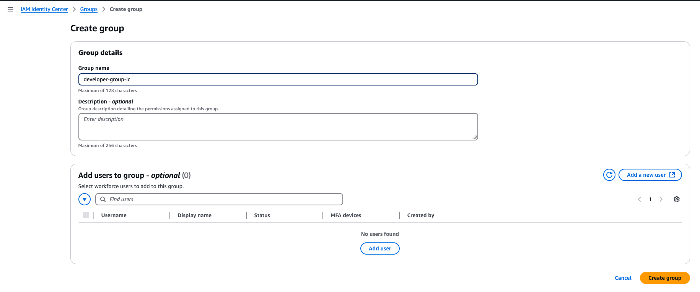

# IAM 

## Create an IAM Identity Center user for the aws cli

1. Add Group by navigating to [IAM Identity Center - Create Group](https://eu-west-2.console.aws.amazon.com/singlesignon/home?region=eu-west-2#/instances/7535f8076f921b2a/groups/create):



2. Navigate to [IAM Identity Center - Create User](https://eu-west-2.console.aws.amazon.com/singlesignon/home?region=eu-west-2#/instances/7535f8076f921b2a/users$addUserWizard) add the user details and click next:


3. Add the user to the group:


4. Review and click Add User:


5. Make a note of the credentials

```text
https://d-9c676dac37.awsapps.com/start
awsnotesic
```

6. Navigate to [IAM Identity Center - AWS Accounts](https://eu-west-2.console.aws.amazon.com/singlesignon/organization/home?region=eu-west-2#/instances/7535f8076f921b2a/accounts)
select the account then Assign users or groups:


7. Select our group then next:


8. Click **Create permission set** then Power User then next:


9. Go to the group and [Assign AWS accounts to group: developer-group-ic](https://eu-west-2.console.aws.amazon.com/singlesignon/home?region=eu-west-2&tab=account-assignments#/instances/7535f8076f921b2a/groups/groupDetails/06a272f4-50b1-70fb-0a52-445fd84fe010/assign-accounts)


(Note: we are resuming from 6 here but after permission set)

10. Check the assignment worked:


11. Attempt to logon:

```bash
@edoatley ➜ /workspaces/aws-notes (main) $ aws configure sso --use-device-code
SSO session name (Recommended): awsnotes-sso
SSO start URL [None]: https://d-9c676dac37.awsapps.com/start
SSO region [None]: eu-west-2
SSO registration scopes [sso:account:access]:
Attempting to automatically open the SSO authorization page in your default browser.
If the browser does not open or you wish to use a different device to authorize this request, open the following URL:

https://d-9c676dac37.awsapps.com/start/#/device

Then enter the code:

PPSR-SFTF
```

Next you need to go to the browser and login. Enter the username and password and then you can allow access from the terminal. 
You then return to the terminal and see the login:

```bash
The only AWS account available to you is: 503561418276
Using the account ID 503561418276
The only role available to you is: PowerUserAccess
Using the role name "PowerUserAccess"
Default client Region [None]: eu-west-2
CLI default output format (json if not specified) [None]:
Profile name [PowerUserAccess-503561418276]:
To use this profile, specify the profile name using --profile, as shown:

aws sts get-caller-identity --profile PowerUserAccess-503561418276
```

12. Try it out:

```bash
@edoatley ➜ /workspaces/aws-notes (main) $ aws s3 ls --profile PowerUserAccess-503561418276
2024-09-06 06:42:23 aws-cloudtrail-logs-management-events-503561418276
2024-11-15 23:47:11 aws-event-stream-edo-4645-tfstate
2024-11-20 20:06:31 cf-templates-1sowselldw28z-eu-west-1
2024-08-27 13:14:11 cf-templates-1sowselldw28z-us-east-1
```