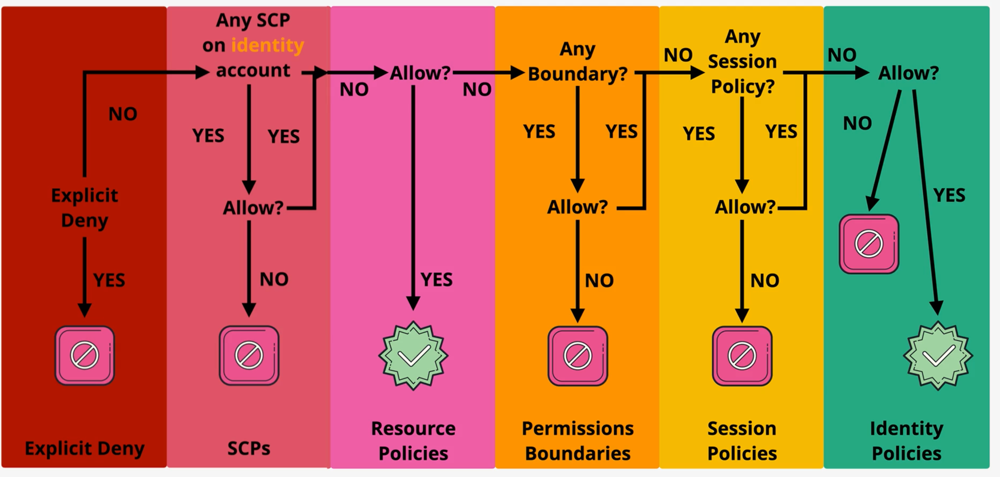

# Policy Evaluation Summary

1. Explicit **DENY**
2. Restrict by SCP with **DENY** on the account containing the **identity**
3. Resource policy can **ALLOW**
4. Restrict by permission boundary
5. Restrict by session policy (relevant where e.g. assuming role)
6. Look for explict **ALLOW**
7. Default **DENY**