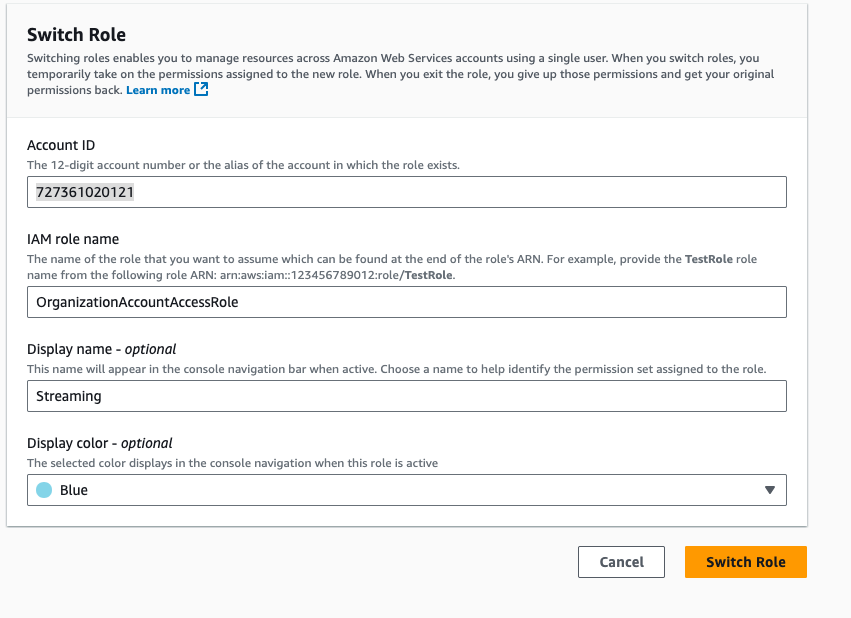

# IAM Role Switching

```
Account ID: <AWS Account ID> e.g. 727361020121
Role: <>Role to allow you to assume role in above account> e.g. OrganizationAccountAccessRole
Name: <Name for the role switch> e.g. Streaming
Display Color: <Color for role>
```

