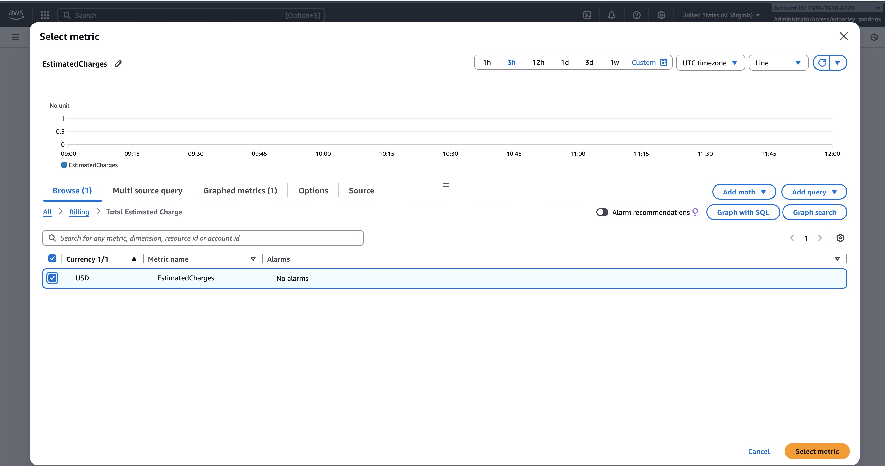
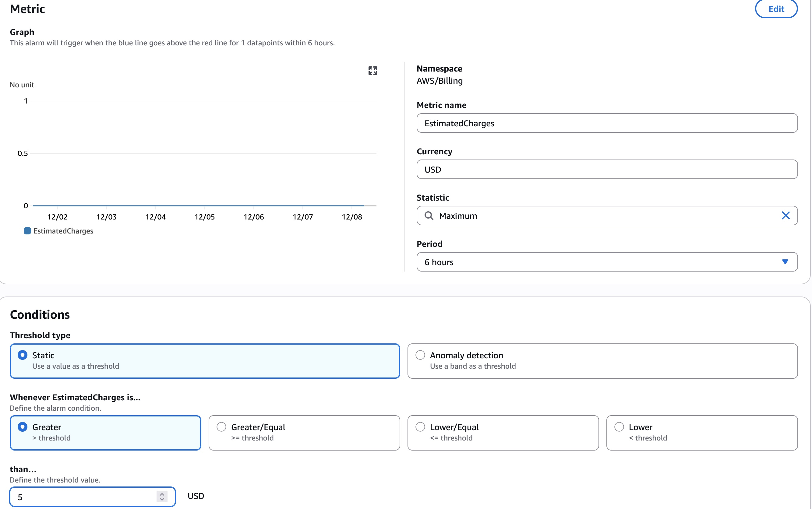
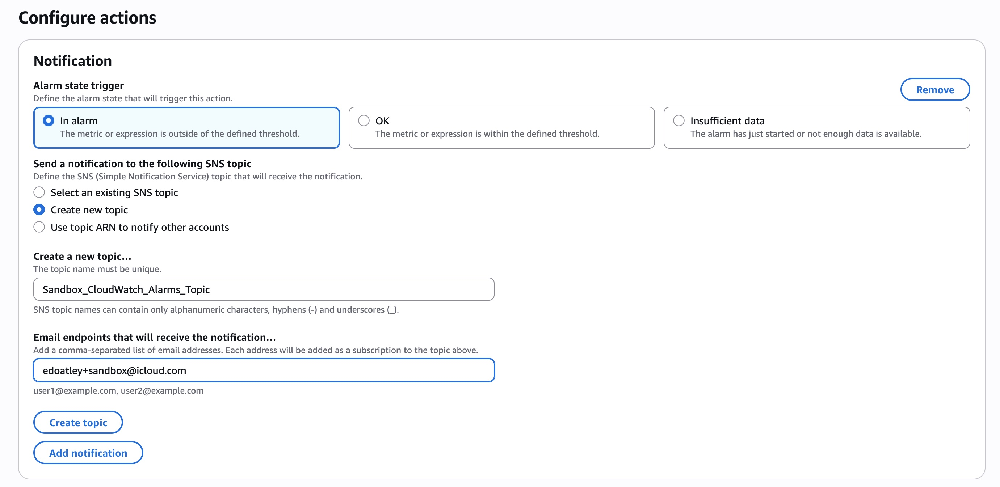
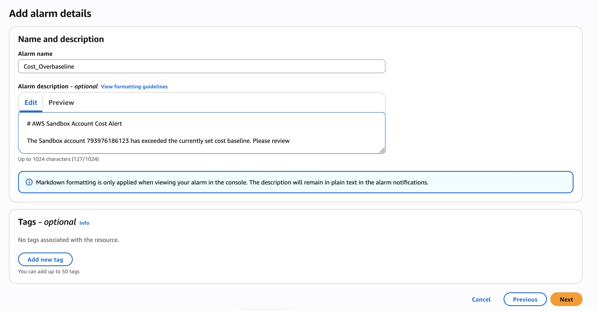
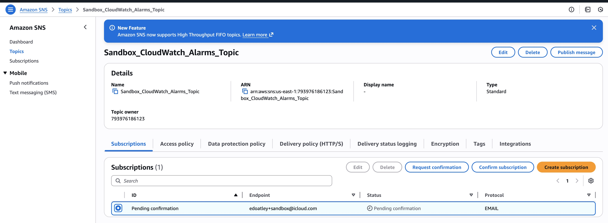
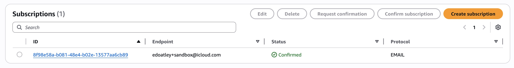

# Lab 0: Billing Alarm (Mandatory)

## Objective
Create a cost-protection billing alarm in `us-east-1` that emails when estimated charges exceed a low threshold.

## Success Criteria
- CloudWatch billing alarm monitors `EstimatedCharges` in `us-east-1`.
- Alarm threshold set (e.g., $5.00 USD).
- SNS topic created and set as alarm action.
- Email subscription for the SNS topic confirmed.
- Notification email received after confirmation.

## Services Involved
- Amazon CloudWatch
- Amazon SNS

## Tips
- Billing metrics publish only to `us-east-1`.
- Alarm is free within CloudWatch always-free custom metrics.
- SNS email subscriptions require manual email confirmation.

## Solution

### Web Console

1. Navigate to us-east-1 in the Region dropdown
2. Go to **Cloudwatch**
3. Click **Create Alarm**
4. Select `EstimatedCharges` then click **Select Metric**:

 

5. Set a threshold of $5 and click **Next**:



6. Click **Add Notification** and complete the SNS details:



7. Click **Create Topic** then **Next**
8. Add alarm details and click **Next**:



9. Click **Create Alarm**

10. Observe the Warning:

> This action sends a message to an SNS topic with an endpoint that is pending confirmation. It will not work as expected until the endpoint is confirmed. Look for a subscription confirmation email or review the topic in SNS.

11. Find the topic in SNS:



12. Acknowledge the subscription request email
13. Observe the subsription is confirmed:



### CloudFormation

1. Create the [template](cloudformation.yaml) 

2. Login

```bash
aws sso login --profile sandbox
```

3. Validate the template:

```bash
aws cloudformation validate-template \
    --template-body file://cloudformation.yaml \
    --region us-east-1 \
    --profile sandbox
```

4. Deploy the stack (replace `YOUR_EMAIL@example.com` with your email address):

```bash
aws cloudformation create-stack \
    --stack-name lab-0-billing-alarm \
    --template-body file://cloudformation.yaml \
    --region us-east-1 \
    --profile sandbox \
    --parameters ParameterKey=EmailSubscription,ParameterValue=edoatley+sandbox@icloud.com \
                 ParameterKey=DollarThreshold,ParameterValue=8.0
```

**Note:** Billing metrics are only available in `us-east-1`, so the stack must be deployed in that region.

5. Check stack status:

```bash
aws cloudformation describe-stacks \
    --stack-name lab-0-billing-alarm \
    --region us-east-1 \
    --profile sandbox \
    --query 'Stacks[0].StackStatus'
```

6. Wait for stack creation to be `CREATE_COMPLETE`, then check your email for the SNS subscription confirmation. Click the confirmation link to activate the subscription.

7. Verify the alarm was created:

```bash
aws cloudwatch describe-alarms \
    --alarm-names HighEstimatedChargesAlarm \
    --region us-east-1 \
    --profile sandbox
```

we should see that it is there and not triggering.

8. (Optional) Update the stack if you need to change parameters:

```bash
aws cloudformation update-stack \
    --stack-name lab-0-billing-alarm \
    --template-body file://cloudformation.yaml \
    --region us-east-1 \
    --profile sandbox \
    --parameters ParameterKey=EmailSubscription,ParameterValue=YOUR_EMAIL@example.com \
                 ParameterKey=DollarThreshold,ParameterValue=8.0
```

9. (Optional) Delete the stack when done:

```bash
aws cloudformation delete-stack \
    --stack-name lab-0-billing-alarm \
    --region us-east-1 \
    --profile sandbox
```


