# Lab 2: Resilient Foundations - Secure Static Website Hosting (Easy)

## Objective
Deploy a private S3 bucket fronted by CloudFront with Origin Access Control (OAC) for secure static website delivery over HTTPS.

## Success Criteria
- Private S3 bucket created with "Block all public access" enabled.
- `index.html` uploaded to the bucket.
- Direct S3 object URL returns 403 Access Denied.
- CloudFront distribution created with the bucket as origin and OAC enabled.
- CloudFront-provided bucket policy applied to allow CloudFront to read objects.
- Accessing the CloudFront domain serves `index.html` over HTTPS.

## Services Involved
- Amazon S3
- Amazon CloudFront

## Tips
- Prefer OAC over legacy OAI for secure origin access.
- Bucket must stay private; CloudFront handles public delivery.
- CloudFront always-free tier is generous; keep costs low by cleaning up.

### Web Console

1. Create a bucket `edo-secure-static-website-lab2`:

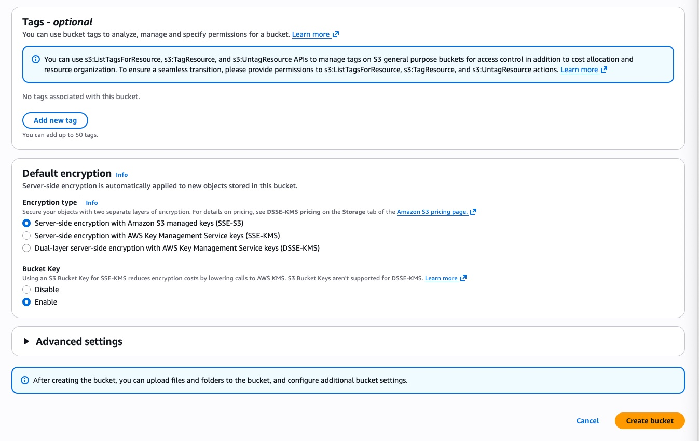

2. Upload [index.html](./index.html)

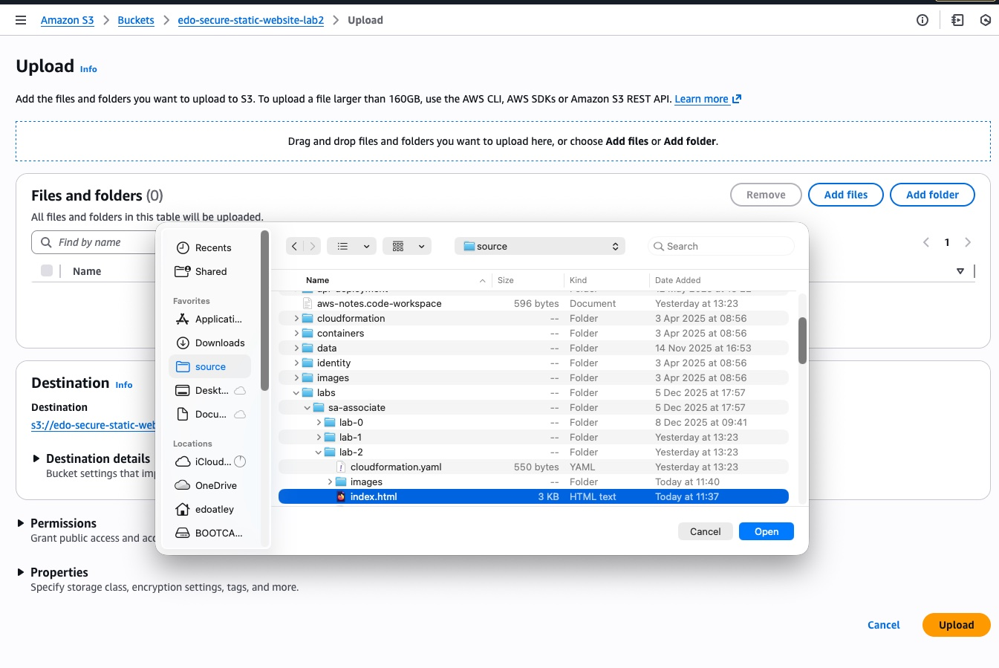
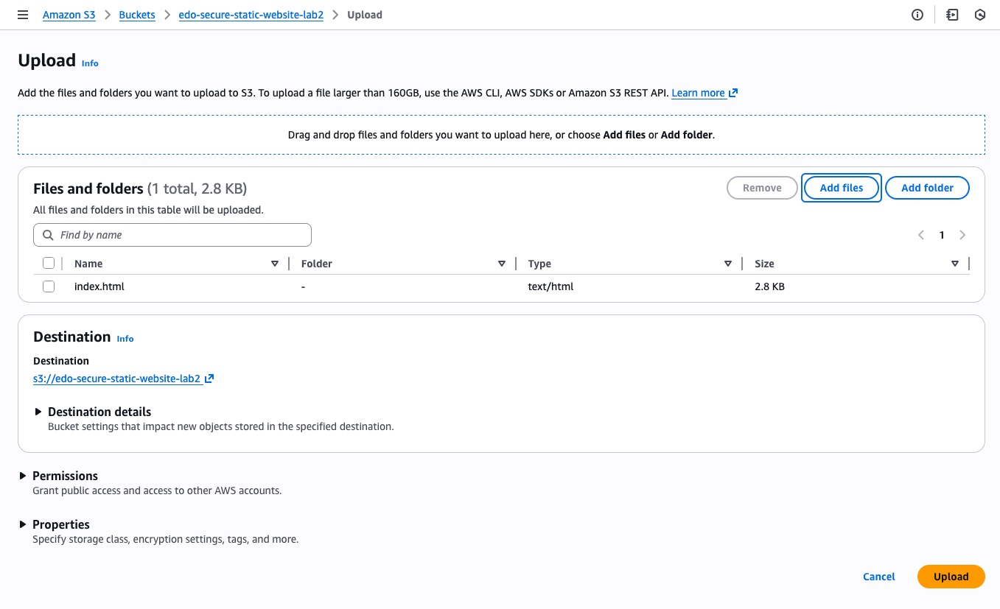

3. Check direct url https://edo-secure-static-website-lab2.s3.eu-west-2.amazonaws.com/index.html is not accessible:

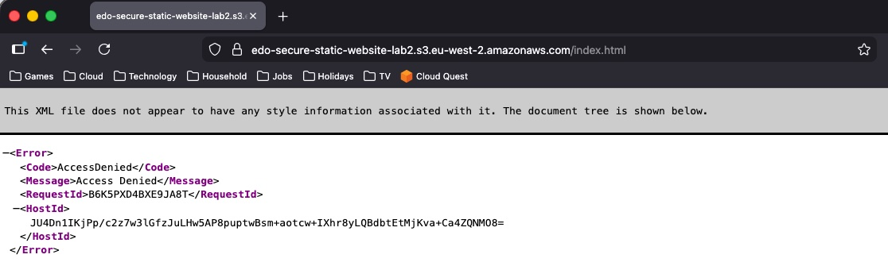

4. Create CloudFront Distibution:

   - Choose Plan 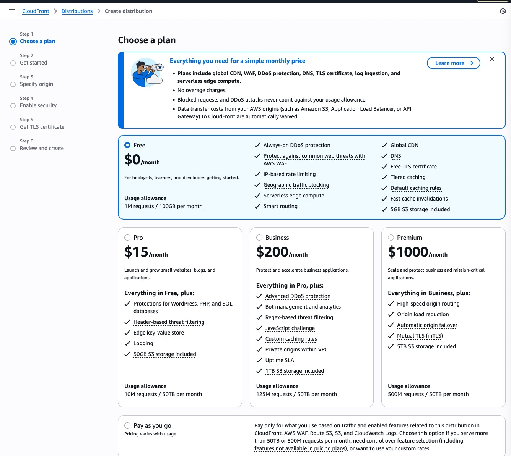
   - Name distribution `edo-secure-static-website-cf-dist` 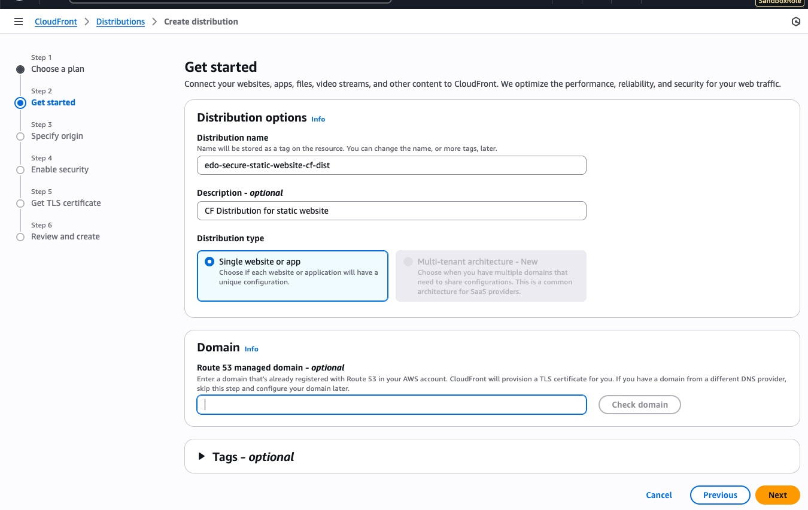
   - Define Origin 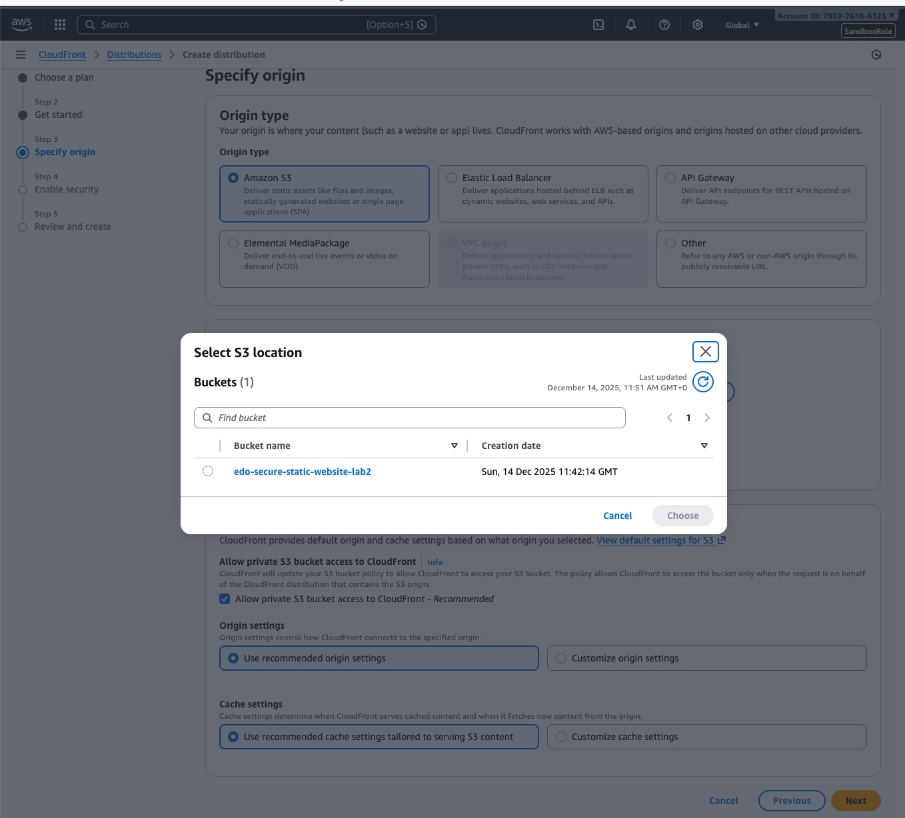 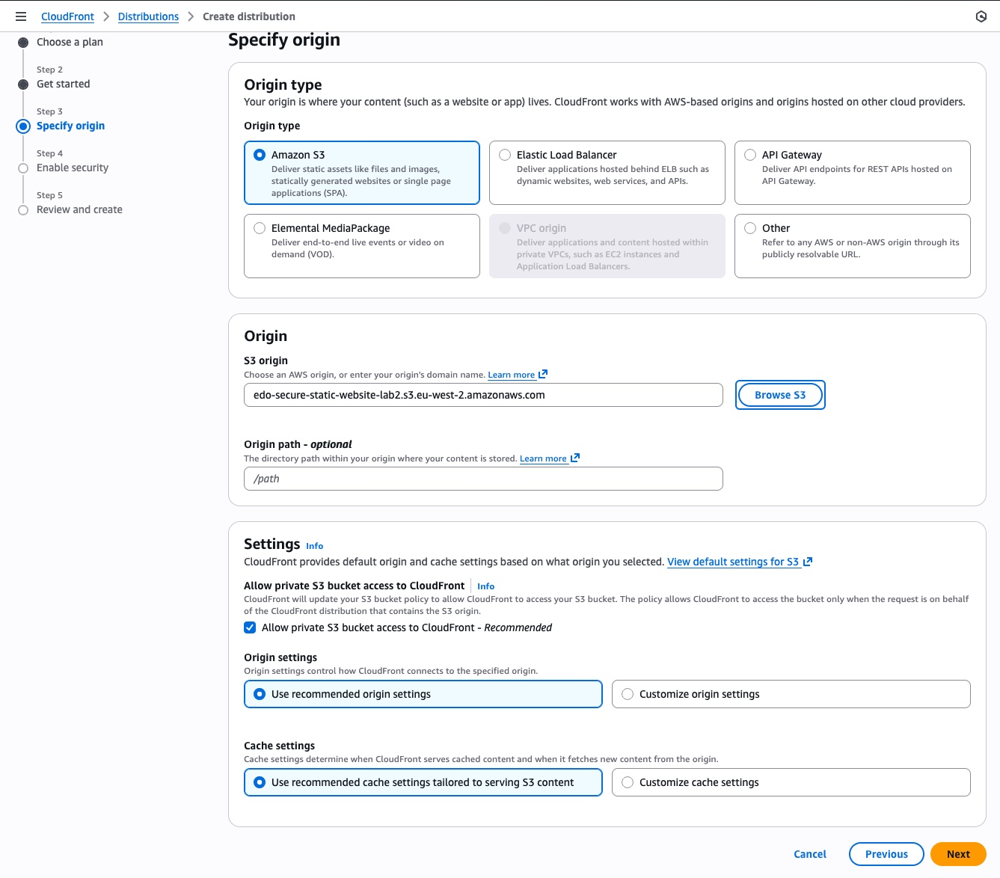 
   - Set WAF settings if applicable 
   - Create distribution: 
   - Check origin protections and wait for deployment to complete 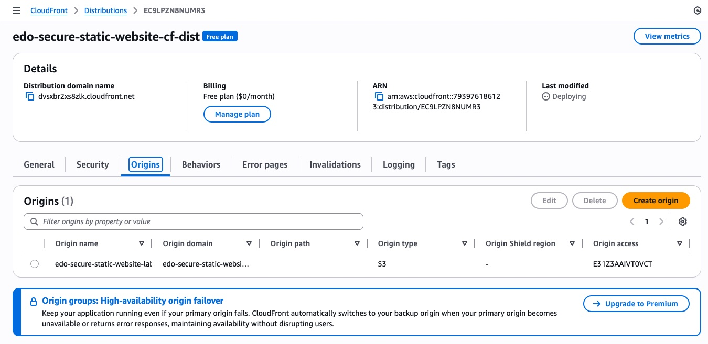

5. Observe / Validate the bucket policy created:

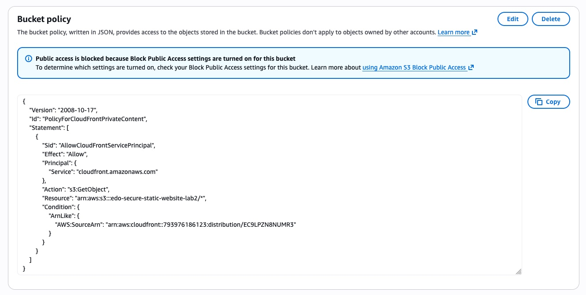

6. Navigate to the [index.html](https://dvsxbr2xs8zlk.cloudfront.net/index.html)

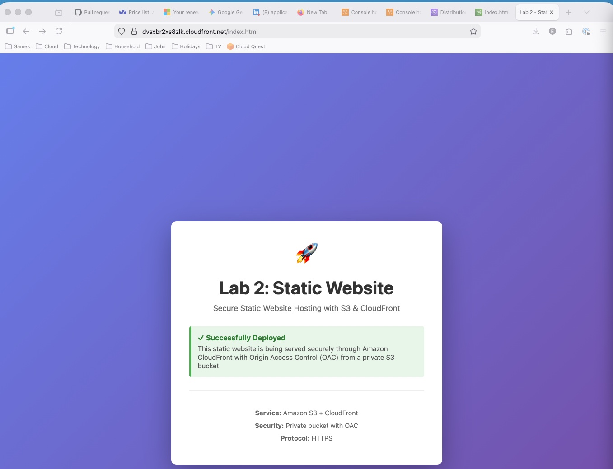

7. Check the direct link is still inaccessible

8. Cleanup
 - Delete the CloudFront distribution
 - Empty the s3 bucket
 - Delete the S3 bucket

### CloudFormation

#### Generate from web console

1. Navigate to CloudFormation then IaC Generator
2. Trigger a scan of all resources
3. Create a template and seelct resources
4. Download the [generated template](Static-Website-With-CloudFront-template.yaml)

#### Build from scratch

_Add CFN link and any CLI/SDK commands here._

