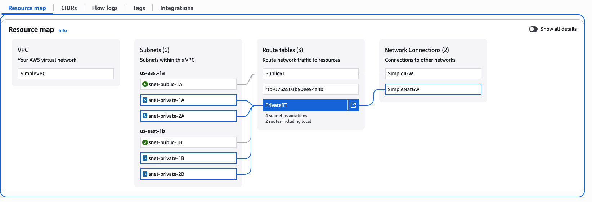
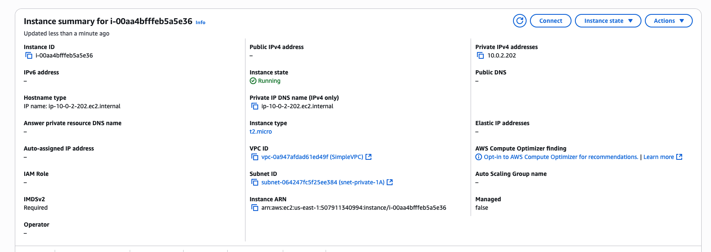
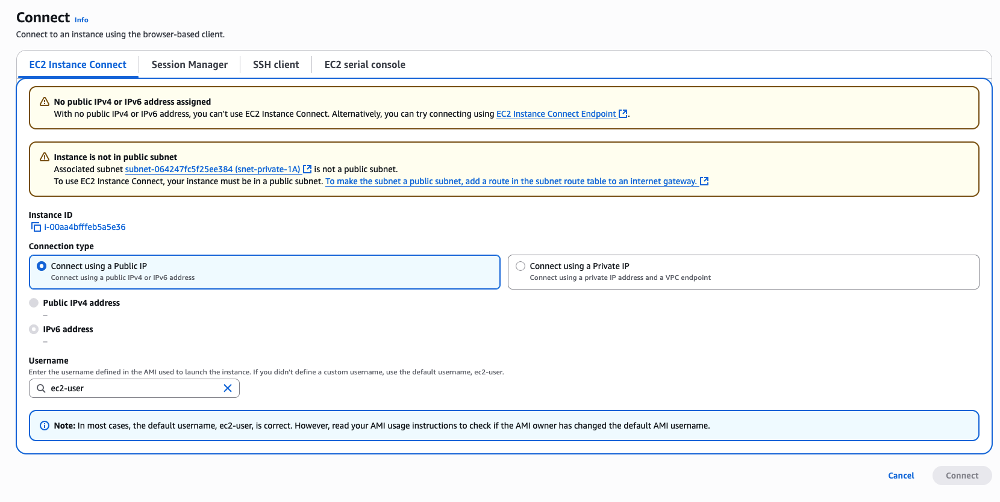

# Vpc

## Templates

### Simple VPC with a subnet

[Template](../resources/network/simple-vpc-cfn.yaml)

### NAT Gateway and Internet Gateway example

[Template](../resources/network/nat-gateway-cfn.yaml)]

1.  create a VPC 'SimpleVPC' with CIDR `10.0.0.0/16`

2.  Create 6 subnets:

| subnet name | CIDR | AZ |
| ----------- | ---- | -- |
| snet-public-1A  | 10.0.0.0/24 | us-east-1a |
| snet-public-1B  | 10.0.1.0/24 | us-east-1b |
| snet-private-1A | 10.0.2.0/24 | us-east-1a |
| snet-private-1B | 10.0.3.0/24 | us-east-1b |
| snet-private-2A | 10.0.4.0/24 | us-east-1a |
| snet-private-2B | 10.0.5.0/24 | us-east-1b |

3. Create an Intenet Gateway Resource and attach to SimpleVPC

4. Create a RouteTable PublicRT and a route from `0.0.0.0/0` to the intenet gateway

5. Associate the route table to the public subnets

6. Create a private route table PrivateRT

7. Associate the route table to the private subnets

8. Deploy a NAT Gateway **PUBLIC** subnet `snet-public-1A`

9. Add a route from `0.0.0.0/0` to the NAT gateway in the private route table

10. With this all deployed we can see our VPC:



11. Deploy EC2 instance in `snet-private-1A`:



12. Connect to instance...

This actully nicely proves the instance has no public IP:



13. Create a VPC endpoint:


```output
   ,     #_
   ~\_  ####_        Amazon Linux 2023
  ~~  \_#####\
  ~~     \###|
  ~~       \#/ ___   https://aws.amazon.com/linux/amazon-linux-2023
   ~~       V~' '->
    ~~~         /
      ~~._.   _/
         _/ _/
       _/m/'
[ec2-user@ip-10-0-2-202 ~]$ ping google.com
PING google.com (142.250.31.113) 56(84) bytes of data.
64 bytes from bj-in-f113.1e100.net (142.250.31.113): icmp_seq=1 ttl=105 time=2.44 ms
64 bytes from bj-in-f113.1e100.net (142.250.31.113): icmp_seq=2 ttl=105 time=1.81 ms
64 bytes from bj-in-f113.1e100.net (142.250.31.113): icmp_seq=3 ttl=105 time=2.07 ms
64 bytes from bj-in-f113.1e100.net (142.250.31.113): icmp_seq=4 ttl=105 time=1.99 ms
64 bytes from bj-in-f113.1e100.net (142.250.31.113): icmp_seq=5 ttl=105 time=2.08 ms
64 bytes from bj-in-f113.1e100.net (142.250.31.113): icmp_seq=6 ttl=105 time=2.41 ms
64 bytes from bj-in-f113.1e100.net (142.250.31.113): icmp_seq=7 ttl=105 time=2.12 ms
^C
--- google.com ping statistics ---
7 packets transmitted, 7 received, 0% packet loss, time 6009ms
rtt min/avg/max/mdev = 1.807/2.130/2.437/0.208 ms
[ec2-user@ip-10-0-2-202 ~]$ 
```