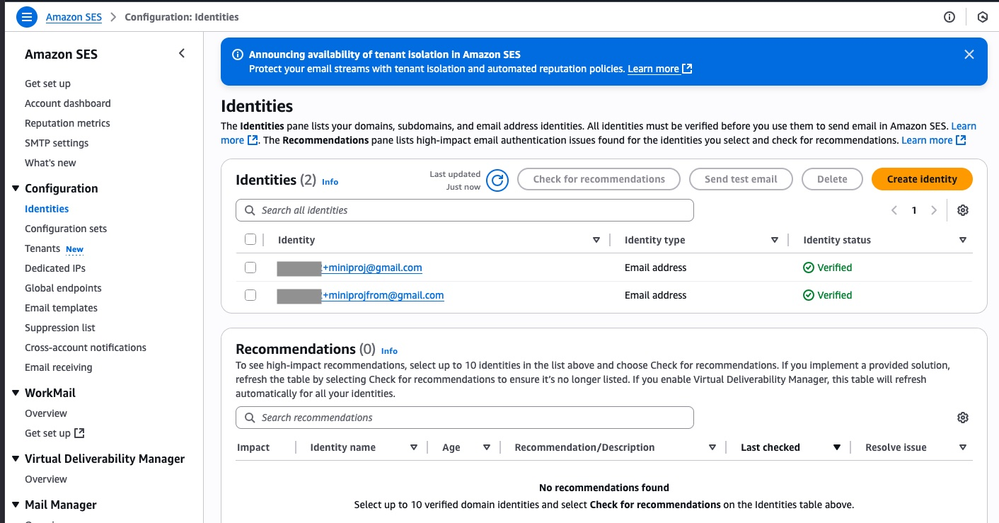
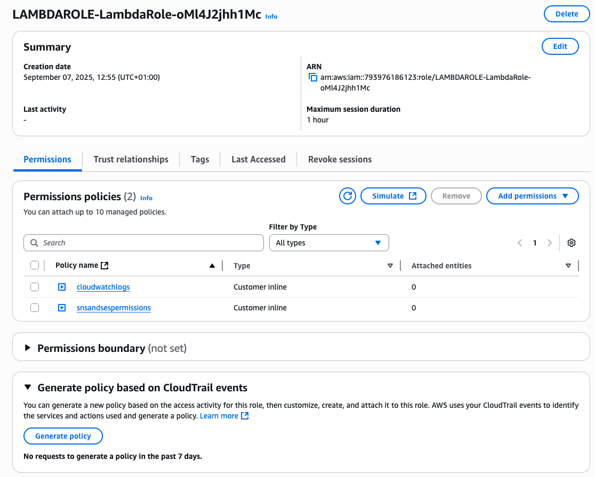
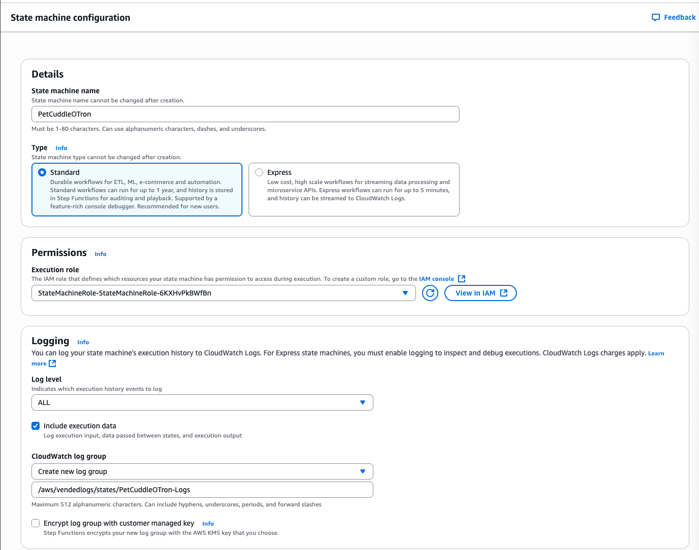
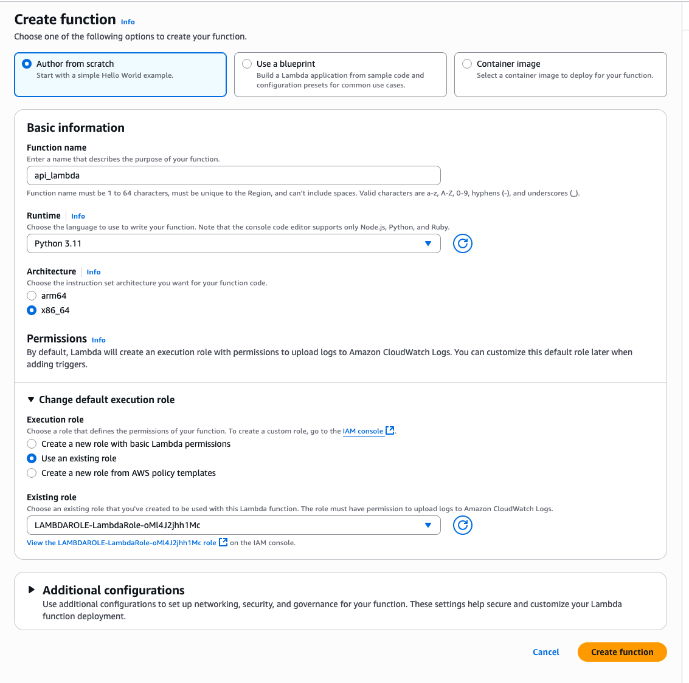
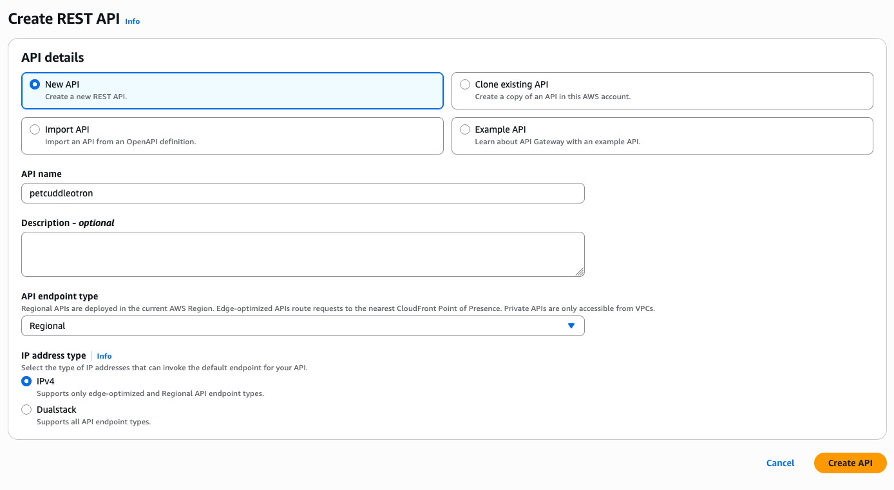
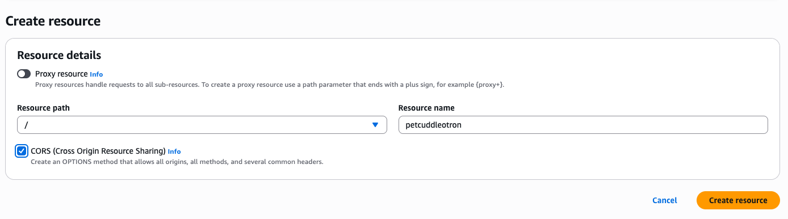
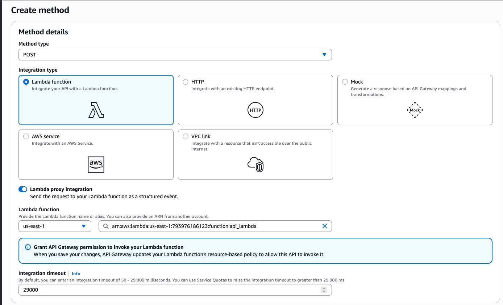
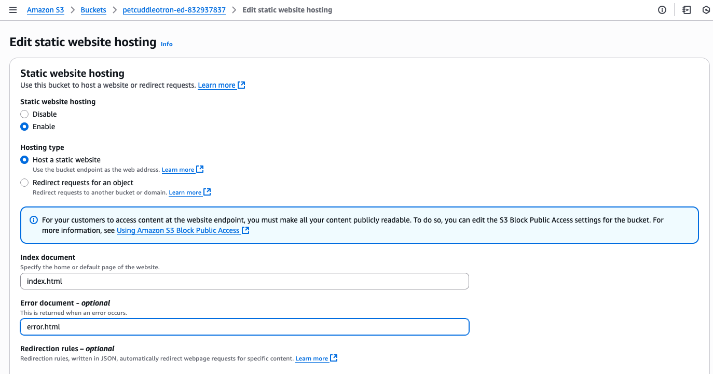
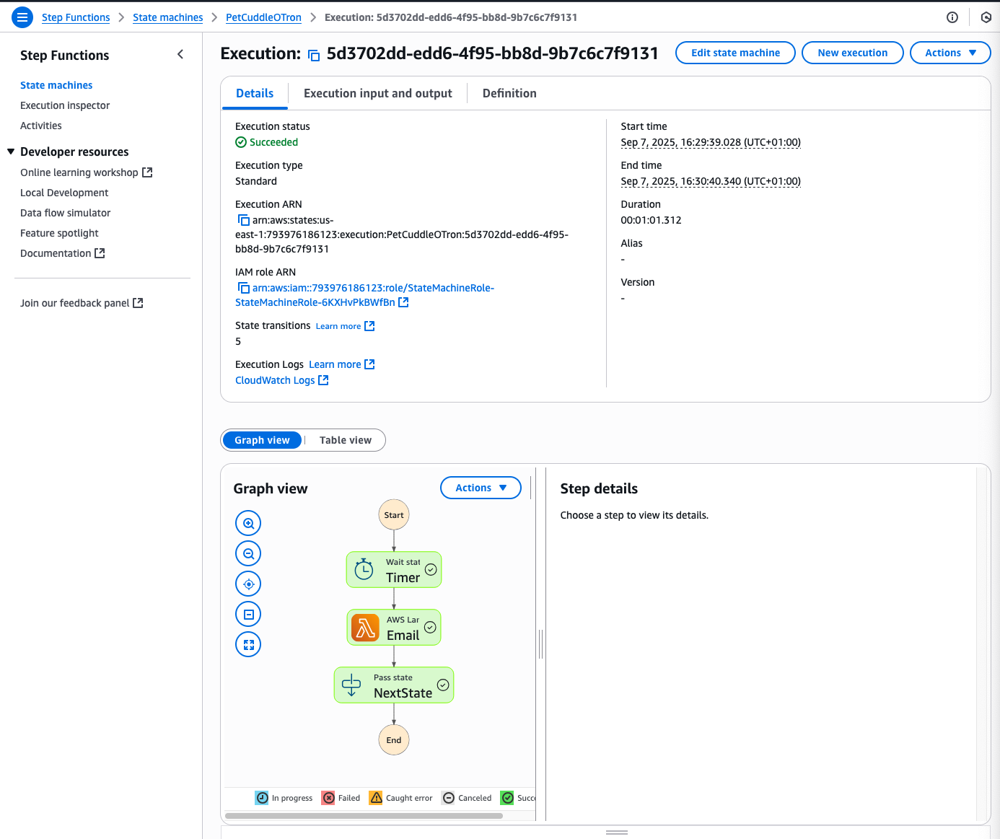

# Create a simple serverless app

See these refs:

- https://github.com/acantril/learn-cantrill-io-labs/blob/master/aws-serverless-pet-cuddle-o-tron/02_LABINSTRUCTIONS/CommonIssues.md
- https://github.com/acantril/learn-cantrill-io-labs/tree/master/aws-serverless-pet-cuddle-o-tron

## Part 1 - Set up Simple Email Service (SES)

SES starts in sandbox mode where every single email address must be owned by you and you must click on a link it sends
to the email to confirm.

1. Click on identities
2. Click "Create Identity"
   - select "Email Address" radio button
   - Enter the email address for emails to be sent from
3. Repeat for the **to** address

It should look like this:
 


## Part 2 — Add an email lambda function to use SES

- Use the CloudFormation [1-click deployment](https://console.aws.amazon.com/cloudformation/home?region=us-east-1#/stacks/quickcreate?templateURL=https://learn-cantrill-labs.s3.amazonaws.com/aws-serverless-pet-cuddle-o-tron/lambdarolecfn.yaml&stackName=LAMBDAROLE)
- Wait for it to complete
- Navigate to IAM and validate the role is there:



- validate the trust policy allows `lambda.amazonaws.com` to assume it
- validate the permissions allow:
   ```json
   "Action": [
       "ses:*",
       "sns:*",
       "states:*"
   ],
   ```
   This means SNS, SES and interaction with State Machines in Step Functions. There is also the standard Lambda `cloudwatchlogs`
   permissions associated
- We now navigate to the Lambda console and create the Email Lambda:


- Add the code:

```python
import boto3, os, json

FROM_EMAIL_ADDRESS = 'REPLACE_ME'

ses = boto3.client('ses')

def lambda_handler(event, context):
    # Print event data to logs .. 
    print("Received event: " + json.dumps(event))
    # Publish message directly to email, provided by EmailOnly or EmailPar TASK
    ses.send_email( Source=FROM_EMAIL_ADDRESS,
        Destination={ 'ToAddresses': [ event['Input']['email'] ] }, 
        Message={ 'Subject': {'Data': 'Whiskers Commands You to attend!'},
            'Body': {'Text': {'Data': event['Input']['message']}}
        }
    )
    return 'Success!'
```

and replace `FROM_EMAIL_ADDRESS` with the from email from Step 1 then click Deploy and make a note of the lambda ARN:
`arn:aws:lambda:us-east-1:793976186123:function:Email_Reminder_Lambda`

## Step 3 - Implement and configure the state machine, the core of the application

- Deploy [1-Click Deploy Link](https://console.aws.amazon.com/cloudformation/home?region=us-east-1#/stacks/quickcreate?templateURL=https://learn-cantrill-labs.s3.amazonaws.com/aws-serverless-pet-cuddle-o-tron/statemachinerole.yaml&stackName=StateMachineRole) for the StateMachine role
- Wait for it to complete
- Review the role created: `arn:aws:iam::793976186123:role/StateMachineRole-StateMachineRole-6KXHvPkBWfBn`:
  - validate the trust policy allows `states.amazonaws.com` to assume it (i.e. Step Functions)
- validate the permissions allow:
  ```json
      "Action": [
          "lambda:InvokeFunction",
          "sns:*"
      ],
  ```
- Navigate to Step Functions and then State Machines and create the State Machine:



- Click code and paste in the [template](https://learn-cantrill-labs.s3.amazonaws.com/aws-serverless-pet-cuddle-o-tron/pet-cuddle-o-tron.json)
- Replace placeholder with our Lambda
- Note the State Machine ARN `arn:aws:iam::793976186123:role/StateMachineRole-StateMachineRole-6KXHvPkBWfBn`

## Step 4 - Implement the API Gateway, API and supporting lambda function

- We now navigate to the Lambda console and create the API Lambda:

- replace the code with [this](http://learn-cantrill-labs.s3.amazonaws.com/aws-serverless-pet-cuddle-o-tron/api_lambda.py)
- replace the placeholder with the state machine ARN
- Note the API Lambda ARN: `arn:aws:lambda:us-east-1:793976186123:function:api_lambda`
- Navigate to API Gateway and click `Create API` then `REST API`:

- Create a Resource:

- Create Method

- Deploy to a new stage `prod`:

- Note the invoke URL: https://s8j2s7q7nc.execute-api.us-east-1.amazonaws.com/prod 

## Step 5 - Implement the static frontend application and test functionality

- Navigate to S3 and create a bucket `petcuddleotron-ed-832937837`
- Uncheck `Block all public access` and check the acknowledgement box
- Click Permissions then Edit the Bucket Policy. Paste in this to give public read access:
```json
{
    "Version":"2012-10-17",
    "Statement":[
      {
        "Sid":"PublicRead",
        "Effect":"Allow",
        "Principal": "*",
        "Action":["s3:GetObject"],
        "Resource":["arn:aws:s3:::petcuddleotron-ed-832937837/*"]
      }
    ]
  }
```
- Go to properties then edit the static website hosting

- Download the static website [files](https://learn-cantrill-labs.s3.amazonaws.com/aws-serverless-pet-cuddle-o-tron/serverless_frontend.zip)
- Edit the placeholder in the javascript folder to point at the API <api gateway url>/petcuddleotron
- Navigate to the s3 hosted website url: http://petcuddleotron-ed-832937837.s3-website-us-east-1.amazonaws.com/ 
- I entered values but got this error:   Oops! Error Error: TypeError: NetworkError when attempting to fetch resource.
and saw this in the console:

```
Cross-Origin Request Blocked: The Same Origin Policy disallows reading the remote resource at https://s8j2s7q7nc.execute-api.us-east-1.amazonaws.com/prod/petcuddleotron.
(Reason: CORS header ‘Access-Control-Allow-Origin’ missing). Status code: 502. 
```

I did initially incorrectly look at CORS on the API gateway resource but it turned out I used the State Machine Role rather
than the actual State Machine. This was found as I read up on the error and saw:

```
The 502 Bad Gateway Error

A 502 Bad Gateway error from API Gateway almost always means there's a problem with the integrated Lambda function. 
```

Trying again and looking at the State Machine monitoring:



## Step 6 - Cleanup

- empty and delete s3 bucket
- delete the 2 lambdas
- delete the state machine
- delete the api gateway resource
- delete the 2 cloudformation 1 click deploys
- optionally delete the SES identities