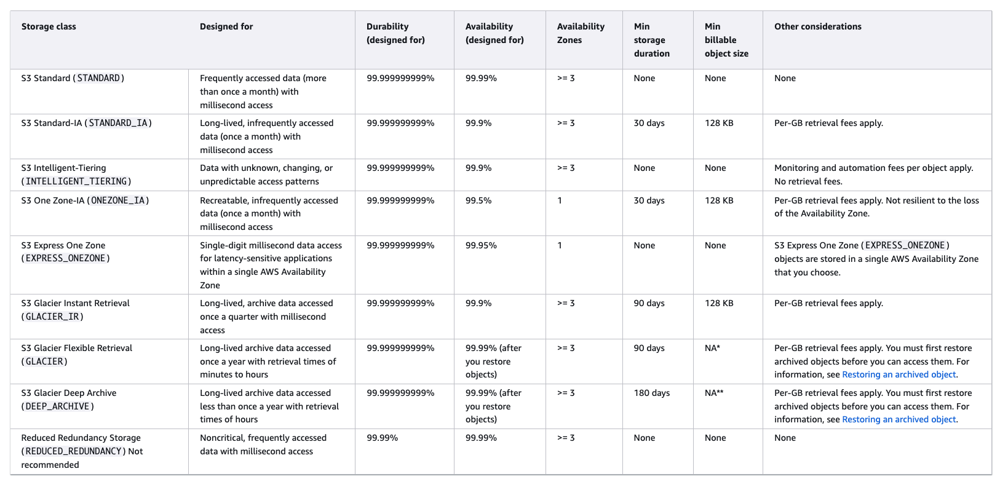
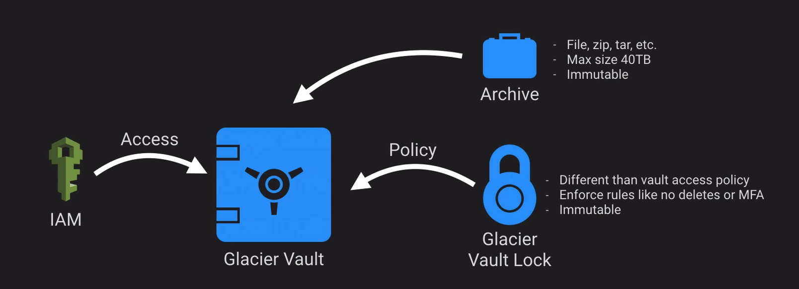

# Storage

## References

- [Performance Efficiency Pillar - AWS Well-Architected Framework](https://docs.aws.amazon.com/wellarchitected/latest/performance-efficiency-pillar/welcome.html)
- [Best Practices Design Patterns: Optimizing Amazon S3 Performance](https://docs.aws.amazon.com/whitepapers/latest/s3-optimizing-performance-best-practices/introduction.html)
- [AWS re:Invent 2017: Deep Dive: Using Hybrid Storage with AWS Storage Gateway to Solv (STG309)](https://www.youtube.com/watch?v=9wgaV70FeaM)
- [AWS re:Invent 2017: ElastiCache Deep Dive: Best Practices and Usage Patterns (DAT305)](https://www.youtube.com/watch?v=_YYBdsuUq2M)
- [AWS re:Invent 2017: Deep Dive on Amazon Relational Database Service (RDS) (DAT302)](https://www.youtube.com/watch?v=TJxC-B9Q9tQ)
- [AWS re:Invent 2017: Deep Dive on Amazon S3 & Amazon Glacier Storage Management with (STG311)](https://www.youtube.com/watch?v=SUWqDOnXeDw)
- [Amazon ElastiCache overview](https://docs.aws.amazon.com/whitepapers/latest/scale-performance-elasticache/amazon-elasticache-overview.html)
- [SaaS Storage Strategies](https://docs.aws.amazon.com/whitepapers/latest/multi-tenant-saas-storage-strategies/multi-tenant-saas-storage-strategies.html)
- [AWS Storage Services Overview](https://docs.aws.amazon.com/pdfs/whitepapers/latest/aws-storage-services-overview/aws-storage-services-overview.pdf)
- [Using Global Secondary Indexes in DynamoDB](https://docs.aws.amazon.com/amazondynamodb/latest/developerguide/GSI.html)
- [Announcing Amazon OpenSearch Service which Supports OpenSearch 1.0](https://aws.amazon.com/blogs/aws/announcing-amazon-opensearch-service-which-supports-opensearch-10/)

## Concepts

Storage Types:

- Persistent - durable and survives power cycles e.g.Glacier/RDS
- Transient - data is temporarily stored and passed on to another process e.g. SQS, SNS
- Ephemeral - data is held in memory and lost when stopped e.g. EC2 instance store, Memcached

Data movement concepts:

- IOPS - how fast we can read and write to a device
- Throughput - how much data can be moved at a time

Consistency models:

- ACID - relational DB model using row locks and rollback
  - atomic - all or nothing
  - consistent - transactions must be valid
  - isolated - transactions cannot mess with each other
  - durable - completed transactions stick
- BASE - more of a nosql model, sacrifice consistency for scalability and availability
  - basically available - availability even if data stale
  - soft state - may not be instantly consistent accross datastores
  - eventually consistent - will achieve consistency at some point

BASE has come into favour where very high volumes and need for more scale

## S3

- Introduced in 2006
- Object store used in many AWS services directly or behind scenes
- Max object size 5TB, Max single put 5GB
- Should use multipart uploads where 100MB is exceeded
- S3 object refs e.g. `s3://bucket-name/images/bob.png` are not file paths they are keys
- S3 Consistency
  - S3 provides read-after-write consistency for PUTs of new objects i.e. if you PUT a new object you can safely read it back immediately
  - HEAD/GET of a key before the object exists result in eventual consistency i.e. can't read it until fully replicated then you can read it
  - Eventual consistency on PUTs and DELETEs i.e. make change locally then replicate then serve up the change when fully replicated
  - Updates to a single key are atomic i.e. one person can update an object at a time, process changes in timestamp order and you can see them once replicated
- S3 security
  - resource based (object ACL, bucket policy)
  - User based (IAM policies)
  - Optional MFA before delete - protect from accidental 
- Versioning
  - new version of object with each write
  - enables undelete / rollback
  - old versions count towards size for billing
  - Integrated with Lifecycle management
  - delete markers used to mark objects as deleted - removing these achieves undelete
- Cross region replication
  - security
  - compliance
  - latency
- S3 storage classes: 
- S3 Lifecycle Management
  - optimize storage costs
  - Adhere to data retention policies e.g. destroy after x years
  - Keep S3 volumes well maintained
- S3 analytics
  - Datalake concept - Athena, Redshift Spectrum, QuickSight
  - IoT Streaming Data Repository - Kinesis Firehose
  - ML and AI Stroage - Rekognition, Lex, MXNet
  - Stroager Class Analysis - S3 Management Analytics
- S3 Encryption at rest
  - SSE-S3 - Use S3's existing encryption keyt
  - SSE-C - Upload your own AES-256 key which S3 will use when it writes objects
  - SSE-KMS - Use a key generated and managed by AWS KMS service
  - Client side - encrypt before uploading to S3 using PGP, GPG etc
- Other S3 features
  - Transfer acceleration - uses CloudFront 'in reverse' to upload your data leveraging local PoP
  - Requester Pays option - the requester of the data (have to have an AWS account) pay for downloading data out of your S3 bucket so you don't incur the charges.
  - Tags - useful across all of AWS, but more specifically in S3. You can assign tags to objects and use that in costing, billing, security, segregation of documents etc 
  - Events -  when you upload or update or delete something then trigger a notification to SNS, SQS, or Lambda and do some activity.
  - Static web hosting feature
  - BitTorrent - S3 supports the BitTorrent protocol, and it actually has a special URL that you can generate a .torrent file to distribute to other users or other people who want to download your content. And then they can use their BitTorrent client to start downloading that content, then ultimately, the content gets distributed across the Torrent network and then you're not serving up so much data straight from S3, but you're leveraging the peer‑to‑peer distribution network.

## Managing permissions in S3

- S3 is private by default
- Only the account root user has access to a bucket by default
- Grant access via:
  - Bucket policies - defined at the bucket resource and give a particular principal access to some or all objects in a bucket. Can explicitly allow or explicitly deny access, and this will take precedence over any other permissions granted.
  - IAM - granting temporary permissions in the form of a role to a given user, service, or application. If you can assume the role, you can access the bucket.
- Evaluating permissions:
  - If that user is denied access explicitly in the bucket policy, they will not be able to get objects from the bucket. 
  - If they're explicitly allowed to access objects in the bucket by the bucket policy, then regardless of any roles or permissions that IAM user has been granted, as a principal listed on that resource‑based policy, they'll be able to access objects in the bucket.
  - If bucket policy does not explicitly allow/deny then identity (IAM) policies are evaluated
- Using trust policies and IAM roles you can share access across AWS accounts - considered more secure than bucket policies as IAM creds frequently rotate

- Bucket policies can also add conditions blocking access unless the conditions are met. In this fragment we set the policy so it does not apply to IP 1.3.3.7 we could use this condition on a deny policy to allow this IP access regardless:

```json
{
  "Condition": {
    "NotIpAddress": {"aws:SourceIp": "1.3.3.7/32"}
  }
}
```

- Some bucket policy examples: https://docs.aws.amazon.com/AmazonS3/latest/dev/example-bucket-policies.html
- access control lists (ACLs) are the old way of managing bucket access
  - not recommended by AWS
  - apply controls to objects and bucket
  - inflexible and only simple permissions:
    - read
    - write
    - read_acp (read ACL)
    - write_acp (write ACL)
    - full_control
- 'block public access' settings apply regardless of S3 bucket policy for public access, meaning it must be explicitly disabled to allow public access.
  This is a safeguard added by AWS to avoid making your data public by mistake.
- Connecting to resources
  - via public endpoint (EC2 -> IGW -> S3 (public EP))
  - via ENI i.e. S3 gateway endpoint (stay on AWS internal network) - reduced storage costs

## Glacier

- S3 archiving solution (cold storage)
- cheap, slow to respond, should be infrequently accessed
- used by AWS Storage Gateway Virtual Tape Library
- integrated with AWS S3 via lifecycle management 
- Offers faster retrieval speeds if you pay more - still not that fast (minutes)
- Glacier vault is immutable (delete only)

- Glacier Vault Lock is immutable and that means it can't change. It can be overwritten, it can be deleted, but it can't be changed 
- Glacier vault locks - create then up to 24 hours to abort or complete.  will auto abort if you do not confirm but once there it cannot be removed

## EBS

- virtual hard drives
- only work from EC2
- Tied to a single AZ (need EC2 to be in same AZ!)
- Unlike instance stores can be attached to different EC2 instances
- EC2 must go over the network to access EBS so there is a little extra latency compared to instance stores
- Powerful snapshots concept
  - backup
  - share data
  - migrate EC2 to a new AZ or region
  - convert unencrypted volume to encrypted
  - initial snapshot is complete but then do differential
  - if you delete an earlier incremental snapshot or the initial full snapshot AWS works some magic to still allow the 
    remaining snapshots to be restored.
- Amazon Data Lifecycle Manager
  - automates snapshot creation on a schedule
  - retention rules

## Elastic File Service (EFS)

- NFS is network file system and is a common way to share storage in linux
- EFS is an implementation of the NFS protocol
- Only pay for what you use (unlike EBS where you pay for the storage)  
- Multi-AZ metadata and storage with mount points in one or many AZs
- Can even be mounted from on-prem 
  - Need a very fast and stable connection and NFS is not a secure protocol
  - Would need direct connect + VPN
  - Amazon DataSync is likely a better option
- 3x more expensive than EBS, 20x more expensive than S3

## FSx 

- File share service for when EFS not suitable i.e not NFS
- common used for windows file service integration with AWS
- Four flavours
  - FSx for NetApp ONTAP
  - FSx for OpenZFS
  - FSx for Windows File Server - Windows data analytics, line of business apps (SMB file protocol) 
  - FSx for Lustre - High performance distributed applications (uses SSDs and offloads uncommonly used data to S3)
- Exam focuses on last two
- FSx consists of
  - mount targets (connected systems e.g. EC2)
  - a mount point (distributed file system)
  - ENI (Elastic Network Interface) to allow comms between mount targets and the distributed file system
- Security via IAM or more commonly Managed Microsoft AD (to allow existing permissions / users)

## Amazon Storage Gateway

- VM that can run on site or EC2
- local storage resource backended by S3 and Glacier
- Easy way to sync on prem data to cloud
- Useful in cloud migrations - slow and steady way to sync data over
- File gateway - exposes volumes as SMB or NFS shares - data replicated to S3 via an NFS/SMB mount point
- Volume gateway stored mode - iSCSI - async replication of on-prem data to S3
- Volume gateway cached mode - iSCSI - primary data to S3, frequently accessed data cached locally on-prem
- Tape Gateway - iSCSI - supports many backup solutions
- Option to throttle bandwidth