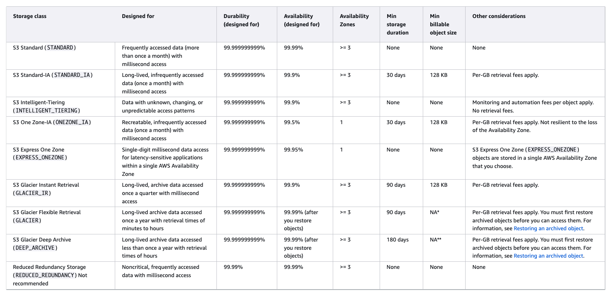

# Storage

## Concepts

Storage Types:

- Persistent - durable and survives power cycles e.g.Glacier/RDS
- Transient - data is temporarily stored and passed on to another process e.g. SQS, SNS
- Ephemeral - data is held in memory and lost when stopped e.g. EC2 instance store, Memcached

Data movement concepts:

- IOPS - how fast we can read and write to a device
- Throughput - how much data can be moved at a time

Consistency models:

- ACID - relational DB model using row locks and rollback
  - atomic - all or nothing
  - consistent - transactions must be valid
  - isolated - transactions cannot mess with each other
  - durable - completed transactions stick
- BASE - more of a nosql model, sacrifice consistency for scalability and availability
  - basically available - availability even if data stale
  - soft state - may not be instantly consistent accross datastores
  - eventually consistent - will achieve consistency at some point

BASE has come into favour where very high volumes and need for more scale

## S3

- Introduced in 2006
- Object store used in many AWS services directly or behind scenes
- Max object size 5TB, Max single put 5GB
- Should use multipart uploads where 100MB is exceeded
- S3 object refs e.g. `s3://bucket-name/images/bob.png` are not file paths they are keys
- S3 Consistency
  - S3 provides read-after-write consistency for PUTs of new objects i.e. if you PUT a new object you can safely read it back immediately
  - HEAD/GET of a key before the object exists result in eventual consistency i.e. can't read it until fully replicated then you can read it
  - Eventual consistency on PUTs and DELETEs i.e. make change locally then replicate then serve up the change when fully replicated
  - Updates to a single key are atomic i.e. one person can update an object at a time, process changes in timestamp order and you can see them once replicated
- S3 security
  - resource based (object ACL, bucket policy)
  - User based (IAM policies)
  - Optional MFA before delete - protect from accidental 
- Versioning
  - new version of object with each write
  - enables undelete / rollback
  - old versions count towards size for billing
  - Integrated with Lifecycle management
  - delete markers used to mark objects as deleted - removing these achieves undelete
- Cross region replication
  - security
  - compliance
  - latency
- S3 storage classes: 
- S3 Lifecycle Management
  - optimize storage costs
  - Adhere to data retention policies e.g. destroy after x years
  - Keep S3 volumes well maintained
- S3 analytics
  - Datalake concept - Athena, Redshift Spectrum, QuickSight
  - IoT Streaming Data Repository - Kinesis Firehose
  - ML and AI Stroage - Rekognition, Lex, MXNet
  - Stroager Class Analysis - S3 Management Analytics
- S3 Encryption at rest
  - SSE-S3 - Use S3's existing encryption keyt
  - SSE-C - Upload your own AES-256 key which S3 will use when it writes objects
  - SSE-KMS - Use a key generated and managed by AWS KMS service
  - Client side - encrypt before uploading to S3 using PGP, GPG etc
- Other S3 features
  - Transfer acceleration - uses CloudFront 'in reverse' to upload your data leveraging local PoP
  - Requester Pays option - the requester of the data (have to have an AWS account) pay for downloading data out of your S3 bucket so you don't incur the charges.
  - Tags - useful across all of AWS, but more specifically in S3. You can assign tags to objects and use that in costing, billing, security, segregation of documents etc 
  - Events -  when you upload or update or delete something then trigger a notification to SNS, SQS, or Lambda and do some activity.
  - Static web hosting feature
  - BitTorrent - S3 supports the BitTorrent protocol, and it actually has a special URL that you can generate a .torrent file to distribute to other users or other people who want to download your content. And then they can use their BitTorrent client to start downloading that content, then ultimately, the content gets distributed across the Torrent network and then you're not serving up so much data straight from S3, but you're leveraging the peer‑to‑peer distribution network.

